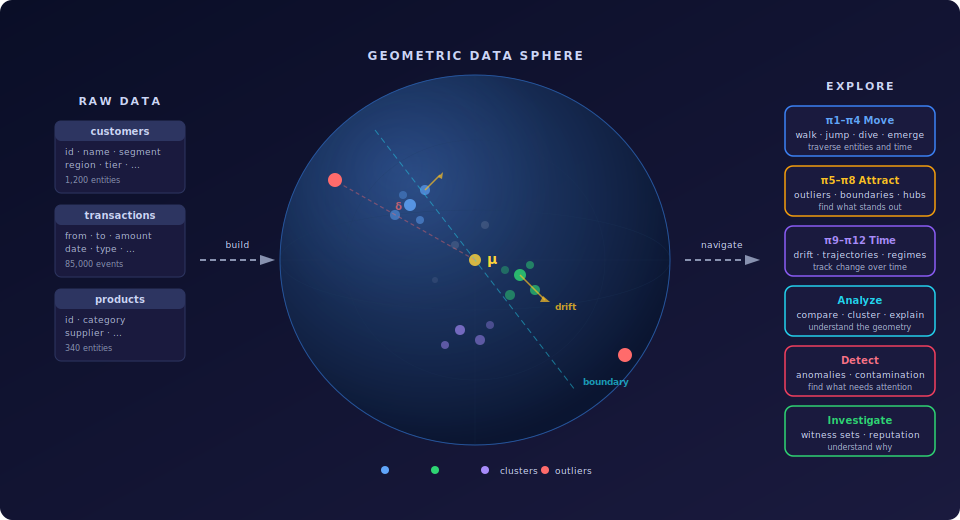

# hypertopos

> **Navigate your data like space.**

[](https://www.python.org/downloads/)
[](LICENSE.md)
[](https://doi.org/10.5281/zenodo.19482069)
[](https://arrow.apache.org/docs/python/)
[](https://github.com/lance-format/lance)
[](https://modelcontextprotocol.io)
[](pyproject.toml)

**hypertopos** transforms relational data into navigable geometric space.

Every entity — customer, vendor, transaction — accumulates a **polygon** built from its typed relationships: who it connects to, through which channels, how often, and with what properties filled or missing. The shape of that polygon is the entity's geometric identity.

A **pattern** calibrates what "typical" looks like for a population: the mean shape (μ), the spread per dimension (σ), and a threshold (θ) derived from the empirical distribution. The resulting coordinate space supports clustering, population comparison, similarity search, hub analysis, boundary exploration, drift tracking, and anomaly detection — no model training, no labeled data, no tuning.

Over time, polygons deform into **solids** — temporal stacks that capture how an entity's geometry evolves. Drift, trajectory similarity, and regime shifts become measurable geometric quantities.

Twelve **navigation primitives** (π1–π12) let AI agents walk lines, jump across relationships, discover clusters, compare populations, find hubs, and track temporal change — all as stateful, composable geometric operations.

```bash
pip install hypertopos
```



## Under the Hood

At its core, the system builds a population-calibrated coordinate space from typed relationships and entity properties — and enables agents to navigate it.

Each entity occupies a position derived from statistical normalization (μ and σ per dimension), producing a shared coordinate system in ℝ^D.

Navigation primitives turn this space into a stateful, step-by-step workspace, where clustering, anomaly detection, drift tracking, and temporal analysis are performed as geometric operations — without model training or learned embeddings.

## What Makes It Different

- **Geometry, not queries** — entities live in a population-calibrated coordinate space (μ, σ, θ). Position tells you what's typical. Distance reveals what's unusual, what's similar, and where clusters form.
- **Navigate, don't search** — twelve primitives (π1–π12) let agents walk lines, jump across relationships, cluster populations, compare groups, find hubs, and track drift. Stateful, composable, geometric.
- **Graph meets geometry** — edge tables give runtime graph traversal with geometric path scoring. Find paths scored by witness overlap and anomaly propagation — not just hop count. Lazy chain discovery without build-time extraction. Surface witness cohorts (`find_witness_cohort`) — entities sharing the target's anomaly signature, ranked by delta similarity, witness overlap, trajectory alignment, and graded anomaly bonus, with already-connected entities filtered out. Investigative peer ranking, not edge forecasting.
- **Time is built in** — polygons accumulate into solids. Trajectory similarity, regime change detection, and drift analysis are first-class — not bolted on.
- **Agents first** — designed for MCP tool-calling. Smart detection recipes, investigation workflows. The sphere is the agent's workspace.
- **Zero training** — no ML models, no labels, no training pipeline. Population statistics and empirical thresholds. Deploy in minutes.

> **Full power via MCP.** The core library provides the Python API. For the complete experience — guided investigation, smart detection, 67 tools exposed to AI agents — use **[hypertopos-mcp](https://github.com/hypertopos/hypertopos-mcp)** (`pip install hypertopos-mcp`). The MCP server turns navigation primitives into agent-callable tools with automatic context management, tool visibility phases, and detection recipes that chain multiple primitives into end-to-end investigative workflows.

## How It Compares

| | hypertopos | Neo4j GDS | Vector DBs | PyGOD |
|---|---|---|---|---|
| **Geometry from** | Entity's own relationships | Graph algorithms | External embeddings (ML) | Graph neural networks |
| **Training required** | No | No | Embedding model needed | Yes |
| **Population-relative** | Yes (μ, σ, θ per population) | No | No | No |
| **Temporal** | Built-in (solids, drift, regimes) | Snapshot-based | No | No |
| **Navigation** | 12 stateful primitives | Query-based | KNN search | N/A |
| **Multi-hop** | Edge table (runtime graph + lazy chains) + pre-computed chain geometry | Native (Cypher, ad-hoc) | No | No |
| **Anomaly propagation** | Contagion scoring + influence BFS in delta-space | No | No | Local neighborhood only |
| **Witness cohort discovery** | Witness overlap + delta + trajectory + edge absence | Topological only (Adamic-Adar, common neighbors) | KNN, no graph awareness | Learned embeddings (training required) |
| **Agent-native (MCP)** | Yes | No | No | No |
| **Explains why** | Witness sets, dimension ranking | Centrality scores | Nearest neighbors | Anomaly scores |

hypertopos is not a graph database, a vector store, or an ML framework. It is a **geometric coordinate system** built from relational structure — designed for AI agents to navigate, not for humans to query.

## Why This Matters

Most systems either:

- operate on raw relationships (queries, traversals), or
- rely on trained models (embeddings, ML pipelines)

This approach provides a third option:

- a persistent, interpretable coordinate system
- consistent across time
- usable for multiple analytical tasks without retraining

This enables simpler, more transparent analysis of complex relational systems.

## Documentation

| | |
|---|---|
| **[Quick Start](docs/quickstart.md)** | Install, build a sphere, navigate — in one page |
| **[Core Concepts](docs/concepts.md)** | GDS mental model, objects, mathematical foundation |
| **[API Reference](docs/api-reference.md)** | Python API — classes, methods, navigation primitives, errors |
| **[Configuration](docs/configuration.md)** | Sphere builder YAML reference |
| **[Data Format](docs/data-format.md)** | Physical storage — directory layout, Arrow schemas |
| **[Architecture](docs/architecture.md)** | Package structure, layers, runtime flow |
| **[Benchmarks](docs/benchmarks.md)** | Validation results — banking, AML, transportation |

## Tech Stack

| Technology | Role |
|------------|------|
| Python 3.12+ | Core language |
| PyArrow | Arrow IPC format, in-memory transport |
| NumPy | Vector operations, delta computation, DTW |
| Lance | Vector index (IVF-PQ), scalar indices, predicate pushdown |
| PyYAML | Sphere builder YAML config |

## License

Licensed under the [Business Source License 1.1](LICENSE.md).

| Question | Answer |
|----------|--------|
| Can I use it internally? | Yes |
| Development, testing, research? | Yes |
| Host as a service for third parties? | Not if it competes with the Licensor's paid offering |
| Embed in a commercial product? | Not if competitive |
| When does it become Apache 2.0? | On the Change Date or third anniversary, whichever comes first |

For commercial licensing: [contact@hypertopos.com](mailto:contact@hypertopos.com)

## Contributing

**Core library** — requires a Contributor License Agreement (CLA).
**MCP server & docs** — DCO sign-off only (`Signed-off-by: Name <email>`).

Bug reports, feature requests, and discussion via [GitHub Issues](https://github.com/hypertopos/hypertopos-py/issues).
