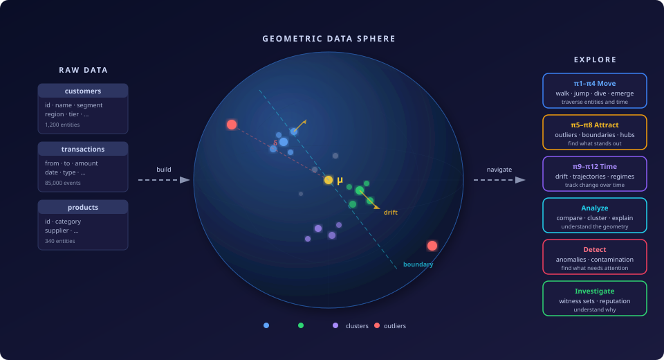

# hypertopos

> A behavioral feature layer for graph and temporal data — turning behavior into coordinates, trajectories, and explanations.

[](https://www.python.org/downloads/)
[](LICENSE.md)
[](https://doi.org/10.5281/zenodo.19482069)
[](https://arrow.apache.org/docs/python/)
[](https://github.com/lance-format/lance)
[](https://modelcontextprotocol.io)
[](pyproject.toml)

hypertopos is not a database, and not a machine learning model. It is a layer that turns relational data into a coordinate system where every entity gets a position derived from its relationships and the population around it.

```
typical:    data → features → feature store → ML → decision
hypertopos: data → representation (hypertopos) → ML / decision
```

```bash
pip install hypertopos
```



## How it works

You describe your data in YAML — entity types, sources, relationships. hypertopos computes population statistics and produces a sphere: pre-computed geometry stored in Apache Arrow format.

Agents (or Python code) open the sphere and navigate it using twelve primitives that cover movement, clustering, anomaly detection, population comparison, and temporal analysis. Each step is stateful — where you are determines what you see next.

For the full picture: [Introduction](docs/introduction.md) · [Core Concepts](docs/concepts.md) · [Quick Start](docs/quickstart.md)

## What's different

Each capability below emerges from treating entities as points in a shared, population-calibrated space.

| Capability | What it does | Compared to | Since |
|---|---|---|---|
| Population-relative coordinates | `delta = (shape - mu) / sigma` — one coordinate for anomaly, clustering, drift | node2vec/GNN: latent dims, retraining on shift | `0.1.0` |
| Self-calibrating threshold | `theta = percentile(norms, 95)` — no tuning, no labels | PyOD: choose contamination rate | `0.1.0` |
| Named dimension attribution | `explain_anomaly` → `loan_count: +3.2σ (42%)`. Sums to 100% | SHAP/LIME: approximate, model-dependent | `0.1.0` |
| Temporal deformation | Append-only delta log. Displacement, path length, directionality | Time-series DBs: metric values, not trajectories | `0.1.0` |
| Stateful navigation | 12 typed primitives. Position type constrains valid ops | SQL/GraphQL: stateless queries | `0.1.0` |
| Cross-sphere comparison | `\|\|delta\|\|` is dimensionless — 4.2σ means the same in any domain | Requires shared features or joint embeddings | `0.1.0` |
| Counterfactual simulation | `simulate_edges` recomputes delta against fixed baseline | Causal inference: explicit DAG required | `0.1.0` |
| Regime change detection | Per-bucket centroids, self-calibrating shift threshold | Evidently/NannyML: model prediction drift | `0.1.0` |
| Graph contagion | Mean `\|\|delta\|\|` of neighbors. Cohen's d vs control group | PageRank: topology, not behavioral propagation | `0.2.0` |
| Witness cohort | Similar deltas, NOT connected. Validates pattern vs one-off | k-NN on features (includes neighbors) | `0.2.1` |
| FDR-controlled detection | Benjamini-Hochberg on rank p-values. Per-entity q-values | BH not combined with geometric detection | `0.3.1` |
| Diverse anomaly selection | Facility location covers distinct anomaly regions | Top-N returns redundant extremes | `0.3.1` |
| Distribution-aware scoring | Per-dim Bregman divergence (gaussian/poisson/bernoulli). Additive | PyOD/sklearn: uniform metric across all features | `0.4.0` |
| Anomaly confidence | Bootstrap `anomaly_confidence: 0-1`. `min_confidence` filter | No equivalent — binary verdict, no stability signal | `0.4.0` |
| Graph algorithm dimensions | PageRank, betweenness, community, clustering as geometry dims | Separate graph DB + manual joins | `0.4.1` |
| Adaptive false-discovery-rate | Storey π₀ estimator + χ² parametric p-values recover BH power loss | BH without adaptive π₀ overcorrects on null-heavy populations | `0.5.0` |
| Drift direction | `gradient_alignment` + `drift_direction ∈ {normalizing, deteriorating, neutral}` | Drift magnitude only — no toward/away-from-centre signal | `0.5.0` |
| One-call root cause | `trace_root_cause` returns bounded evidence DAG — witness, edge-counterparty, contamination, hub | Manual chain of `explain_anomaly → find_counterparties → contagion_score → π7 hub` | `0.5.0` |
| Geometric edge potential | `\|\|delta_from − delta_to\|\| × (1/pair_tx_count)` — per-edge layering signature | Node-level `delta_norm` misses one-off transactions between divergent accounts | `0.5.0` |
| Structural motif scoring | Product of `edge_potential` across closed-vocab motifs (fan_out, cycle_2, cycle_3, structuring) | Graph DB motif matching has no geometric rarity score | `0.5.0` |
| Extended motif catalog | `fan_in` (sink-centric concentrator) and `chain_k` (open directed chain, 3 ≤ k ≤ 8) extend the motif vocabulary; window-filter correctness fix on fan_out/cycle_2/cycle_3 | Prior motifs silently ignored declared `time_window_hours` in production | `0.5.1` |
| Bipartite motif catalog | `split_recombine` (diamond scatter-gather S → k intermediaries → D, forward/backward seed anchoring) and `bipartite_burst` (complete K_{k,m} bipartite subgraph in tight window) cover scatter-gather smurfing, parallel layering, and coordinated-burst atoms | Closed-vocabulary atomic queries — no manual graph inversion or per-side enumeration glue | `0.5.2` |
| Multi-epoch calibration audit | `compare_calibrations(v_from, v_to)` — per-dim μ/σ/θ drift between two retained calibration epochs of one pattern | Drift detectors compare model predictions; nothing compares the underlying coordinate system itself | `0.6.0` |
| Intrinsic vs extrinsic drift decomposition | `decompose_drift` splits an entity's geometric drift into its own movement vs population recalibration; `intrinsic_fraction ∈ [0, 1]` | Drift magnitude alone — population shift and entity behaviour change confound | `0.6.0` |
| Hidden-influencer matrix | `find_calibration_influencers` — 4-cell classification (`hidden` / `distorter` / `standard_anomaly` / `normal`) via exact leave-one-out impact on calibration | SHAP / counterfactual: explain a prediction, not the coordinate system itself | `0.6.0` |
| Cross-pattern temporal lead-lag | `find_lead_lag(pattern_a, pattern_b)` — cross-correlates differenced population-centroid drift; peak lag, Bonferroni-adjusted significance, per-dim FDR matrix | Granger causality on raw metrics — not on population-relative geometry | `0.6.0` |
| Anomaly by absence | `find_density_gaps` — joint-density gaps under independence null with BH-corrected q-values; surfaces under-populated cells in named delta-space ranges | Outlier detection finds extremes; gap detection finds *missing* combinations | `0.6.0` |
| Declarative motif API | `find_motif_by_hops(pattern_id, hops, *, seed_keys)` — caller passes per-hop `HopPredicate`s (amount / time-delta / direction / edge-dim filters); navigator walks chains of length 1..6 | Closed-vocab motif registry — no escape hatch for ad-hoc structural shapes | `0.6.0` |

### What changes in practice

The same problems look different when graph, time, and statistics are unified:

| Problem | Typical approach | With hypertopos |
|---|---|---|
| Detect anomalies | Train model, engineer features, choose contamination rate, retrain on shift | `hypertopos build` from YAML, `find_anomalies()` — threshold auto-calibrated from population |
| Explain an anomaly | SHAP on trained model — feature importance for latent dimensions | `explain_anomaly(entity)` — ranked real dimensions: `loan_count: +3.2 sigma (42%)` |
| Compare across domains | Align schemas, build shared features, normalize units | Compare `\|\|delta\|\|` directly — 4.2 sigma means the same in any sphere |
| Track behavioral drift | Export to time-series DB, build dashboard, set manual thresholds | `attract_drift(window)` — displacement, path length, directionality per entity |
| Validate anomaly is real | Manual investigation, ask domain expert | `find_witness_cohort(entity)` — similar non-connected entities confirming the pattern |
| Understand propagation | PageRank, manual path tracing, cross-table joins | `propagate_influence(source)` — Cohen's d between connected vs control group |
| Trust an anomaly verdict | Re-run with different thresholds, manual sensitivity analysis | `find_anomalies(min_confidence=0.8)` — only entities stable under population perturbation |
| Understand why anomalous | SHAP on black-box model, approximate feature importance | `explain_anomaly` — per-dimension Bregman contribution with distribution kind, sums to 100% |
| Root-cause an anomaly | Manual chain: explain → counterparties → contagion → hub check, 4+ tool calls | `trace_root_cause(entity)` — single call returns bounded DAG of evidence |
| Detect relationship layering | Custom rule engine or manual rare-pair SQL queries | `edge_potential(A, B)` — per-edge score combining endpoint distance and pair rarity |
| Match AML typology patterns | Graph DB subgraph queries + separate risk scoring | `find_motif(type="structuring", …)` — structural pattern + geometric rarity product |
| Direction of behavioural drift | Drift magnitude alone — no toward/away-from-centre signal | `attract_drift` returns `drift_direction ∈ {normalizing, deteriorating, neutral}` |

## Benchmarks

Validated on three domains with the same engine, zero domain rules, zero labels:

| Domain | Dataset | Key result |
|--------|---------|------------|
| Banking | Berka (Czech, real data) | 85.5% recall on loan defaults |
| AML | IBM AML (synthetic) | 80.4% recall, zero labels |
| Transport | NYC Yellow Taxi (7.6M trips) | 8/8 anomaly categories detected |

Benchmark scripts and data preparation are included. Results are reproducible. Numbers are from the pre-0.1.0 validation run and have not been re-evaluated against recent releases.

Full results: [Benchmarks](docs/benchmarks.md)

## Documentation

| | |
|---|---|
| [Introduction](docs/introduction.md) | The idea and where it stands |
| [Quick Start](docs/quickstart.md) | Install, build, navigate |
| [Core Concepts](docs/concepts.md) | Mathematical foundation |
| [Configuration](docs/configuration.md) | Sphere builder YAML reference |
| [API Reference](docs/api-reference.md) | Python API |
| [Data Format](docs/data-format.md) | On-disk storage format |
| [Architecture](docs/architecture.md) | Package layers and design |

## Status

Research-stage project. Working code, reproducible benchmarks, active development. API may change.

## License

[Business Source License 1.1](LICENSE.md). Free for internal use, development, testing, and research. See LICENSE.md for details.
