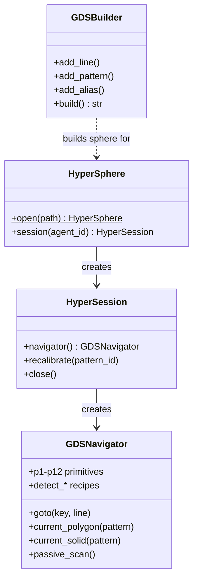
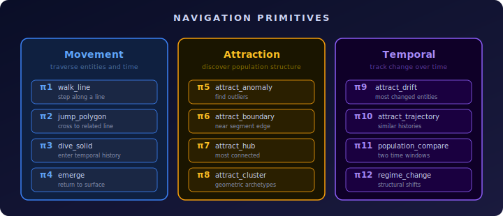
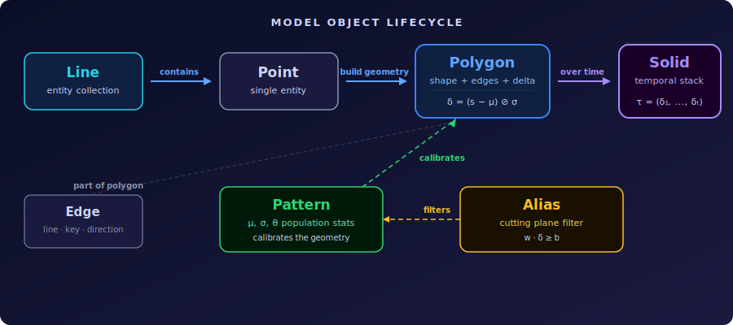
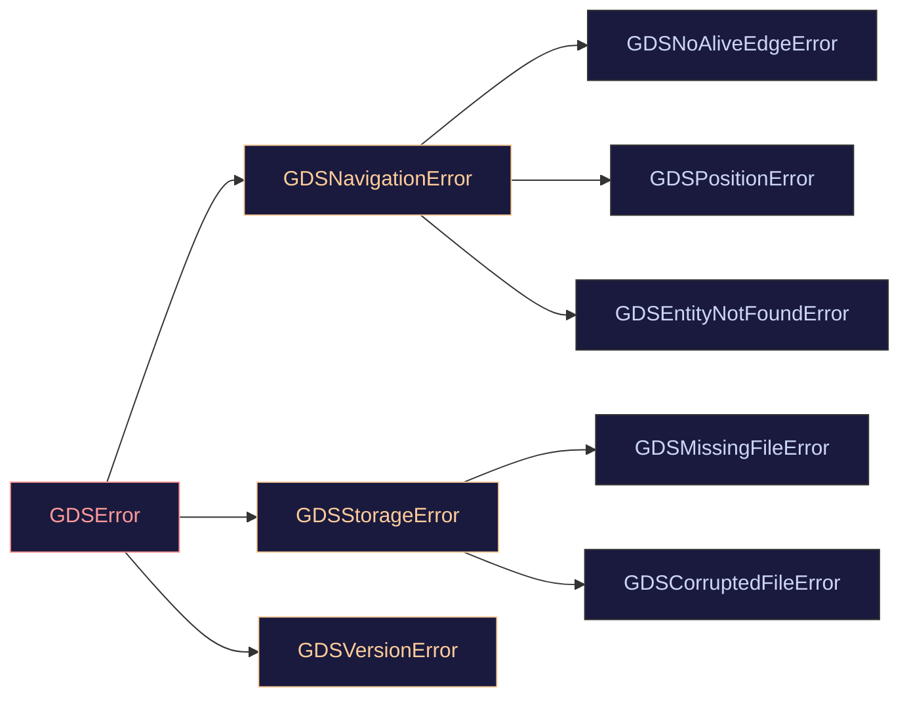

# API Reference

> Navigable overview of the hypertopos Python API — classes, methods, and error hierarchy.

---

## Class Hierarchy



---

## Entry Points

### HyperSphere

| Method | Description |
|--------|-------------|
| `HyperSphere.open(base_path)` | Open a sphere from disk. Returns `HyperSphere` |
| `sphere.session(agent_id)` | Create an isolated session with MVCC-pinned versions |

### HyperSession

| Method | Description |
|--------|-------------|
| `session.navigator()` | Create a `GDSNavigator` bound to this session's manifest |
| `session.recalibrate(pattern_id)` | Full recalibration: recompute mu/sigma/theta, rebuild geometry, reset drift tracker |
| `session.set_forecast_provider(provider)` | Plug in an external forecast provider (or `None` for built-in) |
| `session.close(purge_temporal=False)` | Expire the manifest. Optional: purge agent temporal data |

`HyperSession` is a context manager (`with` statement supported).

### Typical usage

```python
from hypertopos import HyperSphere

sphere = HyperSphere.open("path/to/gds_my_sphere")
with sphere.session("agent-1") as session:
    nav = session.navigator()
    overview = nav.sphere_overview()
    clusters = nav.π8_attract_cluster("pat_customer", n_clusters=4, top_n=3)
    anomalies, total, _, _ = nav.π5_attract_anomaly("pat_customer", top_n=5)
```

---

## Navigation -- GDSNavigator

### Position and Movement

| Method | Description |
|--------|-------------|
| `nav.position` | Property: current position (`Point`, `Polygon`, `Solid`, or `None`) |
| `nav.goto(primary_key, line_id)` | Move to a specific entity. Sets position to `Point` |
| `nav.current_polygon(pattern_id)` | Build the polygon for the current `Point` position |
| `nav.current_solid(pattern_id, filters=None)` | Build the temporal solid for the current `Point` position |
| `nav.event_polygons_for(entity_key, event_pattern_id)` | Return event polygons whose edges reference the entity |

### Navigation Primitives



**Movement** — navigate between entities, lines, and temporal depth:

| Primitive | Method | What it does | Returns |
|-----------|--------|--------------|---------|
| π1 | `π1_walk_line(line_id, direction)` | Step to adjacent entity in a line | `GDSNavigator` |
| π2 | `π2_jump_polygon(polygon, target_line_id, edge_index)` | Cross a polygon edge to a related line | `GDSNavigator` |
| π3 | `π3_dive_solid(primary_key, pattern_id, timestamp)` | Enter an entity's temporal history | `GDSNavigator` |
| π4 | `π4_emerge()` | Return to surface from solid/polygon depth | `GDSNavigator` |

**Attraction** — discover population structure, outliers, clusters, and connectivity:

| Primitive | Method | What it does | Returns |
|-----------|--------|--------------|---------|
| π5 | `π5_attract_anomaly(pattern_id, radius, top_n)` | Find most anomalous polygons | `(list[Polygon], int, list, dict)` |
| π6 | `π6_attract_boundary(alias_id, pattern_id, direction, top_n)` | Find entities nearest to alias cutting plane | `list[(Polygon, float)]` |
| π7 | `π7_attract_hub(pattern_id, top_n, line_id_filter)` | Find entities with highest connectivity | `list[(str, int, float)]` |
| π7+ | `π7_attract_hub_and_stats(pattern_id, top_n, line_id_filter)` | Hub ranking + population hub score statistics in one scan | `(list, dict)` |
| π8 | `π8_attract_cluster(pattern_id, n_clusters, top_n, sample_size)` | Discover geometric archetypes via k-means++ | `list[dict]` |

**Temporal** — population and trajectory analysis over time:

| Primitive | Method | What it does | Returns |
|-----------|--------|--------------|---------|
| π9 | `π9_attract_drift(pattern_id, top_n, sample_size)` | Find entities with highest temporal drift | `list[dict]` |
| π10 | `π10_attract_trajectory(primary_key, pattern_id, top_n)` | Find entities with similar temporal trajectory | `list[dict]` |
| π11 | `π11_attract_population_compare(pattern_id, window_a_from, window_a_to, window_b_from, window_b_to)` | Compare population geometry between two time windows | `dict` |
| π12 | `π12_attract_regime_change(pattern_id, timestamp_from, timestamp_to)` | Detect population geometry regime shifts | `list[dict]` |

### Graph Traversal (Edge Table)

| Method | Description |
|--------|-------------|
| `find_geometric_path(from_key, to_key, pattern_id, max_depth=5, beam_width=10, scoring="geometric")` | Beam search for paths between two entities via the edge table, scored by geometric coherence. Scoring modes: `"geometric"` (witness overlap + delta alignment + anomaly preservation), `"amount"` (geometric score modulated by log(transaction amount)), `"anomaly"` (prefer paths through anomalous entities), `"shortest"` (plain BFS, no geometric scoring). Returns best paths with per-hop scores |
| `discover_chains(primary_key, pattern_id, time_window_hours=168, max_hops=10, min_hops=2, max_chains=100, direction="forward")` | Runtime temporal BFS on the edge table to discover entity chains from a starting point. Unlike `find_chains_for_entity()` which queries pre-computed chains, this performs live traversal -- works without build-time chain extraction |
| `entity_flow(primary_key, pattern_id, top_n=20, *, timestamp_cutoff=None)` | Net flow analysis per counterparty via edge table. Two edge lookups (outgoing + incoming), sum amounts, compute per-counterparty net flow. `timestamp_cutoff` (Unix seconds) restricts to edges with `timestamp <= cutoff`. Returns outgoing/incoming totals, net_flow, flow_direction, counterparties sorted by abs(net_flow) |
| `contagion_score(primary_key, pattern_id, *, timestamp_cutoff=None)` | Score how many of an entity's counterparties are anomalous via edge table + geometry check. `timestamp_cutoff` enables as-of contagion reconstruction. Returns score (0.0–1.0), total/anomalous counterparty counts |
| `contagion_score_batch(primary_keys, pattern_id, max_keys=200, *, timestamp_cutoff=None)` | Batch contagion scoring for multiple entities — forwards `timestamp_cutoff` to each per-entity call. Returns per-entity scores plus summary (mean, max, high_contagion_count) |
| `degree_velocity(primary_key, pattern_id, n_buckets=4, *, timestamp_cutoff=None)` | Temporal connection velocity — buckets edges by timestamp, counts unique counterparties per bucket. Velocity = last_bucket_degree / first_bucket_degree. `timestamp_cutoff` clamps the last bucket endpoint by filtering edges at the read level. Returns buckets with out/in degree, velocity metrics |
| `investigation_coverage(primary_key, pattern_id, explored_keys)` | Agent guidance: how much of an entity's edge neighborhood has been explored. Splits counterparties into explored/unexplored, batch anomaly check on unexplored |
| `propagate_influence(seed_keys, pattern_id, max_depth=3, decay=0.7, min_threshold=0.001, max_affected=10_000, *, timestamp_cutoff=None)` | BFS influence propagation from seed entities with geometric decay and tx_count weighting. At each hop: influence = parent_score * decay * geometric_coherence * tx_weight. `timestamp_cutoff` restricts BFS expansion to edges with `timestamp <= cutoff`. Returns affected_entities with tx_count per neighbor |
| `cluster_bridges(pattern_id, n_clusters=5, top_n_bridges=10)` | Find entities bridging geometric clusters via edge table. Runs π8 clustering then identifies cross-cluster edges and bridge entities |
| `anomalous_edges(from_key, to_key, pattern_id, top_n=10)` | Find edges between two entities enriched with event-level geometry (delta_norm, is_anomaly). Unlike path tools which score entities (anchor), this scores individual transactions (event geometry) |
| `find_witness_cohort(primary_key, pattern_id, top_n=10, *, config=None, edge_pattern_id=None)` | Rank entities that share the target's witness signature. Investigative peer ranking — NOT edge forecasting. Combines four signals: `exp(-distance/theta)` delta similarity, witness Jaccard overlap, trajectory cosine alignment (optional), and graded anomaly bonus from `delta_rank_pct`. Excludes entities already connected via BTREE edge lookup — this is the function's main contribution over plain ANN. Configure via `WitnessCohortConfig(weights=WitnessCohortWeights(...), candidate_pool, min_witness_overlap, min_score, use_trajectory, bidirectional_check, timestamp_cutoff)`. Returns `WitnessCohortResult` with ranked `CohortMember` items, per-component scores, exclusion counts, and reproducibility metadata |

### Analysis and Detection

**Entity investigation:**

| Method | Description |
|--------|-------------|
| `explain_anomaly(primary_key, pattern_id)` | Structured investigation: severity, witness set, repair set, conformal p-value, reputation |
| `explain_anomaly_chain(primary_key, pattern_id, max_hops)` | Trace anomaly propagation through geometric neighbors |
| `find_similar_entities(primary_key, pattern_id, top_n)` | ANN search for nearest entities in delta-space. Returns `SimilarityResult` |
| `contrast_populations(pattern_id, group_a, group_b)` | Dimension-by-dimension comparison of two entity groups (Cohen's d) |
| `composite_risk(primary_key, line_id)` | Fisher's method combination of conformal p-values across patterns |
| `composite_risk_batch(primary_keys, line_id)` | Batch Fisher combination for multiple entities |
| `cross_pattern_profile(primary_key, line_id)` | Anomaly status from all patterns the entity participates in |
| `find_chains_for_entity(primary_key, pattern_id, top_n)` | Find chains involving a specific entity |
| `find_neighborhood(primary_key, pattern_id, max_hops)` | BFS through polygon edges to find reachable entities |
| `find_counterparties(primary_key, line_id, from_col, to_col, pattern_id, top_n, use_edge_table=True, *, timestamp_cutoff=None)` | Discover counterparty entities from event data. When pattern_id is given and edge table exists, uses BTREE fast path with amount_sum/amount_max per counterparty. `timestamp_cutoff` applies to the edge-table fast path only; raises `GDSNavigationError` when supplied without an edge-table-eligible configuration |
| `assess_false_positive(primary_key, pattern_id)` | Evaluate likelihood of false positive anomaly classification |

**Detection recipes (population-level patterns):**

| Method | Description |
|--------|-------------|
| `detect_cross_pattern_discrepancy(entity_line, top_n)` | Entities anomalous in exactly one pattern but normal elsewhere |
| `detect_neighbor_contamination(primary_key, pattern_id)` | Check if entity's neighbors show anomaly clustering |
| `detect_trajectory_anomaly(pattern_id, top_n_per_range)` | Entities with unusual temporal trajectory shapes (arch, v-shape, spike) |
| `detect_segment_shift(pattern_id, min_shift_ratio)` | Segments with disproportionate anomaly rates vs baseline |
| `detect_event_rate_anomaly(pattern_id, threshold)` | Entities with high event anomaly rate but normal anchor geometry |
| `detect_hub_anomaly_concentration(pattern_id, top_n)` | Hubs whose neighborhood is dominated by anomalies |
| `detect_composite_subgroup_inflation(entity_line, group_by)` | Subgroups with inflated composite risk vs population baseline |
| `detect_collective_drift(pattern_id, top_n)` | Clusters of entities drifting in the same geometric direction |
| `detect_temporal_burst(pattern_id, window_days)` | Entities with bursty event patterns (z-score on rolling windows) |
| `detect_data_quality_issues(pattern_id)` | Coverage gaps, dead dimensions, theta ceiling proximity |

### Population Queries

| Method | Description |
|--------|-------------|
| `sphere_overview(pattern_id=None)` | Population summary for one or all patterns (rates, calibration health, dimension stats) |
| `anomaly_summary(pattern_id, max_clusters)` | Anomaly population breakdown with geometric clustering |
| `aggregate_anomalies(pattern_id, group_by)` | Group anomalies by a property column with per-group rates |
| `aggregate(event_pattern_id, group_by_line)` | Aggregate event polygons by group with metric computation |
| `check_alerts(pattern_id=None)` | Implicit health checks: anomaly rate spikes, population shocks, calibration staleness |
| `hub_score_stats(pattern_id)` | Hub score distribution statistics |
| `check_anomaly_batch(pattern_id, primary_keys)` | Batch anomaly status check for multiple entities |
| `temporal_quality_summary(pattern_id)` | Temporal anomaly persistence metrics |
| `line_geometry_stats(pattern_id)` | Per-relation-line entity count breakdown from geometry |
| `line_profile(line_id, property_name)` | Column profiling on raw points table (categorical, numeric, temporal) |
| `search_entities_fts(line_id, query, limit)` | Full-text BM25 search across string properties |
| `search_hybrid(primary_key, pattern_id, line_id, query, top_n=10)` | Hybrid search combining FTS with geometric similarity (reciprocal rank fusion) |

---

## Builder -- GDSBuilder

### Constructor

```python
builder = GDSBuilder(
    sphere_id="my_sphere",
    output_path="/path/to/output",
    name="My Sphere",
    description="Optional description",
)
```

### Methods

| Method | Description |
|--------|-------------|
| `add_line(line_id, data, key_col, source_id, role)` | Register an entity line from Arrow table or list of dicts |
| `add_pattern(pattern_id, pattern_type, entity_line, relations)` | Define a geometric pattern with relations, thresholds, and optional grouping |
| `add_event_dimension(pattern_id, column, edge_max)` | Add a continuous dimension to an event pattern (amounts, quantities) |
| `add_derived_dimension(anchor_line, event_line, anchor_fk, metric, metric_col, dimension_name)` | Dimension derived from event aggregation (count, sum, max, std, mean) |
| `add_composite_line(anchor_line, event_line, anchor_fk, ...)` | Create composite anchor line from event-anchor join |
| `add_precomputed_dimension(anchor_line, dimension_name, edge_max)` | Dimension from a column already on the entity table |
| `add_graph_features(anchor_line, event_line, from_col, to_col, features)` | Auto-compute graph structural features (in/out-degree, reciprocity) |
| `add_chain_line(line_id, chains, features)` | Create anchor line from extracted chain dicts |
| `add_alias(alias_id, base_pattern_id, cutting_plane_dimension, cutting_plane_threshold)` | Register an alias with a cutting plane for sub-population analysis |
| `build()` | Validate, compute statistics, write all files. Returns output path |
| `incremental_update(pattern_id, changed_entities, deleted_keys)` | Update geometry incrementally with drift tracking |
| `build_temporal(time_col, time_window)` | Generate temporal snapshots from time-windowed event data. Call after `build()` |

### RelationSpec

```python
@dataclass
class RelationSpec:
    line_id: str                        # Target line
    fk_col: str | None                  # FK column name (None for "self")
    direction: Literal["in", "out", "self"] = "in"
    required: bool = True
    display_name: str | None = None
    edge_max: int | None = None         # None = binary, int = continuous count cap
```

---

## Storage -- GDSReader / GDSWriter

### Edge Table (GDSReader)

| Method | Description |
|--------|-------------|
| `read_edges(pattern_id, from_keys=None, to_keys=None, timestamp_from=None, timestamp_to=None, columns=None)` | Read edge table with Lance BTREE-indexed push-down filters. Returns `pa.Table` |
| `has_edge_table(pattern_id)` | Check if an edge table exists for a pattern. Returns `bool` |
| `edge_table_stats(pattern_id)` | Quick statistics (row count, unique entities, timestamp/amount ranges). Returns `dict` or `None` |

### Edge Table (GDSWriter)

| Method | Description |
|--------|-------------|
| `write_edges(pattern_id, edges_table)` | Write edge table as a Lance dataset with BTREE indexes on `from_key` and `to_key` |
| `append_edges(pattern_id, new_edges)` | Append new edges to an existing Lance dataset (streaming build) |
| `create_edge_indexes(pattern_id)` | Build BTREE indexes on `from_key` and `to_key` after streaming writes |

---

## Model Objects



### Line

| Field | Type | Description |
|-------|------|-------------|
| `line_id` | `str` | Unique identifier |
| `entity_type` | `str` | Logical entity type (e.g. "customers") |
| `line_role` | `"anchor" \| "event"` | Role in the sphere |
| `pattern_id` | `str` | Pattern associated with this line |
| `versions` | `list[int]` | Available data versions |
| `source_id` | `str \| None` | Source identifier (sibling lines share the same source) |

Key methods: `current_version()`, `has_fts()`.

### Point

| Field | Type | Description |
|-------|------|-------------|
| `primary_key` | `str` | Business key |
| `line_id` | `str` | Which line this point belongs to |
| `version` | `int` | Data version |
| `status` | `"active" \| "expired" \| "ghost"` | Lifecycle status |
| `properties` | `dict[str, Any]` | All non-system columns |
| `created_at` | `datetime` | Creation timestamp |
| `changed_at` | `datetime` | Last modification timestamp |

### Edge

| Field | Type | Description |
|-------|------|-------------|
| `line_id` | `str` | Target line of this edge |
| `point_key` | `str` | Target entity key (empty string for continuous mode) |
| `status` | `"alive" \| "dead"` | Edge liveness |
| `direction` | `"in" \| "out" \| "self"` | Edge direction relative to polygon owner |
| `is_jumpable` | `bool` | `False` for continuous-mode edges (edge_max) |

### Polygon

| Field | Type | Description |
|-------|------|-------------|
| `primary_key` | `str` | Entity this polygon represents |
| `pattern_id` | `str` | Pattern that defines the geometry |
| `pattern_type` | `"anchor" \| "event"` | Pattern class |
| `scale` | `int` | Number of alive edges |
| `delta` | `np.ndarray` | Z-scored deviation from population mean |
| `delta_norm` | `float` | L2 norm of delta (distance from center) |
| `is_anomaly` | `bool` | Whether delta_norm >= theta_norm |
| `edges` | `list[Edge]` | All edges in this polygon |
| `delta_rank_pct` | `float \| None` | Percentile rank within population (0-100) |

Key methods: `is_event()`, `is_anchor()`, `alive_edges()`, `edges_for_line(line_id)`.

### Solid

| Field | Type | Description |
|-------|------|-------------|
| `primary_key` | `str` | Entity key |
| `pattern_id` | `str` | Pattern reference |
| `base_polygon` | `Polygon` | Current polygon state |
| `slices` | `list[SolidSlice]` | Temporal deformation history, ordered by time |

Key methods: `slice_at(timestamp)` -- binary search for the slice active at a given time.

### SolidSlice

| Field | Type | Description |
|-------|------|-------------|
| `slice_index` | `int` | Position in temporal sequence |
| `timestamp` | `datetime` | When this deformation occurred |
| `deformation_type` | `"internal" \| "edge" \| "structural"` | What changed |
| `delta_snapshot` | `np.ndarray` | Delta vector at this point in time |
| `delta_norm_snapshot` | `float` | L2 norm of delta_snapshot |

### Pattern

| Field | Type | Description |
|-------|------|-------------|
| `pattern_id` | `str` | Unique identifier |
| `entity_type` | `str` | Logical entity type name |
| `pattern_type` | `"anchor" \| "event"` | Pattern class |
| `relations` | `list[RelationDef]` | Dimension definitions |
| `mu` | `np.ndarray` | Population mean vector |
| `sigma_diag` | `np.ndarray` | Population standard deviation per dimension |
| `theta` | `np.ndarray` | Anomaly threshold vector |
| `population_size` | `int` | Total entity count at calibration time |
| `version` | `int` | Pattern version |
| `prop_columns` | `list[str]` | Boolean property columns tracked as dimensions |
| `dimension_weights` | `np.ndarray \| None` | Per-dimension importance weights |

Key properties: `theta_norm`, `dim_labels`, `delta_dim()`, `is_continuous`, `max_hub_score`.

### Alias

| Field | Type | Description |
|-------|------|-------------|
| `alias_id` | `str` | Unique identifier |
| `base_pattern_id` | `str` | Parent pattern this alias filters |
| `filter` | `AliasFilter` | Includes `cutting_plane` (normal, bias) |
| `derived_pattern` | `DerivedPattern` | Sub-population statistics (mu, sigma, theta) |
| `version` | `int` | Alias version |
| `status` | `str` | Lifecycle status |

---

## Errors



| Error | When raised |
|-------|-------------|
| `GDSError` | Base class for all hypertopos errors |
| `GDSNavigationError` | Navigation operation failed (invalid primitive call, missing data) |
| `GDSNoAliveEdgeError` | p2 jump fails because no alive edge connects to the target line |
| `GDSPositionError` | Current position type is incompatible with the requested operation |
| `GDSEntityNotFoundError` | Primary key not found in the specified line |
| `GDSStorageError` | Storage-layer I/O failure |
| `GDSMissingFileError` | An expected data file was not found on disk |
| `GDSCorruptedFileError` | A data file exists but its content is invalid or unreadable |
| `GDSVersionError` | Version mismatch or requested version not found in manifest |

---

## PassiveScanner

Multi-source batch screening. Scores entities by aggregating signals across multiple geometric sources -- anomaly scores, boundary proximity, attribute rules, and compound criteria.

### Initialization

```python
from hypertopos.navigation.scanner import PassiveScanner

scanner = PassiveScanner(reader, sphere, manifest)
```

Or use the navigator shortcut: `nav.passive_scan(home_line_id)`.

### Methods

| Method | Description |
|--------|-------------|
| `add_source(name, pattern_id, key_type, weight)` | Register a geometry anomaly source (auto-detects key_type) |
| `add_borderline_source(name, pattern_id, rank_threshold)` | Register a near-threshold source (high delta_rank_pct, not anomalous) |
| `add_points_source(name, line_id, rules, combine)` | Register a points-rule source filtering by column thresholds |
| `add_compound_source(name, geometry_pattern_id, line_id, rules)` | Geometry expansion intersected with points rules |
| `add_graph_source(name, pattern_id, contagion_threshold=0.3, weight)` | Register a graph contagion source — flags entities whose anomalous counterparty ratio exceeds threshold. Requires event pattern with edge table |
| `auto_discover(home_line_id, include_borderline, *, include_graph=True)` | Auto-register all patterns related to a line. Also auto-detects graph sources for event patterns with edge tables. Pass `include_graph=False` to skip graph source registration when the downstream scan does not need contagion signal — `detect_cross_pattern_discrepancy` uses this to avoid ~37s-per-event-pattern edge-table reads |
| `scan(home_line_id, scoring, threshold, top_n)` | Execute batch scan across all registered sources. Returns `ScanResult` |

### ScanResult

| Field | Type | Description |
|-------|------|-------------|
| `home_line_id` | `str` | Line being screened |
| `total_entities` | `int` | Population size |
| `total_flagged` | `int` | Entities above threshold |
| `hits` | `list[ScanHit]` | Per-entity results sorted by score descending |
| `elapsed_ms` | `float` | Wall-clock time |

---

## Cross-references

- [Quickstart](quickstart.md) -- getting started with installation and first sphere
- [Concepts](concepts.md) -- mathematical foundations: delta vectors, anomaly thresholds, solids
- [Configuration](configuration.md) -- sphere.json schema, storage backends, aliases
- [Data Format](data-format.md) -- physical Arrow/Lance file layout and schemas
