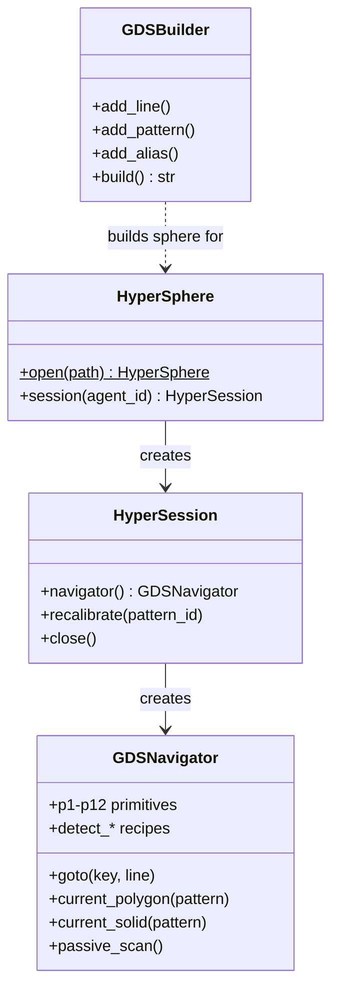
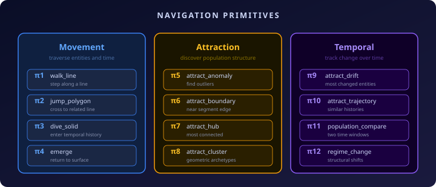
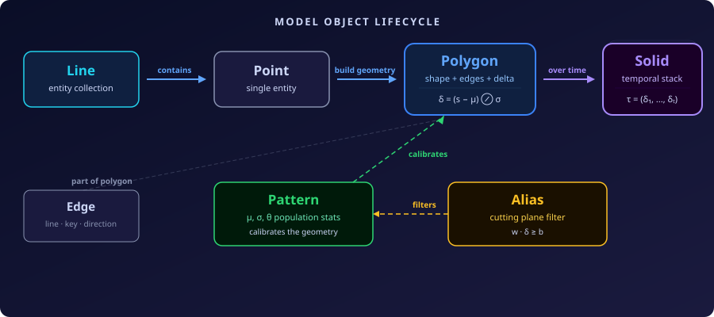
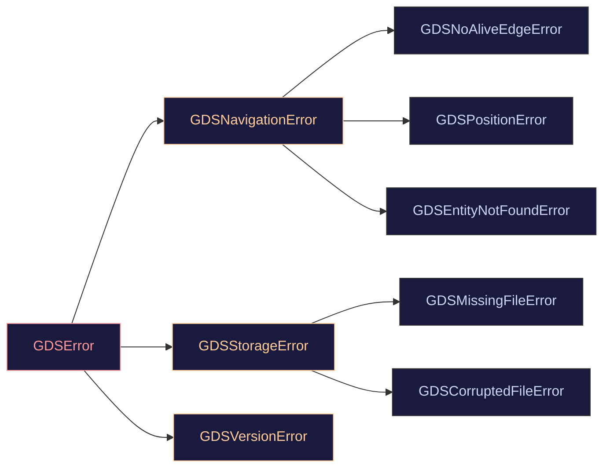

# API Reference

> Navigable overview of the hypertopos Python API — classes, methods, and error hierarchy.

---

## Class Hierarchy


```mermaid
classDiagram
    class HyperSphere {
        +open(path) HyperSphere$
        +session(agent_id) HyperSession
    }
    class HyperSession {
        +navigator() GDSNavigator
        +recalibrate(pattern_id)
        +close()
    }
    class GDSNavigator {
        +goto(key, line)
        +current_polygon(pattern)
        +current_solid(pattern)
        +p1-p12 primitives
        +detect_* recipes
        +passive_scan()
    }
    class GDSBuilder {
        +add_line()
        +add_pattern()
        +add_alias()
        +build() str
    }

    HyperSphere --> HyperSession : creates
    HyperSession --> GDSNavigator : creates
    GDSBuilder ..> HyperSphere : builds sphere for
```

---

## Entry Points

### HyperSphere

| Method | Description |
|--------|-------------|
| `HyperSphere.open(base_path)` | Open a sphere from disk. Returns `HyperSphere` |
| `sphere.session(agent_id)` | Create an isolated session with MVCC-pinned versions |

### HyperSession

| Method | Description |
|--------|-------------|
| `session.navigator()` | Create a `GDSNavigator` bound to this session's manifest |
| `session.recalibrate(pattern_id)` | Full recalibration: recompute mu/sigma/theta, rebuild geometry, reset drift tracker |
| `session.set_forecast_provider(provider)` | Plug in an external forecast provider (or `None` for built-in) |
| `session.close(purge_temporal=False)` | Expire the manifest. Optional: purge agent temporal data |

`HyperSession` is a context manager (`with` statement supported).

### Typical usage

```python
from hypertopos import HyperSphere

sphere = HyperSphere.open("path/to/gds_my_sphere")
with sphere.session("agent-1") as session:
    nav = session.navigator()
    overview = nav.sphere_overview()
    clusters = nav.π8_attract_cluster("pat_customer", n_clusters=4, top_n=3)
    anomalies, total, _, _ = nav.π5_attract_anomaly("pat_customer", top_n=5)
```

---

## Navigation -- GDSNavigator

### Position and Movement

| Method | Description |
|--------|-------------|
| `nav.position` | Property: current position (`Point`, `Polygon`, `Solid`, or `None`) |
| `nav.goto(primary_key, line_id)` | Move to a specific entity. Sets position to `Point` |
| `nav.current_polygon(pattern_id)` | Build the polygon for the current `Point` position |
| `nav.current_solid(pattern_id, filters=None)` | Build the temporal solid for the current `Point` position |
| `nav.event_polygons_for(entity_key, event_pattern_id)` | Return event polygons whose edges reference the entity |

### Navigation Primitives



**Movement** — navigate between entities, lines, and temporal depth:

| Primitive | Method | What it does | Returns |
|-----------|--------|--------------|---------|
| π1 | `π1_walk_line(line_id, direction)` | Step to adjacent entity in a line | `GDSNavigator` |
| π2 | `π2_jump_polygon(polygon, target_line_id, edge_index)` | Cross a polygon edge to a related line | `GDSNavigator` |
| π3 | `π3_dive_solid(primary_key, pattern_id, timestamp)` | Enter an entity's temporal history | `GDSNavigator` |
| π4 | `π4_emerge()` | Return to surface from solid/polygon depth | `GDSNavigator` |

**Attraction** — discover population structure, outliers, clusters, and connectivity:

| Primitive | Method | What it does | Returns |
|-----------|--------|--------------|---------|
| π5 | `π5_attract_anomaly(pattern_id, radius, top_n, fdr_alpha, fdr_method, p_value_method, select, min_confidence)` | Find most anomalous polygons | `(list[Polygon], int, list, dict)` |
| π6 | `π6_attract_boundary(alias_id, pattern_id, direction, top_n, fdr_alpha, fdr_method, p_value_method, select)` | Find entities nearest to alias cutting plane | `list[(Polygon, float)]` |
| π7 | `π7_attract_hub(pattern_id, top_n, line_id_filter, fdr_alpha, fdr_method, p_value_method, select)` | Find entities with highest connectivity | `list[(str, int, float)]` |
| π7+ | `π7_attract_hub_and_stats(pattern_id, top_n, line_id_filter, fdr_alpha, fdr_method, p_value_method, select)` | Hub ranking + population hub score statistics in one scan | `(list, dict)` |
| π8 | `π8_attract_cluster(pattern_id, n_clusters, top_n, sample_size)` | Discover geometric archetypes via k-means++ | `list[dict]` |

**Temporal** — population and trajectory analysis over time:

| Primitive | Method | What it does | Returns |
|-----------|--------|--------------|---------|
| π9 | `π9_attract_drift(pattern_id, top_n, sample_size, fdr_alpha, fdr_method, p_value_method, select)` | Find entities with highest temporal drift | `list[dict]` |
| π10 | `π10_attract_trajectory(primary_key, pattern_id, top_n)` | Find entities with similar temporal trajectory | `list[dict]` |
| π11 | `π11_attract_population_compare(pattern_id, window_a_from, window_a_to, window_b_from, window_b_to)` | Compare population geometry between two time windows | `dict` |
| π12 | `π12_attract_regime_change(pattern_id, timestamp_from, timestamp_to)` | Detect population geometry regime shifts | `list[dict]` |

### Graph Traversal (Edge Table)

| Method | Description |
|--------|-------------|
| `find_geometric_path(from_key, to_key, pattern_id, max_depth=5, beam_width=50, scoring="geometric")` | Bidirectional BFS for paths between two entities via the edge table, scored by geometric coherence. Scoring modes: `"geometric"` (witness overlap + delta alignment + anomaly preservation), `"amount"` (geometric score modulated by log(transaction amount)), `"anomaly"` (prefer paths through anomalous entities), `"shortest"` (plain BFS, no geometric scoring). Returns top `beam_width` paths by score |
| `discover_chains(primary_key, pattern_id, time_window_hours=168, max_hops=10, min_hops=2, max_chains=100, direction="forward")` | Runtime temporal BFS on the edge table to discover entity chains from a starting point. Unlike `find_chains_for_entity()` which queries pre-computed chains, this performs live traversal -- works without build-time chain extraction |
| `entity_flow(primary_key, pattern_id, top_n=20, *, timestamp_cutoff=None)` | Net flow analysis per counterparty via edge table. Two edge lookups (outgoing + incoming), sum amounts, compute per-counterparty net flow. `timestamp_cutoff` (Unix seconds) restricts to edges with `timestamp <= cutoff`. Returns outgoing/incoming totals, net_flow, flow_direction, counterparties sorted by abs(net_flow) |
| `contagion_score(primary_key, pattern_id, *, timestamp_cutoff=None)` | Score how many of an entity's counterparties are anomalous via edge table + geometry check. `timestamp_cutoff` enables as-of contagion reconstruction. Returns score (0.0–1.0), total/anomalous counterparty counts |
| `contagion_score_batch(primary_keys, pattern_id, max_keys=200, *, timestamp_cutoff=None)` | Batch contagion scoring for multiple entities — forwards `timestamp_cutoff` to each per-entity call. Returns per-entity scores plus summary (mean, max, high_contagion_count) |
| `degree_velocity(primary_key, pattern_id, n_buckets=4, *, timestamp_cutoff=None)` | Temporal connection velocity — buckets edges by timestamp, counts unique counterparties per bucket. Velocity = last_bucket_degree / first_bucket_degree. `timestamp_cutoff` clamps the last bucket endpoint by filtering edges at the read level. Returns buckets with out/in degree, velocity metrics |
| `investigation_coverage(primary_key, pattern_id, explored_keys)` | Agent guidance: how much of an entity's edge neighborhood has been explored. Splits counterparties into explored/unexplored, batch anomaly check on unexplored |
| `propagate_influence(seed_keys, pattern_id, max_depth=3, decay=0.7, min_threshold=0.001, max_affected=10_000, *, timestamp_cutoff=None)` | BFS influence propagation from seed entities with geometric decay and tx_count weighting. At each hop: influence = parent_score * decay * geometric_coherence * tx_weight. `timestamp_cutoff` restricts BFS expansion to edges with `timestamp <= cutoff`. Returns affected_entities with tx_count per neighbor |
| `cluster_bridges(pattern_id, n_clusters=5, top_n_bridges=10)` | Find entities bridging geometric clusters via edge table. Runs π8 clustering then identifies cross-cluster edges and bridge entities |
| `anomalous_edges(from_key, to_key, pattern_id, top_n=10)` | Find edges between two entities enriched with event-level geometry (delta_norm, is_anomaly). Unlike path tools which score entities (anchor), this scores individual transactions (event geometry) |
| `edge_potential(from_key, to_key, pattern_id)` | Per-edge geometric anomaly score (distance × 1/pair_count). Complements `delta_norm`. Returns `{score, delta_distance, pair_tx_count, effective_weight, interpretation}` |
| `attract_edge_potential(pattern_id, top_n, from_key, to_key, min_pair_count)` | Rank all edges by `edge_potential` DESC. Scope to an entity with from/to. |
| `score_motif(entity_key, motif_type, pattern_id, time_window_hours=None, amt1_min=10000.0, amt2_max=10000.0, min_k=None, k=4, direction="forward", min_m=3)` | Score best structural motif seeded at entity. `pattern_id` must be an **anchor** pattern (event-pattern inputs are rejected with a `GDSNavigationError` pointing at the anchor companion). `motif_type` ∈ {`fan_out`, `fan_in`, `cycle_2`, `cycle_3`, `structuring`, `chain_k`, `split_recombine`, `bipartite_burst`}. Composes `edge_potential` via product across motif edges. Defaults: fan_out/fan_in=168h, cycle_2=24h, cycle_3=72h, structuring=1h, chain_k=168h, split_recombine=168h, bipartite_burst=24h. `amt1_min`/`amt2_max` gate the three hops of a `structuring` motif; `k` sets chain length for `chain_k` (3 ≤ k ≤ 8, default 4); `min_k` overrides the distinct-neighbour (or source-side, for bipartite_burst) cardinality threshold for `fan_out` / `fan_in` / `split_recombine` / `bipartite_burst` (default 3 when `None`, must be ≥ 2); `direction` ("forward" or "backward") picks whether the seed plays the source S or sink D of a `split_recombine` diamond; `min_m` sets the sink-side cardinality of a `bipartite_burst` K_{k,m} subgraph (default 3, must be ≥ 2); each parameter is ignored for motif types it doesn't gate. |
| `find_high_potential_motifs(pattern_id, motif_type, top_n, time_window_hours, seeds, min_k, amt1_min, amt2_max, k, direction="forward", min_m=3)` | Rank motifs of a given type across the pattern. `pattern_id` must be an **anchor** pattern; passing an event pattern raises `GDSNavigationError` (same gate as `score_motif`). LRU-cached per (pattern, motif_type, window, amt1_min, amt2_max, k, direction, min_m), cap 8. `cycle_3` deduplicated by canonical ring; `structuring` and `chain_k` deduplicated by canonical path tuple; `split_recombine` deduplicated by `(direction, source, sink, sorted intermediaries)`; `bipartite_burst` deduplicated by `(frozenset sources, frozenset sinks)`. `min_k` applies to `fan_out` / `fan_in` / `split_recombine` / `bipartite_burst` (default 3); `k` applies to `chain_k` (default 4); `direction` applies to `split_recombine`; `min_m` applies to `bipartite_burst`. |
| `find_witness_cohort(primary_key, pattern_id, top_n=10, *, config=None, edge_pattern_id=None)` | Rank entities that share the target's witness signature. Investigative peer ranking — NOT edge forecasting. Combines four signals: `exp(-distance/theta)` delta similarity, witness Jaccard overlap, trajectory cosine alignment (optional), and graded anomaly bonus from `delta_rank_pct`. Excludes entities already connected via BTREE edge lookup — this is the function's main contribution over plain ANN. Configure via `WitnessCohortConfig(weights=WitnessCohortWeights(...), candidate_pool, min_witness_overlap, min_score, use_trajectory, bidirectional_check, timestamp_cutoff)`. Returns `WitnessCohortResult` with ranked `CohortMember` items, per-component scores, exclusion counts, and reproducibility metadata |
| `find_novel_entities(pattern_id, top_n=10, sample_size=5000)` | Rank entities by geometric deviation from neighbor-expected position using edge table adjacency. High `novelty_score` = entity doesn't behave like its neighborhood. Requires a pattern with an edge table. Returns list of dicts with `primary_key`, `novelty_score`, and per-dimension decomposition |

### Analysis and Detection

**Entity investigation:**

| Method | Description |
|--------|-------------|
| `explain_anomaly(primary_key, pattern_id)` | Structured investigation: severity, witness set, repair set, conformal p-value, reputation, Bregman contributions under `top_dimensions[]` (fields: `dim`, `kind`, `bregman`, `pct_of_total`), and `reliability_flags` (per-polygon triage: `single_dim_driven`, `dominant_dim`, `dominant_dim_share`, `low_confidence_bucket`, `confidence`, `flags`). `dominant_dim` agrees with `top_dimensions[0]["dim"]` for the same polygon |
| `trace_root_cause(primary_key, pattern_id, max_depth, max_branches)` | Multi-hop root-cause DAG: composes `explain_anomaly` + `find_counterparties` + `contagion_score` + `π7_attract_hub` into one bounded tree. Returns `{root, summary, hop_count, branches_explored, truncated}`. Replaces `explain_anomaly_chain` |
| `find_similar_entities(primary_key, pattern_id, top_n, dim_mask, metric)` | ANN search for nearest entities in delta-space. `dim_mask`: list of dimension names to restrict distance. `metric`: `"L2"` or `"cosine"`. Returns `SimilarityResult` |
| `contrast_populations(pattern_id, group_a, group_b)` | Dimension-by-dimension comparison of two entity groups (Cohen's d) |
| `composite_risk(primary_key, line_id, *, include_reliability_flags=True)` | Wilson harmonic-mean p-value (HMP) combination of conformal p-values across patterns. Robust under positive dependence between patterns. Returns `combined_p`, `n_patterns`, `per_pattern{}`, and (when `include_reliability_flags=True` and the entity has a direct anchor pattern) `reliability_flags` for the home polygon. `chi2` / `df` fields removed (HMP has no chi-squared statistic) |
| `composite_risk_batch(primary_keys, line_id, *, include_reliability_flags=False)` | Batch HMP combination for multiple entities. `include_reliability_flags` defaults `False` on the bulk path — every per-entity attachment triggers an extra polygon build, so 200 entities × one build is bounded by opt-in. Investigators who need per-entity reliability metadata in bulk call `composite_risk` individually |
| `combine_anomaly_pvalues(pattern_id, *, detectors, weights, sample_size, top_n)` | Multi-detector anomaly consensus via HMP across five orthogonal detectors (`delta_norm`, `neighbor_contamination`, `segment_shift`, `trajectory_continuous`, `density_gap`). `density_gap` contributes no per-entity p-value (structurally aggregate — findings describe missing population, not per-entity attribution) so is silently skipped. Returns ranked list of `{primary_key, hmp, p_per_detector, rank, reliability_flags}` ascending by `hmp` — `reliability_flags` is attached post-truncation only |
| `cross_pattern_profile(primary_key, line_id)` | Anomaly status from all patterns the entity participates in |
| `find_chains_for_entity(primary_key, pattern_id, top_n)` | Find chains involving a specific entity |
| `find_neighborhood(primary_key, pattern_id, max_hops)` | BFS through polygon edges to find reachable entities |
| `find_counterparties(primary_key, line_id, from_col, to_col, pattern_id, top_n, use_edge_table=True, *, timestamp_cutoff=None)` | Discover counterparty entities from event data. When pattern_id is given and edge table exists, uses BTREE fast path with amount_sum/amount_max per counterparty. `timestamp_cutoff` applies to the edge-table fast path only; raises `GDSNavigationError` when supplied without an edge-table-eligible configuration |
| `assess_false_positive(primary_key, pattern_id)` | Evaluate likelihood of false positive anomaly classification |

**Detection recipes (population-level patterns):**

| Method | Description |
|--------|-------------|
| `detect_cross_pattern_discrepancy(entity_line, top_n)` | Entities anomalous in exactly one pattern but normal elsewhere |
| `detect_neighbor_contamination(primary_key, pattern_id)` | Check if entity's neighbors show anomaly clustering |
| `detect_trajectory_anomaly(pattern_id, top_n_per_range)` | Entities with unusual temporal trajectory shapes (arch, v-shape, spike) |
| `detect_segment_shift(pattern_id, min_shift_ratio)` | Segments with disproportionate anomaly rates vs baseline |
| `detect_event_rate_anomaly(pattern_id, threshold)` | Entities with high event anomaly rate but normal anchor geometry |
| `detect_hub_anomaly_concentration(pattern_id, top_n)` | Hubs whose neighborhood is dominated by anomalies |
| `detect_composite_subgroup_inflation(entity_line, group_by)` | Subgroups with inflated composite risk vs population baseline |
| `detect_collective_drift(pattern_id, top_n)` | Clusters of entities drifting in the same geometric direction |
| `detect_temporal_burst(pattern_id, window_days)` | Entities with bursty event patterns (z-score on rolling windows) |
| `detect_data_quality_issues(pattern_id)` | Coverage gaps, dead dimensions, theta ceiling proximity |

### Multi-detector consensus (HMP)

Cross-pattern composition (`composite_risk`) and cross-detector
composition (`combine_anomaly_pvalues`) both combine independent p-values
via Wilson's harmonic-mean p-value (HMP):

```
HMP = sum(w_i) / sum(w_i / p_i)
```

with weights `w_i` defaulting to uniform `1/n` across the inputs that
fired. The combiner lives in `engine/composition.py` (`harmonic_mean_p`)
and is paired with a direct null-simulation threshold lookup
(`hmp_threshold_at_alpha(L, alpha)`, deterministic via fixed seed and
LRU-cached).

HMP is robust under positive dependence between inputs (Wilson 2019,
*PNAS*), which is the regime composite anomaly scoring actually faces:
multiple patterns derived from the same event line share dimensions and
fire together on the same entity. Fisher's method assumed independence
and inflated combined significance whenever inputs co-fired.

`combine_anomaly_pvalues` orchestrates five detector adapters from
`engine/p_value_calibration.py`:

| Detector | Source signal | p-value transform |
|----------|---------------|-------------------|
| `delta_norm` | population-relative geometry deviation | `1 − anomaly_confidence` (chi² survival fallback when null) |
| `neighbor_contamination` | k-neighbour anomaly density | hypergeometric upper-tail |
| `segment_shift` | categorical-segment anomaly rate | Fisher exact 2×2 back-projected per entity |
| `trajectory_continuous` | DTW distance vs population-median trajectory (`engine/topology.py`) | ECDF survival |
| `density_gap` | local density-gap detector findings | structurally aggregate — emits `{}` per entity (findings describe missing population, no per-entity attribution) |

Detectors that fail to produce a value for a given entity are silently
skipped — HMP is then computed from the remaining detectors. `delta_norm`
is the always-available primary path.

### Population Queries

| Method | Description |
|--------|-------------|
| `sphere_overview(pattern_id=None)` | Population summary for one or all patterns (rates, calibration health, dimension stats) |
| `anomaly_summary(pattern_id, max_clusters)` | Anomaly population breakdown with geometric clustering |
| `aggregate_anomalies(pattern_id, group_by)` | Group anomalies by a property column with per-group rates |
| `aggregate(event_pattern_id, group_by_line)` | Aggregate event polygons by group with metric computation |
| `check_alerts(pattern_id=None)` | Implicit health checks: anomaly rate spikes, population shocks, calibration staleness, stale ANN vector index |
| `vector_index_health(pattern_id, line_id=None)` | ANN (IVF) index staleness for a pattern's geometry: indexed/unindexed row counts, `is_stale`, recommendation (metadata-only read) |
| `hub_score_stats(pattern_id)` | Hub score distribution statistics |
| `check_anomaly_batch(pattern_id, primary_keys)` | Batch anomaly status check for multiple entities |
| `temporal_quality_summary(pattern_id)` | Temporal anomaly persistence metrics |
| `line_geometry_stats(pattern_id)` | Per-relation-line entity count breakdown from geometry |
| `line_profile(line_id, property_name)` | Column profiling on raw points table (categorical, numeric, temporal) |
| `search_entities_fts(line_id, query, limit)` | Full-text BM25 search across string properties |
| `search_hybrid(primary_key, pattern_id, line_id, query, top_n=10)` | Hybrid search combining FTS with geometric similarity (reciprocal rank fusion) |

---

## Builder -- GDSBuilder

### Constructor

```python
builder = GDSBuilder(
    sphere_id="my_sphere",
    output_path="/path/to/output",
    name="My Sphere",
    description="Optional description",
)
```

### Methods

| Method | Description |
|--------|-------------|
| `add_line(line_id, data, key_col, source_id, role)` | Register an entity line from Arrow table or list of dicts |
| `add_pattern(pattern_id, pattern_type, entity_line, relations)` | Define a geometric pattern with relations, thresholds, and optional grouping |
| `add_event_dimension(pattern_id, column, edge_max)` | Add a continuous dimension to an event pattern (amounts, quantities) |
| `add_derived_dimension(anchor_line, event_line, anchor_fk, metric, metric_col, dimension_name)` | Dimension derived from event aggregation (count, sum, max, std, mean) |
| `add_composite_line(anchor_line, event_line, anchor_fk, ...)` | Create composite anchor line from event-anchor join |
| `add_precomputed_dimension(anchor_line, dimension_name, edge_max)` | Dimension from a column already on the entity table |
| `add_graph_features(anchor_line, event_line, from_col, to_col, features)` | Auto-compute graph structural features (degree, reciprocity, pagerank, betweenness, community, clustering, components) |
| `add_chain_line(line_id, chains, features)` | Create anchor line from extracted chain dicts |
| `add_alias(alias_id, base_pattern_id, cutting_plane_dimension, cutting_plane_threshold)` | Register an alias with a cutting plane for sub-population analysis |
| `build(temporal_configs=None)` | Validate, compute statistics, write all files. Pass `temporal_configs` to run geometry→temporal pipeline per pattern. Returns output path |
| `incremental_update(pattern_id, changed_entities, deleted_keys, recalibrate, reindex, recompute_ranks)` | Add/modify/delete entities without a full rebuild; new entities are immediately visible to anomaly search. Supports patterns whose dimensions are relations, event dimensions, edge-dim aggregations, and tracked properties; group-calibrated (`group_by_property`), GMM, and FDR-hierarchy patterns are rejected and must be rebuilt. `reindex=True` rebuilds the ANN index immediately; `recompute_ranks=False` defers the global `delta_rank_pct` recompute for batched ingestion |
| `finalize_incremental(pattern_id)` | Recompute the global `delta_rank_pct` percentile once and rebuild the ANN index. Call at the end of a batched ingestion session that used `recompute_ranks=False` |
| `build_temporal(time_col, time_window)` | Generate temporal snapshots from time-windowed event data. Call after `build()` when not using pipeline mode |

### RelationSpec

```python
@dataclass
class RelationSpec:
    line_id: str                        # Target line
    fk_col: str | None                  # FK column name (None for "self")
    direction: Literal["in", "out", "self"] = "in"
    required: bool = True
    display_name: str | None = None
    edge_max: int | None = None         # None = binary, int = continuous count cap
```

---

## Storage -- GDSReader / GDSWriter

### Edge Table (GDSReader)

| Method | Description |
|--------|-------------|
| `read_edges(pattern_id, from_keys=None, to_keys=None, timestamp_from=None, timestamp_to=None, columns=None)` | Read edge table with Lance BTREE-indexed push-down filters. Returns `pa.Table` |
| `has_edge_table(pattern_id)` | Check if an edge table exists for a pattern. Returns `bool` |
| `edge_table_stats(pattern_id)` | Quick statistics (row count, unique entities, timestamp/amount ranges). Returns `dict` or `None` |
| `edge_stats_cached(pattern_id)` | Read precomputed edge_stats JSON only — never falls back to a live scan. Returns `dict` or `None` if cache missing |

### Edge Table (GDSWriter)

| Method | Description |
|--------|-------------|
| `write_edges(pattern_id, edges_table)` | Write edge table as a Lance dataset with BTREE indexes on `from_key` and `to_key` |
| `append_edges(pattern_id, new_edges)` | Append new edges to an existing Lance dataset (streaming build) |
| `create_edge_indexes(pattern_id)` | Build BTREE indexes on `from_key` and `to_key` after streaming writes |

### Edge Features Sidecar (GDSReader)

| Method | Description |
|--------|-------------|
| `read_edge_features(pattern_id)` | Read the per-edge derived dimension sidecar at `_gds_meta/edge_features/{pattern_id}/data.lance`. Returns an empty `pa.Table` conforming to `EDGE_FEATURES_SCHEMA` when no sidecar exists (the pattern did not declare an `edge_dimensions:` block). Forward-compatibility entry for a future HopPredicate query API; current navigator primitives read the dim values from the polygon `shape_snapshot` directly. |

### `GDSNavigator.find_motif_by_hops`

```python
nav.find_motif_by_hops(
    pattern_id: str,
    hops: list[HopPredicate],
    *,
    seed_keys: list[str] | None = None,
    max_results: int = 100,
    score: bool = False,
    time_window_hours: float | None = None,
) -> dict
```

Declarative motif API — power-user escape hatch from the closed-vocab `find_motif` registry. Caller passes a list of `HopPredicate`s describing per-hop constraints (`amount_min`, `amount_max`, `time_delta_max_hours`, `amount_ratio_to_prev`, `direction` (`"forward"` / `"reverse"` / `"any"`), `edge_dim_predicates: dict[str, tuple[op, value]]`); the navigator walks the in-memory `AdjacencyIndex` for matching chains via level-synchronous BFS. `seed_keys=None` enumerates from all `from_key` nodes (capped at `max_results`). `time_window_hours` (optional, default `None`) caps the total chain span: when set, every hop after the first must satisfy `abs(current_edge_ts - first_edge_ts) <= time_window_hours`; independent of per-hop `time_delta_max_hours`, both apply when both are set. When `score=True`, the navigator resolves the event pattern's anchor companion via `_resolve_anchor_pattern_for_scoring` and scores each motif as the product of event-aware `edge_potential` (`delta_distance × (1/effective_pair_count) × (1 + event_norm)`) across its edges. The `event_norm` factor (norm of the event pattern's per-transaction polygon for each edge's `event_key`) breaks ties between motifs that share a node sequence but use different transactions. Scored motifs gain `score`, `score_breakdown` (per-edge entries carry `edge_potential`, `delta_distance`, `pair_tx_count`, `effective_weight`, `event_factor`), and `anchor_pattern_id` fields together (sorted descending on score, unscored motifs at tail). Returns `{pattern_id, n_results, motifs}` with each motif carrying `nodes`, `edges` (event_keys), `timestamps`, `amounts`, `dim_values_per_hop` (only when `edge_dim_predicates` were used), and the score triple when `score=True` succeeds. Raises on anchor pattern (event-only), unknown pattern, empty hops, hop count outside `1..8`, non-positive `time_window_hours`, `max_results<1`, or `score=True` with no anchor companion configured for the pattern.

### `HopPredicate` (dataclass, frozen)

Fields: `amount_min`, `amount_max`, `time_delta_max_hours`, `amount_ratio_to_prev` (`float | None`, decreasing-chain ratio in `(0, 1.0]`; rejects edge unless `current_amount / prev_hop_amount ≤ ratio`; must be `None` on `hops[0]`; edges with non-positive amounts are silently skipped), `direction` (Literal["forward", "reverse", "any"], default `"forward"`), `edge_dim_predicates` (`dict[str, tuple[str, float]]`, e.g. `{"pair_edge_count": (">=", 20.0)}`). Operators: `<`, `<=`, `>`, `>=`, `==`. `require_anomalous_entity` (`bool`, default `False`) — when `True` on hop `i`, the destination entity (`nodes[i+1]`) must satisfy `is_anomaly=True` in the resolved anchor companion pattern's geometry; constraints AND across hops; filter runs at the navigator post-BFS, pre-scoring; `max_results` applies AFTER the filter; raises `GDSNavigationError` when no anchor companion is configured.

### Density Gaps Engine (`hypertopos.engine.density_gaps`)

| Symbol | Description |
|--------|-------------|
| `ECDFEntry(sorted_values)` | Frozen dataclass with `transform(x)` (raw → uniform `[0, 1]`) and `inverse(u)` (uniform → raw). Constructed via `ECDFEntry.from_values(x)` |
| `is_usable_for_gap(col)` | `(bool, reason)` admissibility check — rejects `too_sparse` (<30 finite), `degenerate` (σ≈0), `bernoulli_like` (≤2 unique) |
| `select_pairs_by_corr(corr, *, r_min, r_max, top_k)` | Pick top-`top_k` dim pairs with Pearson `|r| ∈ [r_min, r_max]`, sorted by `|r|` desc |
| `compute_density_gaps_for_pair(u_i, u_j, *, n, bins, alpha)` | Per-cell chi² residuals against uniform-independence expectation, Benjamini-Hochberg correction. Returns under-populated cells with `p_value`, `q_value`, `is_gap` |

### `GDSNavigator.find_density_gaps`

```python
nav.find_density_gaps(
    pattern_id: str,
    *,
    top_n: int = 10,
    dim_pairs: list[tuple[str, str]] | None = None,
    bins: int = 10,
    alpha: float = 0.05,
    r_min: float = 0.1,
    r_max: float = 0.7,
) -> dict
```

Returns dict with `pattern_id`, `n_entities`, `gaps` (each sorted by
`ratio` desc with `dim_i` / `dim_j` / `delta_range_i` / `delta_range_j`
(z-score space — geometry deltas, not raw property values) / `u_range_i`
/ `u_range_j` / `observed` / `expected` / `q_value` / `correlation`), `excluded_dims`, and `n_pairs_tested`. Raises
`GDSNavigationError` for unknown pattern, fewer than 100 entities,
invalid `alpha` / `bins` / `r_min`/`r_max` / `top_n`, or unknown dim
names in user-supplied `dim_pairs`.

### Edge Features Engine (`hypertopos.engine.edge_features`)

| Symbol | Description |
|--------|-------------|
| `EDGE_DIM_KINDS: dict[str, str]` | Per-dim Bregman kind tag (poisson / gaussian / bernoulli) keyed by dim name |
| `compute_pair_edge_count(edges)` | edges per `(from_key, to_key)` directed pair |
| `compute_position_in_chain(edges, *, min_position)` | depth in longest reverse-temporal chain ending at this edge; values below `min_position` zero out |
| `compute_time_since_pair_last_edge(edges, *, burst_seconds, dormant_seconds)` | seconds since previous edge in same pair; first edge → `dormant_seconds` |
| `compute_pair_amount_zscore(edges, *, cv_threshold, min_count)` | signed z-score of amount within LOW_VAR pairs |
| `compute_find_motif_structuring(edges, *, time_window_hours, amt1_min, amt2_max)` | 1.0 if edge participates in any A→B→C→D structuring motif |
| `compute_all_edge_dims(edges, config)` | orchestrator — runs each dim listed in config, returns Arrow table keyed by `event_key` |

### Structuring Engine (`hypertopos.engine.structuring`)

| Symbol | Description |
|--------|-------------|
| `enumerate_structuring_for_seed(seed, edges, *, time_window_sec, amt1_min, amt2_max, max_instances)` | Single-seed enumeration of A→B→C→D motifs anchored at `seed`; returns list of motif dicts |
| `enumerate_structuring_event_keys(edges, *, time_window_sec, amt1_min, amt2_max)` | All-seeds sweep — returns the set of `event_key`s participating in any motif. Build-time helper for `compute_find_motif_structuring` |

### Edge Dimensions YAML Parser (`hypertopos.builder.mapping`)

| Symbol | Description |
|--------|-------------|
| `EdgeDimensionsConfig(dims: dict[str, dict])` | Parsed `edge_dimensions:` block — frozen dataclass attached to `PatternMapping.edge_dimensions` |
| `parse_edge_dimensions(raw_list, *, pattern_type)` | Parse + validate the YAML list of dim entries (bare strings or single-key dicts). Raises `ValueError` on anchor pattern, `min_position < 3`, `cv_threshold` outside `(0, 1]`, `min_count < 2`, non-positive `amt1_min` / `amt2_max` / `time_window_hours`, negative `burst_seconds`, duplicate or unknown dim names, malformed entries |
| `EdgeDimAggregationsConfig(from_event_pattern: str, dims: tuple[str, ...], aggregates_per_dim: dict[str, tuple[str, ...]])` | Parsed `edge_dim_aggregations:` block on an anchor pattern — frozen dataclass attached to `PatternMapping.edge_dim_aggregations`. `dims` is a non-empty tuple of source dim names; `aggregates_per_dim` maps each source dim to the canonical-ordered subset of `AGGREGATE_NAMES` it emits. Direct constructor calls without `aggregates_per_dim` default to all five canonical aggregates per dim |
| `parse_edge_dim_aggregations(raw_dict, *, pattern_type)` | Parse + validate the YAML mapping. Accepts two `dims:` shapes — Form A (list of dim names → all five aggregates per dim) and Form B (mapping `{dim: [agg, ...]}` → explicit per-dim subset). Raises `ValueError` on event pattern, missing `from`, missing/empty `dims`, neither-list-nor-mapping `dims`, empty per-dim agg list, or unknown dim/aggregate name |
| `aggregate_edge_dims_for_anchor(*, anchor_keys, edges, sidecar, dims, anchor_kind, pair_separator, chain_events, key_cols, event_table, thresholds, aggregates_per_dim)` | Aggregate per-edge sidecar dim values up to per-anchor columns. For each source dim in `dims`, emits the aggregates listed in `aggregates_per_dim[dim]` (defaults to all five canonical names: `mean` / `max` / `std` / `p95` / `count_above_threshold`). `anchor_kind` ∈ `{single, pair, chain}`. For chain regime, pass `chain_events: list[str]` of comma-joined event_keys per anchor (one per `anchor_keys` entry); `edges` arg is ignored. `key_cols` carries composite anchor PK columns when k>2. `thresholds` overrides per-dim `_count_above_threshold` cutoffs (default = population p95 of each source dim from the sidecar). Returns a `pa.Table` keyed by `primary_key` with one column per `<dim>_<agg>` selected |

### Calibration History (GDSReader)

| Method | Description |
|--------|-------------|
| `read_calibration_fit(pattern_id, version=None)` | Load one calibration epoch as a frozen `CalibrationFit` dataclass. `version=None` resolves to the pattern's current `calibration_epoch` from sphere.json. Raises `CalibrationNotFoundError` if the requested version does not exist on disk (trimmed by GC, or schema bump wiped history). When `calibration_history/` is absent, `version=None` and `version=1` both reconstruct a `CalibrationFit` from the inline sphere.json fields; any `version >= 2` raises `CalibrationNotFoundError`. |
| `list_calibration_versions(pattern_id)` | Return all available calibration epochs for a pattern, ascending. Returns the integers `N` present in `_gds_meta/calibration_history/{pattern_id}/v={N}.json`, or `[1]` when the history dir is absent (no past full builder runs). |
| `read_calibration_history_policy()` | Read the `calibration_history_policy` from sphere.json. Defaults to `{"last_k": 5}` if absent. Raises `ValueError` if `last_k < 1`. |

### `CalibrationFit` (dataclass, frozen)

Fields: `pattern_id`, `calibration_epoch`, `schema_version`, `schema_hash`,
`mu`, `sigma_diag`, `theta`, `population_size`, `dimension_weights`,
`dimension_kinds`, `dim_percentiles`, `group_stats`, `gmm_components`,
`edge_max`, `computed_at`, `last_calibrated_at`.

### `CalibrationNotFoundError` (exception)

Extends `GDSError`. Raised by `read_calibration_fit` when the requested epoch
is not on disk.

### Calibration drift

#### `GDSNavigator.compare_calibrations(pattern_id, v_from=None, v_to=None, top_n=10, verbose=False) -> CalibrationDriftReport`

Per-dimension μ/σ/θ drift between two calibration epochs of the same pattern.
Auto-resolves: both `None` → second-to-last vs last; only `v_to=None` →
explicit `v_from` vs latest. Returns a `CalibrationDriftReport` with an
aggregate `overall_drift_rms` (RMS in σ units), ranked `top_drifted`
list, and optional full `per_dimension` breakdown when `verbose=True`.

Raises `ValueError` on `v_from == v_to`, single-epoch auto-resolve, or
schema_hash mismatch (cross-schema mu vectors are not dimensionally
comparable). `CalibrationNotFoundError` bubbles from missing versions.

#### `CalibrationDriftReport` (dataclass, frozen)

Fields: `pattern_id`, `v_from`, `v_to`, `schema_hash`,
`population_size_from`, `population_size_to`, `overall_drift_rms`,
`top_drifted: list[DimensionDrift]`, `per_dimension: list[DimensionDrift] | None`,
`edge_dim_threshold_drift: dict[str, dict[str, float]] | None` —
per-source-dim `{from, to, delta}` of the `_count_above_threshold` cutoff
when both compared epochs declared `edge_dim_aggregations:` on the anchor
pattern; `None` when at least one epoch lacks the aggregations block.

#### `DimensionDrift` (dataclass, frozen)

Fields: `dim_index`, `dim_kind`, `mu_from`, `mu_to`, `mu_delta`,
`mu_delta_normalized` (z-score: `(mu_to - mu_from) / sigma_from` with
`sigma_safe` guard for degenerate dims), `sigma_from`, `sigma_to`,
`sigma_delta`, `theta_from`, `theta_to`, `theta_delta`.

### Drift decomposition

#### `GDSNavigator.decompose_drift(entity_key, pattern_id, v_from=None, v_to=None, timestamp_from=None, timestamp_to=None, top_n=10, verbose=False) -> IntrinsicExtrinsicReport`

Decompose an entity's drift between two temporal slices into intrinsic
(entity-driven, σ_v1-normalised shape change) and extrinsic (population-
recalibration-driven, residual) components, viewed across two calibration
epochs. Auto-resolves: both version args `None` → oldest retained vs current;
both timestamp args `None` → first vs last temporal slice. Returns an
`IntrinsicExtrinsicReport` with aggregate L2 displacements, sum-of-squares
`intrinsic_fraction` in [0, 1], ranked `top_dimensions`, and optional full
`per_dimension` breakdown when `verbose=True`.

Raises `ValueError` on `<2` retained epochs, `v_from == v_to`, schema_hash
mismatch, `<2` slices in window, or event pattern. `CalibrationNotFoundError`
bubbles up from missing versions.

#### `IntrinsicExtrinsicReport` (dataclass, frozen)

Fields: `pattern_id`, `entity_key`, `v_from`, `v_to`, `schema_hash`,
`timestamp_from`, `timestamp_to`, `intrinsic_displacement`,
`extrinsic_displacement`, `total_displacement`, `intrinsic_fraction`,
`top_dimensions: list[DimensionDecomposition]`, `per_dimension: list[DimensionDecomposition] | None`.

#### `DimensionDecomposition` (dataclass, frozen)

Fields: `dim_index`, `dim_kind`, `dim_label`, `total` (delta_b - delta_a),
`intrinsic` ((s_b - s_a) / σ_v1), `extrinsic` (residual), `intrinsic_fraction`
(per-dim sum-of-squares ratio in [0, 1]).

### Influence analysis

#### `GDSNavigator.find_calibration_influencers(pattern_id, top_n=10, classify="hidden", high_threshold_pct=90.0, sample_size=None, verbose=False) -> InfluenceReport`

Detect entities with high influence on coordinate system calibration. Classifies
into the 4-cell influence × anomaly matrix (hidden / distorter /
standard_anomaly / normal); default `classify="hidden"` returns top_n entities
with high `total_impact` but low anomaly score (the patent's primary detection
cell — entities defining what 'normal' means without being detected as anomalous).

Math: exact leave-one-out via rolling Σs/Σs². For each entity E:
- `μ_without[i] = (Σs[i] - s_E[i]) / (N-1)`
- `σ²_without[i] = (Σs²[i] - s_E[i]²) / (N-1) - μ_without[i]²`
- `mu_impact = ‖(μ_full - μ_without) / σ_full_safe‖`
- `sigma_impact = ‖(σ_full - σ_without) / σ_full_safe‖`
- `total_impact = sqrt(mu_impact² + sigma_impact²)`

Classification: `high_impact = total_impact ≥ percentile(total_impact, high_threshold_pct)`;
`high_anomaly = ‖δ(E)‖ ≥ θ_norm`.

`verbose=True` attaches per-entry `cascading_flip_count` — count of
OTHER entities flipping `is_anomaly` after this entity's removal.

Raises `ValueError` on event pattern, `N<2`, `high_threshold_pct ∉ (0, 100)`,
invalid `classify`, or `top_n ∉ [1, 50]`.

#### `GDSNavigator.find_group_influence(pattern_id, groups) -> list[GroupInfluenceReport]`

Caller-supplied per-group leave-set-out impact. For each input
group, computes the set's collective μ/σ shift plus
`reinforcing_factor = total_impact_set / Σ_individuals`. Reinforcing > 1
indicates members pull together (coordinated injection or duplicate-record
contamination); < 1 indicates canceling (members offset each other).

Returns `list[GroupInfluenceReport]` (input order preserved).

Raises `ValueError` on event pattern, `N<3`, empty groups list, group with
`<2` members, group `≥ N`, missing entity_key, duplicate entity in group, or
undefined reinforcing factor (sum of individual impacts = 0).

#### Additive surface on `find_anomalies` MCP tool

Each per-entity polygon dict gains 2 scalar fields: `total_impact` (M4
leave-one-out scalar) and `classification` (`"hidden"` / `"distorter"` /
`"standard_anomaly"` / `"normal"`). Resolves to `null` per-entry when pattern
is event-type, `N<2`, or storage backend lacks shape-reconstruction
prerequisites — keeps batch response intact.

#### `InfluenceReport` (dataclass, frozen)

Fields: `pattern_id`, `pattern_version`, `population_size`, `high_threshold_pct`,
`total_impact_threshold`, `theta_norm`, `classify_filter`,
`cell_counts: dict[str, int]`, `entries: list[InfluenceEntry]`.

#### `InfluenceEntry` (dataclass, frozen)

Fields: `entity_key`, `mu_impact`, `sigma_impact`, `total_impact`, `delta_norm`,
`classification`, `top_dim_contributions: list[DimensionContribution]`,
`cascading_flip_count: int | None`.

#### `GroupInfluenceReport` (dataclass, frozen)

Fields: `pattern_id`, `pattern_version`, `group_index`, `member_count`,
`members: list[str]`, `mu_impact_set`, `sigma_impact_set`, `total_impact_set`,
`sum_individual_impacts`, `reinforcing_factor`,
`top_dim_contributions: list[DimensionContribution]`.

#### `DimensionContribution` (dataclass, frozen)

Fields: `dim_index`, `dim_kind`, `dim_label`, `mu_shift`, `sigma_shift`,
`contribution` (sqrt(mu_shift² + sigma_shift²)).

### Cross-pattern temporal lead-lag

#### `Navigator.find_lead_lag`

```python
nav.find_lead_lag(
    pattern_a: str,
    pattern_b: str,
    *,
    timestamp_from: str | None = None,
    timestamp_to: str | None = None,
    cohort: Literal["fixed", "all"] = "fixed",
    min_epochs: int = 8,
    max_lag: int | None = None,
    fdr_alpha: float = 0.05,
    fdr_method: Literal["bh", "storey"] = "storey",
    verbose: bool = False,
    entity_key: str | None = None,
) -> LeadLagReport
```

Cross-pattern temporal lead-lag in population-relative coordinates. Both
patterns must be `pattern_type="anchor"` and (effectively) over the same
entity space — `cohort="fixed"` raises empty-cohort otherwise. Time alignment
uses the intersection of pattern timestamp sets; `min_epochs` is a hard
floor. Default `max_lag = (N - 1) // 4`.

Three nested answer levels:

1. **Population scalar.** `lag` and `correlation` from the cross-correlation
   of differenced population centroid drift series. Bonferroni-adjusted peak
   threshold (`max_corr_threshold` field) is the cut-off used by
   `is_significant`.
2. **Per-dim D_A × D_B matrix.** `top_dim_pairs` (top 10 by ascending
   q-value, ties broken by descending |corr|) with full sorted matrix in
   `per_dim_pairs` when `verbose=True`. BH or Storey FDR applied to
   Bonferroni-over-lag-adjusted p-values across all `D_A * D_B` pairs.
3. **Per-entity drill-down.** Pass `entity_key` to replace the population
   centroid by that entity's own delta trajectory.

#### `LeadLagReport` (dataclass, frozen)

Fields: `pattern_a`, `pattern_b`, `entity_key: str | None`, `n_epochs_used`,
`n_dropped_a`, `n_dropped_b`, `cohort_size`, `cohort_dropped: int | None`,
`timestamp_from: datetime`, `timestamp_to: datetime`, `schema_hash_a`,
`schema_hash_b`, `lag`, `correlation`,
`centroid_drift_series_a/b: list[float]`, `lag_volatility`,
`correlation_volatility`, `volatility_series_a/b: list[float]`, `agreement`
(`"strong"` / `"weak"` / `"divergent"`), `bartlett_ci_95`,
`max_corr_threshold`, `is_significant`, `fdr_alpha`, `fdr_method`,
`n_dim_pairs`, `n_significant_pairs`, `top_dim_pairs: list[DimPairLeadLag]`,
`per_dim_pairs: list[DimPairLeadLag] | None`, `reliability`
(`"high"` / `"medium"` / `"low"`), `max_lag`,
`correlation_by_lag: list[float]`, `coverage_warning`, `degenerate_signal`.

#### `DimPairLeadLag` (dataclass, frozen)

Fields: `dim_index_a`, `dim_index_b`, `dim_label_a: str | None`,
`dim_label_b: str | None`, `lag`, `correlation`, `p_value`, `q_value`,
`is_significant`.

---

## Model Objects



### Line

| Field | Type | Description |
|-------|------|-------------|
| `line_id` | `str` | Unique identifier |
| `entity_type` | `str` | Logical entity type (e.g. "customers") |
| `line_role` | `"anchor" \| "event"` | Role in the sphere |
| `pattern_id` | `str` | Pattern associated with this line |
| `versions` | `list[int]` | Available data versions |
| `source_id` | `str \| None` | Source identifier (sibling lines share the same source) |

Key methods: `current_version()`, `has_fts()`.

### Point

| Field | Type | Description |
|-------|------|-------------|
| `primary_key` | `str` | Business key |
| `line_id` | `str` | Which line this point belongs to |
| `version` | `int` | Data version |
| `status` | `"active" \| "expired" \| "ghost"` | Lifecycle status |
| `properties` | `dict[str, Any]` | All non-system columns |
| `created_at` | `datetime` | Creation timestamp |
| `changed_at` | `datetime` | Last modification timestamp |

### Edge

| Field | Type | Description |
|-------|------|-------------|
| `line_id` | `str` | Target line of this edge |
| `point_key` | `str` | Target entity key (empty string for continuous mode) |
| `status` | `"alive" \| "dead"` | Edge liveness |
| `direction` | `"in" \| "out" \| "self"` | Edge direction relative to polygon owner |
| `is_jumpable` | `bool` | `False` for continuous-mode edges (edge_max) |

### Polygon

| Field | Type | Description |
|-------|------|-------------|
| `primary_key` | `str` | Entity this polygon represents |
| `pattern_id` | `str` | Pattern that defines the geometry |
| `pattern_type` | `"anchor" \| "event"` | Pattern class |
| `scale` | `int` | Number of alive edges |
| `delta` | `np.ndarray` | Z-scored deviation from population mean |
| `delta_norm` | `float` | L2 norm of delta (distance from center) |
| `is_anomaly` | `bool` | Whether delta_norm >= theta_norm |
| `edges` | `list[Edge]` | All edges in this polygon |
| `delta_rank_pct` | `float \| None` | Percentile rank within population (0-100) |
| `bregman_divergence` | `float \| None` | Per-entity Bregman divergence score — distribution-aware anomaly distance computed per dimension using its `kind` tag. `None` on pre-2.3 spheres. |
| `anomaly_confidence` | `float \| None` | Bootstrap stability score (0–1): fraction of bootstrap samples in which the entity is classified as anomalous. `None` when bootstrap was skipped (N > 50K, `group_by_property`, or `use_mahalanobis`). |

Key methods: `is_event()`, `is_anchor()`, `alive_edges()`, `edges_for_line(line_id)`.

### Solid

| Field | Type | Description |
|-------|------|-------------|
| `primary_key` | `str` | Entity key |
| `pattern_id` | `str` | Pattern reference |
| `base_polygon` | `Polygon` | Current polygon state |
| `slices` | `list[SolidSlice]` | Temporal deformation history, ordered by time |

Key methods: `slice_at(timestamp)` -- binary search for the slice active at a given time.

### SolidSlice

| Field | Type | Description |
|-------|------|-------------|
| `slice_index` | `int` | Position in temporal sequence |
| `timestamp` | `datetime` | When this deformation occurred |
| `deformation_type` | `"internal" \| "edge" \| "structural"` | What changed |
| `delta_snapshot` | `np.ndarray` | Delta vector at this point in time |
| `delta_norm_snapshot` | `float` | L2 norm of delta_snapshot |

### Pattern

| Field | Type | Description |
|-------|------|-------------|
| `pattern_id` | `str` | Unique identifier |
| `entity_type` | `str` | Logical entity type name |
| `pattern_type` | `"anchor" \| "event"` | Pattern class |
| `relations` | `list[RelationDef]` | Dimension definitions |
| `mu` | `np.ndarray` | Population mean vector |
| `sigma_diag` | `np.ndarray` | Population standard deviation per dimension |
| `theta` | `np.ndarray` | Anomaly threshold vector |
| `population_size` | `int` | Total entity count at calibration time |
| `version` | `int` | Pattern version |
| `prop_columns` | `list[str]` | Boolean property columns tracked as dimensions |
| `edge_dim_names` | `list[str]` | Edge-derived dim names for event patterns that declared an `edge_dimensions:` block in `sphere.yaml`. Order matches the storage layout (after `event_dimensions`, before `prop_columns`). Empty for patterns without `edge_dimensions:`. |
| `dimension_weights` | `np.ndarray \| None` | Per-dimension importance weights |
| `dimension_kinds` | `list[str] \| None` | Per-dimension distribution family: `"gaussian"`, `"poisson"`, or `"bernoulli"`. Populated at build time; `None` on pre-2.3 spheres. |

Key properties: `theta_norm`, `dim_labels`, `delta_dim()`, `is_continuous`, `max_hub_score`.

### Alias

| Field | Type | Description |
|-------|------|-------------|
| `alias_id` | `str` | Unique identifier |
| `base_pattern_id` | `str` | Parent pattern this alias filters |
| `filter` | `AliasFilter` | Includes `cutting_plane` (normal, bias) |
| `derived_pattern` | `DerivedPattern` | Sub-population statistics (mu, sigma, theta) |
| `version` | `int` | Alias version |
| `status` | `str` | Lifecycle status |

---

## Errors


```mermaid
graph LR
    GE["GDSError"]
    GE --> GNE["GDSNavigationError"]
    GE --> GSE["GDSStorageError"]
    GE --> GVE["GDSVersionError"]

    GNE --> NAE["GDSNoAliveEdgeError"]
    GNE --> PE["GDSPositionError"]
    GNE --> ENF["GDSEntityNotFoundError"]

    GSE --> MF["GDSMissingFileError"]
    GSE --> CF["GDSCorruptedFileError"]

    style GE fill:#1a1a3e,color:#f99,stroke:#f99
    style GNE fill:#1a1a3e,color:#fc9,stroke:#fc9
    style GSE fill:#1a1a3e,color:#fc9,stroke:#fc9
    style GVE fill:#1a1a3e,color:#fc9,stroke:#fc9
    style NAE fill:#1a1a3e,color:#ccd6f6,stroke:#333
    style PE fill:#1a1a3e,color:#ccd6f6,stroke:#333
    style ENF fill:#1a1a3e,color:#ccd6f6,stroke:#333
    style MF fill:#1a1a3e,color:#ccd6f6,stroke:#333
    style CF fill:#1a1a3e,color:#ccd6f6,stroke:#333
```

| Error | When raised |
|-------|-------------|
| `GDSError` | Base class for all hypertopos errors |
| `GDSNavigationError` | Navigation operation failed (invalid primitive call, missing data) |
| `GDSNoAliveEdgeError` | p2 jump fails because no alive edge connects to the target line |
| `GDSPositionError` | Current position type is incompatible with the requested operation |
| `GDSEntityNotFoundError` | Primary key not found in the specified line |
| `GDSStorageError` | Storage-layer I/O failure |
| `GDSMissingFileError` | An expected data file was not found on disk |
| `GDSCorruptedFileError` | A data file exists but its content is invalid or unreadable |
| `GDSVersionError` | Version mismatch or requested version not found in manifest |

---

## PassiveScanner

Multi-source batch screening. Scores entities by aggregating signals across multiple geometric sources -- anomaly scores, boundary proximity, attribute rules, and compound criteria.

### Initialization

```python
from hypertopos.navigation.scanner import PassiveScanner

scanner = PassiveScanner(reader, sphere, manifest)
```

Or use the navigator shortcut: `nav.passive_scan(home_line_id)`.

### Methods

| Method | Description |
|--------|-------------|
| `add_source(name, pattern_id, key_type, weight)` | Register a geometry anomaly source (auto-detects key_type) |
| `add_borderline_source(name, pattern_id, rank_threshold)` | Register a near-threshold source (high delta_rank_pct, not anomalous) |
| `add_points_source(name, line_id, rules, combine)` | Register a points-rule source filtering by column thresholds |
| `add_compound_source(name, geometry_pattern_id, line_id, rules)` | Geometry expansion intersected with points rules |
| `add_graph_source(name, pattern_id, contagion_threshold=0.3, weight)` | Register a graph contagion source — flags entities whose anomalous counterparty ratio exceeds threshold. Requires event pattern with edge table |
| `auto_discover(home_line_id, include_borderline, *, include_graph=True)` | Auto-register all patterns related to a line. Also auto-detects graph sources for event patterns with edge tables. Pass `include_graph=False` to skip graph source registration when the downstream scan does not need contagion signal — `detect_cross_pattern_discrepancy` uses this to avoid ~37s-per-event-pattern edge-table reads |
| `scan(home_line_id, scoring, threshold, top_n)` | Execute batch scan across all registered sources. Returns `ScanResult` |

### ScanResult

| Field | Type | Description |
|-------|------|-------------|
| `home_line_id` | `str` | Line being screened |
| `total_entities` | `int` | Population size |
| `total_flagged` | `int` | Entities above threshold |
| `hits` | `list[ScanHit]` | Per-entity results sorted by score descending |
| `elapsed_ms` | `float` | Wall-clock time |

---

## Cross-references

- [Quickstart](quickstart.md) -- getting started with installation and first sphere
- [Concepts](concepts.md) -- mathematical foundations: delta vectors, anomaly thresholds, solids
- [Configuration](configuration.md) -- sphere.json schema, storage backends, aliases
- [Data Format](data-format.md) -- physical Arrow/Lance file layout and schemas
