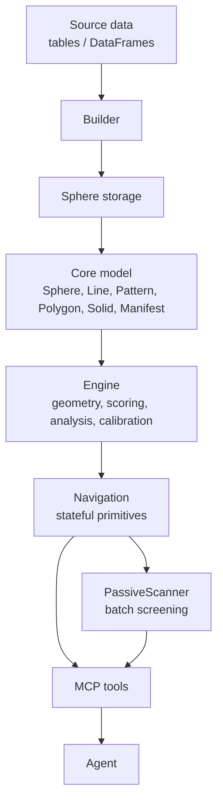
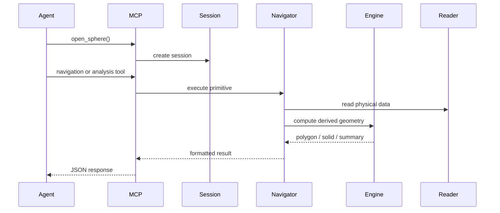
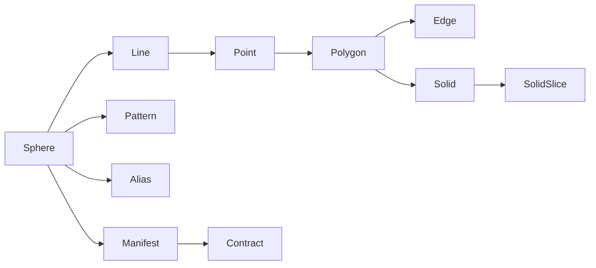
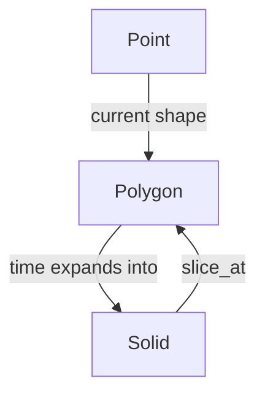
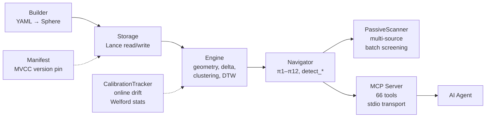
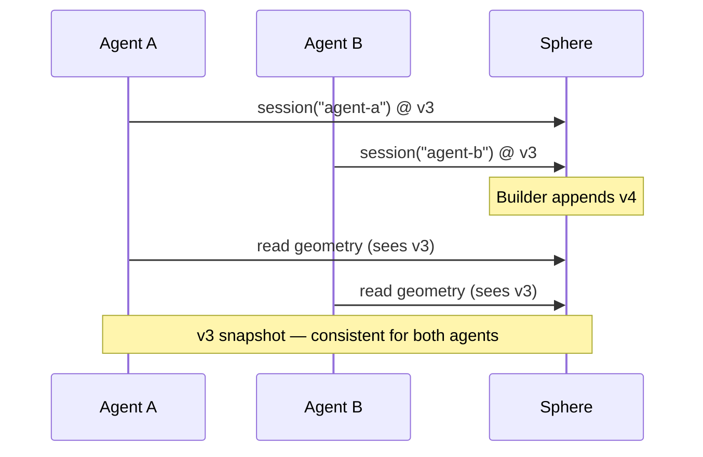

# Architecture

> Compact orientation to the hypertopos package: layers, runtime flow, and component responsibilities.

hypertopos implements the Geometric Data Sphere (GDS) concept.

For the conceptual model, see [concepts.md](concepts.md). For API details, see
[api-reference.md](api-reference.md). For the physical storage format, see
[data-format.md](data-format.md). For getting started, see [quickstart.md](quickstart.md).

## Navigation Primitives

Navigation is expressed through a small set of primitives rather than direct query strings.
The point is not to replace every analytical operation with a custom DSL, but to make the
most common exploratory moves explicit, stateful, and composable.

The `π1`–`π12` family covers movement (π1–π4), population-level attraction (π5–π8), and temporal analysis (π9–π12). Navigation is stateful — each step depends on the agent's current position. Primitives are intentionally small and composable: chain them to build investigation workflows.

For the full list with method signatures and return types, see [API Reference — Navigation Primitives](api-reference.md#navigation-primitives).

## Package Layout

The core package is split into a few layers:

- **Model**: sphere, line, pattern, alias, point, edge, polygon, solid, manifest, contract
- **Storage**: readers, writers, caches, and physical layout handling
- **Engine**: geometry, anomaly scoring, similarity, drift, forecasting, aggregation, calibration tracking
- **Navigation**: stateful step-by-step movement through the sphere
- **PassiveScanner**: multi-source batch screening over navigation primitives
- **Builder**: transforms source data into a complete sphere
- **CLI**: builds and inspects spheres from the command line

The `hypertopos-mcp` package sits on top of this core library and exposes the same capabilities to agents via 66 MCP tools.

The split is deliberate:

- the **model** defines the vocabulary of the system, including Manifest/Contract for MVCC version pinning
- **storage** owns physical reads and writes, scoped by manifest version
- the **engine** computes derived geometry and analysis, with CalibrationTracker for online drift monitoring
- **navigation** orchestrates stateful movement through that geometry
- **PassiveScanner** runs batch screening across multiple geometric sources without manual primitive chaining
- the **builder** performs ingestion-time work that should not happen on every session open
- the **CLI** is an operational entry point for humans and automation

This keeps expensive work in the build phase and keeps the runtime path focused on reading, navigating, and summarizing already-built data.

## Physical Layout

A sphere is stored as a directory tree. The exact storage rules are defined by the core code and package configuration, but the mental model is:

- metadata describes the sphere
- points store source entities
- geometry stores derived vectors and anomaly labels
- edges store entity-to-entity relationships (Lance, BTREE indexed) for graph traversal and chain discovery
- temporal data stores shape history
- auxiliary caches store precomputed summaries

The important point is that the system is designed for on-demand loading. The session does not read every file at startup.

Most of the package logic assumes this storage model:

- the sphere can be opened quickly from metadata
- derived data is read lazily when a primitive needs it
- repeated reads should benefit from cache and precomputed summaries
- build-time artifacts should be stable enough that sessions do not need to recompute them

That means the architecture is optimized for repeated inspection of a built sphere, not for re-deriving the full dataset on every request.

For the full directory structure and Arrow schemas, see [data-format.md](data-format.md).

## Level Design

The package architecture is easier to read when viewed as a few stacked layers:



The runtime flow is similarly layered:



These diagrams are intentionally high-level. They are meant to show the shape of the system, not the implementation details.

For a denser top-down view, this stack is a useful shorthand:

```text
┌─────────────────────────────────────┐
│  MCP Server (hypertopos-mcp)        │  66 tools, smart detection mode
├─────────────────────────────────────┤
│  PassiveScanner                     │  multi-source batch screening
├─────────────────────────────────────┤
│  Navigation (navigator.py)          │  π1–π12 primitives + edge table graph traversal
│                                     │  (find_geometric_path, discover_chains, entity_flow,
│                                     │   contagion_score, propagate_influence, cluster_bridges, ...)
├─────────────────────────────────────┤
│  Engine (geometry.py)               │  delta vectors, metrics, scoring, clustering
│  CalibrationTracker                 │  online Welford drift stats
├─────────────────────────────────────┤
│  Storage (reader.py, writer.py)     │  Lance storage (points, geometry, edges, temporal),
│                                     │  PyArrow transport, partition filtering, BTREE edge indexes
│  Manifest / Contract                │  MVCC version pinning (incl. edge table snapshots)
├─────────────────────────────────────┤
│  Model (sphere.py, objects.py)      │  Point, Edge, Polygon, Solid, Pattern, Alias
├─────────────────────────────────────┤
│  Builder (builder.py)               │  YAML config → sphere build
└─────────────────────────────────────┘
```

This view is intentionally compact. It shows the execution stack from ingestion at the bottom to agent-facing tools at the top.

## Core Model Map



Manifest pins a specific version of every line, pattern, and alias. Contract declares the
structural guarantees of that version snapshot. Together they provide MVCC isolation: multiple
agents can hold different manifests and see consistent, non-interfering views of the same sphere.



## Responsibility Split



## MVCC Model

Multiple agents can open sessions against the same sphere concurrently. Each session is pinned
to a manifest version at open time. The builder may append new versions in the background, but
existing sessions continue to see their pinned snapshot until they explicitly refresh.



This isolation is provided by the Manifest/Contract pair. The manifest records which version
of each line, pattern, and alias the session should use. The contract declares the structural
guarantees of that version. Storage reads are filtered through the manifest, so concurrent
sessions never interfere with each other or with an ongoing build.

## PassiveScanner

PassiveScanner provides multi-source batch screening on top of the navigation primitives.
Instead of manually chaining individual attract calls, an agent can request a scan across
multiple geometric sources in a single operation. The scanner draws candidates from five
source types:

- **geometry** — anomaly scores from delta vectors (via attract_anomaly)
- **borderline** — boundary proximity scores (via attract_boundary)
- **points** — direct point-level attribute filters
- **compound** — combinations of the above, with configurable weighting
- **graph** — anomaly contagion through the edge table (an entity is flagged when its
  graph neighborhood contains anomalous counterparties beyond a configurable threshold)

The scanner collects, deduplicates, and ranks results into a unified candidate list. This
is the primary entry point for broad screening workflows where the agent does not yet know
which specific primitive to focus on. `auto_discover()` registers the appropriate sources
automatically — graph sources are added for every event pattern that has an edge table.

## Build Flow

Building a sphere is an ingestion-time task.

At a high level, the builder:

1. reads structured source tables or DataFrames
2. maps them into lines and patterns
3. computes geometry and population statistics
4. writes the physical datasets
5. builds indexes and auxiliary summaries
6. stores the result as a self-contained sphere

This is where expensive work should happen. The runtime session should mostly read already-prepared data.

In practice, the builder is the place where the package turns raw source data into a reusable geometric asset. If something can be computed once and reused many times, it belongs here rather than in the navigation path.

## Session and Navigation

A session is the agent's working context: open a sphere → create a session (MVCC-pinned) → navigate → close.

Sessions are stateful. The agent starts with a position and moves from there — jump to an entity, walk a line, inspect a polygon, dive into temporal history, compare populations. Primitives compose: some move the position, some inspect it, some expand it into a population-level view.

Opening a session is lightweight (no rebuild). Navigation reuses existing geometry. The session is the working memory of the investigation flow.

## Engine Responsibilities

The engine layer computes the derived signals that make the sphere useful.

Typical responsibilities include:

- geometry construction from population statistics
- clustering and archetype discovery
- similarity search
- anomaly scoring and threshold calibration
- hub and connectivity analysis
- temporal drift and regime analysis
- population comparisons
- aggregation over geometric structure
- **online calibration tracking** via CalibrationTracker, which maintains running Welford
  statistics for drift monitoring without requiring a full population rescan

These computations are what make the GDS representation more than just a storage format.

The engine should stay focused on derived meaning, not on transport or CLI concerns. If a result can be expressed as geometry, score, comparison, or summary, that is usually engine territory.

## MCP Role

The MCP package is a transport and tool layer.

It does not define the core GDS model. Instead, it:

- opens and closes spheres
- exposes 66 navigation and analysis tools
- formats results as JSON
- manages session state for an agentic client

The MCP layer should stay thinner than the core library. Most behavior belongs in `hypertopos`, not in the transport wrapper.

That boundary matters for maintainability:

- core changes should not force transport logic to become aware of storage internals
- transport changes should not leak into the geometric model
- tool outputs should be formatted results, not a second implementation of the domain logic

The MCP layer is valuable because it exposes the model cleanly, not because it redefines it.

## Design Principles

- **Population first**: start with the sphere before drilling down to entities
- **Geometry over rows**: represent structure as vectors, thresholds, and boundaries
- **Persist derived signals**: expensive work should be computed once and reused
- **Keep sessions stateful**: navigation should build on prior context
- **Separate core from transport**: MCP is a wrapper, not the place for core logic
- **Prefer readable defaults**: the system should be useful before the user learns every primitive
- **Version isolation**: concurrent sessions must not interfere with each other

Two more rules are worth keeping in mind:

- **Make the runtime path cheap**: sessions should mostly read, not build
- **Prefer explicit steps over hidden orchestration**: the system should be understandable from the primitives it exposes

## What This Document Is Not

This page is not:

- a full API reference (see [api-reference.md](api-reference.md))
- a storage-format specification (see [data-format.md](data-format.md))
- a getting-started guide (see [quickstart.md](quickstart.md))
- a list of every module in the package
- a detailed design-decision archive

It is a compact orientation document for the package.

## Short Version

hypertopos is a stateful geometric analytics system.

It turns business data into a sphere, preserves the derived structure needed for navigation, and gives agents a way to explore that structure step by step instead of flattening everything into a single query result.
