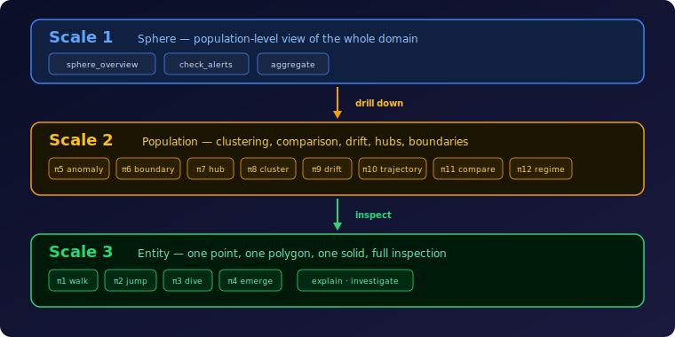
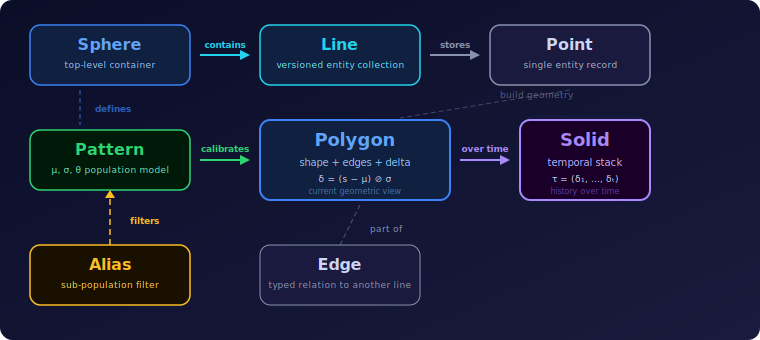

# Core Concepts

> Mental model, vocabulary, and object relationships for the Geometric Data Sphere.

## GDS in One Sentence

Geometric Data Sphere (GDS) represents business data as a population-relative geometric space that agents can navigate step by step.

## The Main Idea

The system models a domain as a sphere:

- entities belong to lines
- each entity has a polygon
- populations define patterns
- time turns polygons into solids
- agents explore the result with navigation primitives instead of only queries

The main shift is from "what rows match this filter?" to:

- how does this entity differ from its population?
- how does that difference change over time?
- which entities are structurally close, drifting, anomalous, or boundary-near?

That makes GDS useful when the interesting part of the problem is not a single record, but the shape of the population around it.

## Mathematical Foundation

GDS operates in a **delta space** (ℝ^D, d₂) — a complete metric space where each entity is embedded via its relationship structure.

**Shape vector.** For entity *e* with *D* typed relation dimensions:

```
s(e) ∈ [0,1]^D     (normalized edge counts per relation type)
```

**Delta vector.** Population-relative z-score embedding:

```
δ(e) = (s(e) − μ) ⊘ σ
```

where μ = E[s] is the population mean, σ = max(std(s), ε) the clamped standard deviation. The delta vector is the core coordinate — it tells you where an entity sits relative to its population in every dimension simultaneously.

**What the delta space enables:**

- **Clustering** — entities with similar δ occupy the same region; k-means++ discovers natural geometric archetypes
- **Similarity search** — ANN over δ finds structurally similar entities regardless of surface-level attributes
- **Population comparison** — contrasting δ distributions between groups reveals which dimensions discriminate them (Cohen's d)
- **Hub analysis** — structural centrality scores from normalized connectivity in the shape vector
- **Segment partitioning** — cutting planes (w·δ ≥ b) partition the population into named segments with derived statistics
- **Anomaly detection** — entities with ‖δ‖₂ > θ (empirical quantile threshold) are flagged — no training, no labels
- **Dimension ranking** — contribution magnitude per dimension identifies which relations drive an entity's position (witness sets)
- **Drift tracking** — temporal sequences τ(e) = (δ₁, ..., δₜ) measure how an entity's geometric position evolves
- **Trajectory forecasting** — extrapolation of temporal coordinate sequences predicts future position, anomaly status, and segment crossings
- **Population-level temporal analysis** — centroid displacement across time windows detects structural regime shifts
- **Stateful navigation** — typed position state (Point → Polygon → Solid) with AI agent tool-callable primitives
- **Cross-sphere comparison** *(planned)* — dimensionless scalar metrics from independently calibrated coordinate spaces enable comparison across separate data systems
- **What-if analysis** *(planned)* — hypothetical edge changes produce a modified coordinate vector showing the geometric effect

## Three Scales



The usual rule is simple: start broad, then zoom in only as needed.

In practice, that usually means:

- inspect the sphere first when you want population structure and health
- explore clusters, compare segments, or find hubs when you want group-level insights
- inspect one entity when you want to understand a specific case in detail

This keeps exploration focused and avoids jumping too quickly into detail.

## Core Objects



The objects are deliberately layered: a **point** is the raw record, a **polygon** is its current geometric view, and a **solid** is that view across time.

That layering is what lets hypertopos answer questions about both structure and change without collapsing them into one opaque object.

### How objects relate

A practical way to picture the core model is:

- a `Line` groups many `Point`s of the same entity type
- a `Polygon` is the connected local structure formed by `Point`s and `Edge`s
- `Edge`s connect those points to other points on other lines
- a `Solid` is the time-expanded history of that same polygon

The important nuance is:

- the polygon is not just a single point
- the line holds the population
- the polygon is the linked structure of points inside that population
- the edges connect those points to other lines

### Anchor and event lines

Every line has a `line_role` — either **anchor** or **event**. The distinction reflects the nature of the entities it holds.

| | Anchor line | Event line |
|---|-------------|------------|
| **What it holds** | Stable entities (customers, accounts, products, districts) | Discrete occurrences (transactions, orders, log entries) |
| **Cardinality** | Typically thousands–millions of unique entities | Often orders of magnitude larger — one row per event |
| **Identity** | Each point has a persistent identity across time | Each point is a single, immutable occurrence |
| **Full-text search** | Enabled by default (`fts: true`) | Disabled by default — event volume makes FTS impractical |
| **Role in patterns** | Subject of anchor patterns — geometry built from relationships and properties of the entity itself | Subject of event patterns — geometry built from which anchor entities participated and continuous event dimensions (e.g. amount, duration) |

The same distinction carries into patterns: `pattern_type` is `"anchor"` or `"event"`.

**Anchor patterns** describe the geometric shape of a stable entity. Their dimensions come from:
- **relations** — edges to other anchor lines (e.g. account → district)
- **derived dimensions** — aggregates computed from linked event patterns (e.g. transaction count, burst frequency)
- **precomputed dimensions** — columns already present on the entity (e.g. balance volatility)
- **tracked properties** — categorical columns carried through for cohort analysis

**Event patterns** describe the geometric shape of a single occurrence. Their dimensions come from:
- **relations** — edges pointing back to anchor lines (e.g. transaction → account, transaction → operation)
- **event dimensions** — continuous numeric columns on the event itself (e.g. amount, balance)

In a typical sphere, event lines feed into anchor patterns via `derived_dimensions` — the builder aggregates event-level data per anchor entity to produce behavioral features. This is how "1M transactions" becomes "4,500 account behavioral profiles."

## Edge Table

An edge table is a flat Lance dataset that links anchor entities through an event pattern. It is stored at `edges/{pattern_id}/data.lance` with BTREE indexes on `from_key` and `to_key`.

**When it exists:** The builder emits an edge table automatically for event patterns with 2+ FK relations to the same anchor line (e.g. an event pattern with `from_entity` and `to_entity` both pointing to the same anchor line). It can also be configured explicitly in YAML.

**What it enables:**
- **Runtime graph traversal** -- `find_geometric_path` uses beam search over the edge table, scoring paths by geometric coherence of intermediate entities
- **Lazy chain discovery** -- `discover_chains` performs temporal BFS on edges without requiring build-time chain extraction
- **Edge statistics** -- row counts, unique entity counts, timestamp and amount ranges

**Edge table fields:** `from_key` and `to_key` are anchor entity keys derived from event pattern FK columns. `event_key` links back to the event line for traceability. `timestamp` is epoch seconds from the column specified by `edge_table.timestamp_col` (or auto-detected). `amount` is the numeric value from `edge_table.amount_col` (or auto-detected from columns named `amount`, `value`, `total`, `amt`). The semantic meaning of `amount` depends on the domain (e.g. payment value, fare, order total, shipment weight). When no amount column is found, defaults to 0.0.

The edge table is intentionally separate from geometry. Geometry stores delta vectors and polygon edges; the edge table stores pairwise anchor-to-anchor links with timestamps and amounts. This separation keeps geometry scans lean (no graph adjacency loaded) while enabling graph operations when needed.

Skippable during build with `--no-edges` for faster iteration.

## Chain Interpretation

Chains (both build-time `chain_lines` and runtime `discover_chains`) are sequences of entities linked by temporally ordered edges. They represent **structural paths** — the existence of a route through the graph within a time window — not causally linked flows.

**What `total_amount` means:** the sum of per-hop `amount` values along the path. Each hop independently selects the best temporally-ordered edge between two entities. The amounts at different hops may originate from unrelated events. A chain `A→B (500) → C (10000)` means A connected to B with amount 500, and B connected to C with amount 10000 — not that 500 propagated from A to C.

**Implications:**
- `total_amount` is a **corridor magnitude indicator**, not a causal quantity
- **Amount decay** (`last_hop / first_hop`) is more informative than total — a decreasing pattern along the path suggests value dispersion
- **Exact value tracking** (matching amounts across consecutive hops within a tolerance) is a separate analytical step not built into chain extraction
- **Cyclic chains** (`is_cyclic=true`) indicate structural loops, not that the same value returned to the origin
- These properties apply equally to pre-computed `chain_lines` and runtime `discover_chains`

## Geometry Vocabulary

| Term | Definition |
|------|------------|
| **Shape vector** | Normalized raw representation before population-relative centering |
| **Delta vector** | Centered and scaled deviation from the population mean |
| **Delta norm** | L2 magnitude of the deviation -- basis for similarity, clustering, and anomaly scoring |
| **Theta threshold** | Statistical boundary derived from the population distribution (used for anomaly classification) |
| **Deformation log** | History of changes that produced the current solid |

Every dimension has a meaning tied to a relation or tracked property.

Optionally, `dimension_weights` adjusts importance of individual axes, and Mahalanobis mode accounts for inter-dimension correlations. See [configuration.md](configuration.md) for details.

Every dimension corresponds to a relation line, tracked property, or event-derived signal. The geometry is population-relative — the same raw record can look typical in one population and unusual in another.

## Builder

The sphere builder takes a declarative YAML configuration and produces a navigable sphere on disk. Seven configuration families:

| Family | What it does |
|--------|-------------|
| `sources` | Load data — CSV, Parquet, multi-file join, or Python script |
| `lines` | Define entity tables with roles, keys, search indexes |
| `patterns` | Define population geometry — relations, dimensions, calibration |
| `composite_lines` | Derive anchor lines from event co-occurrence |
| `chain_lines` | Extract multi-hop path entities from event flows |
| `aliases` | Define sub-populations via cutting planes |
| `temporal` | Build rolling snapshots and trajectory indices |

For the full YAML syntax, field tables, and examples, see [configuration.md](configuration.md).

## Navigation

Navigation is stateful. Each step depends on the current position.

| Primitive | Purpose | Category | Requires |
|-----------|---------|----------|----------|
| `π1` walk_line | Move along a line | Position | Point on a line |
| `π2` jump_polygon | Jump through polygon to another line | Position | Polygon with alive edge to target line |
| `π3` dive_solid | Dive into temporal history | Depth | entity key + pattern (any position) |
| `π4` emerge | Return to higher level | Depth | Polygon or Solid position |
| `π5` attract_anomaly | Find most anomalous polygons | Attract | pattern only (population scan) |
| `π6` attract_boundary | Find boundary-near entities | Attract | pattern + alias (population scan) |
| `π7` attract_hub | Find most connected entities | Attract | pattern only (population scan) |
| `π8` attract_cluster | Discover geometric archetypes | Attract | pattern only (population scan) |
| `π9` attract_drift | Find highest temporal drift | Temporal | pattern + temporal data |
| `π10` attract_trajectory | Find similar temporal trajectories | Temporal | pattern + reference entity |
| `π11` attract_population_compare | Compare geometry across time windows | Temporal | pattern + two time windows |
| `π12` attract_regime_change | Detect geometry regime shifts | Temporal | pattern + temporal data |

The primitives are intentionally small. They work best as building blocks:

- walk and jump move the current position — they require an active point or polygon
- dive and emerge change the level of detail — dive enters a solid, emerge returns to point
- attract_* primitives scan the population — they need only a pattern, not a specific position
- compare and regime primitives summarize what changed across time or groups

This keeps the agent interaction model readable. Instead of one giant search API, GDS gives a small set of moves that can be chained together.

For the full primitive signatures, see [api-reference.md](api-reference.md).

## Why This Model Exists

The model is useful when you need:

- population-relative positioning instead of global heuristics
- clustering and archetype discovery without labeled training data
- structural comparison between groups, segments, or time windows
- similarity search based on geometric shape rather than attribute matching
- anomaly detection without training a separate model
- hub and connectivity analysis from relationship geometry
- temporal drift tracking and regime shift detection
- stepwise exploration instead of one-shot retrieval

It is especially useful for agentic workflows, where the next action depends on what was just discovered.

## Example Thinking Pattern

A typical GDS exploration might look like this:

1. inspect the sphere to understand population structure and health
2. discover clusters, find hubs, locate anomalies, or compare segments
3. compare their geometry to the baseline population or to each other
4. inspect the temporal solid if behavior over time matters
5. use navigation primitives to move from one finding to the next

That pattern is the core of the system: broad structure first, focused investigation second.

## What This Document Is Not

This is not a full API reference or storage specification. For those, see:

- [quickstart.md](quickstart.md) -- getting started with hypertopos
- [api-reference.md](api-reference.md) -- full Python API and primitive signatures
- [data-format.md](data-format.md) -- Arrow IPC format, directory structure, and schemas
- [configuration.md](configuration.md) -- YAML builder syntax and field tables

## Patent Pending

This work explores a different way of thinking about data.

Instead of querying entities or training models, it constructs a shared geometric space where every entity occupies a position defined relative to the population it belongs to. Entities are mapped to coordinates derived from their relational structure, enabling direct geometric interpretation of similarity, deviation, and change over time.

From this perspective, anomaly is distance. Similarity is proximity. Change is trajectory.

The system derives these positions directly from observable relational patterns and maintains them as a persistent, population-calibrated coordinate system — enabling analysis, comparison, and navigation without retraining or opaque embeddings.

This approach opens the door to treating complex data systems as navigable spaces rather than queryable records.

Based on a U.S. provisional patent application (2026, USPTO). The scope of protection will be defined by the claims of the subsequent non-provisional application.
