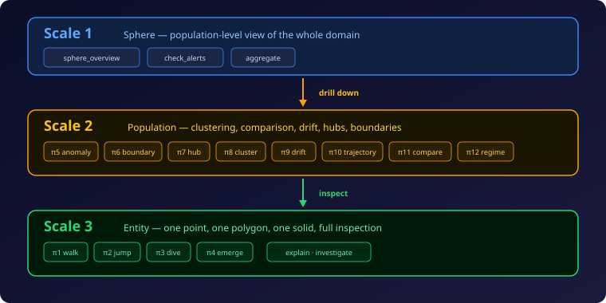
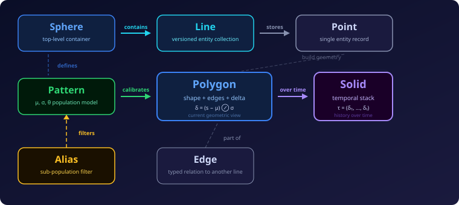

# Core Concepts

> Mental model, vocabulary, and object relationships for the Geometric Data Sphere.

## GDS in One Sentence

Geometric Data Sphere (GDS) represents business data as a population-relative geometric space that agents can navigate step by step.

## The Main Idea

The system models a domain as a sphere:

- entities belong to lines
- each entity has a polygon
- populations define patterns
- time turns polygons into solids
- agents explore the result with navigation primitives instead of only queries

The main shift is from "what rows match this filter?" to:

- how does this entity differ from its population?
- how does that difference change over time?
- which entities are structurally close, drifting, anomalous, or boundary-near?

That makes GDS useful when the interesting part of the problem is not a single record, but the shape of the population around it.

## Mathematical Foundation

GDS operates in a **delta space** (ℝ^D, d₂) — a complete metric space where each entity is embedded via its relationship structure.

**Shape vector.** For entity *e* with *D* typed relation dimensions:

```
s(e) ∈ [0,1]^D     (normalized edge counts per relation type)
```

**Delta vector.** Population-relative z-score embedding:

```
δ(e) = (s(e) − μ) ⊘ σ
```

where μ = E[s] is the population mean, σ = max(std(s), ε) the clamped standard deviation. The delta vector is the core coordinate — it tells you where an entity sits relative to its population in every dimension simultaneously.

**What the delta space enables:**

- **Clustering** — entities with similar δ occupy the same region; k-means++ discovers natural geometric archetypes
- **Similarity search** — ANN over δ finds structurally similar entities regardless of surface-level attributes
- **Population comparison** — contrasting δ distributions between groups reveals which dimensions discriminate them (Cohen's d)
- **Hub analysis** — structural centrality scores from normalized connectivity in the shape vector
- **Segment partitioning** — cutting planes (w·δ ≥ b) partition the population into named segments with derived statistics
- **Anomaly detection** — entities with ‖δ‖₂ > θ (empirical quantile threshold) are flagged — no training, no labels
- **Dimension ranking** — contribution magnitude per dimension identifies which relations drive an entity's position (witness sets)
- **Drift tracking** — temporal sequences τ(e) = (δ₁, ..., δₜ) measure how an entity's geometric position evolves
- **Trajectory forecasting** — extrapolation of temporal coordinate sequences predicts future position, anomaly status, and segment crossings
- **Population-level temporal analysis** — centroid displacement across time windows detects structural regime shifts
- **Stateful navigation** — typed position state (Point → Polygon → Solid) with AI agent tool-callable primitives
- **Cross-sphere comparison** *(planned)* — dimensionless scalar metrics from independently calibrated coordinate spaces enable comparison across separate data systems
- **What-if analysis** *(planned)* — hypothetical edge changes produce a modified coordinate vector showing the geometric effect

## Statistical Guarantees

Two opt-in post-processing stages can be applied to any attract primitive that scans a population (pi5, pi6, pi7, pi9). Both are off by default — omitting them preserves the legacy behavior exactly.

**FDR control.** When `fdr_alpha` is set, the result set passes through a Benjamini-Hochberg (BH) procedure. Each entity's empirical-null p-value is derived from its population rank percentile: `p = 1 - rank_pct / 100`, where `rank_pct` is the entity's position in the full population sorted by the primitive's ranking metric (delta norm for pi5/pi6, hub score for pi7, displacement for pi9). The BH procedure guarantees `E[FDR] <= alpha` under independence or positive regression dependency (PRDS). Every retained entity carries a q-value — the minimum alpha at which it would still be retained. Entities with `q_value > alpha` are removed before the top-N / selection step.

**Storey adaptive correction.** `fdr_method="storey"` scales BH q-values by the Storey LSL estimator of the null-hypothesis proportion π₀ — when the population contains a genuine null mass alongside the anomalous tail, Storey shrinks q-values by that factor and recovers additional discoveries at the same α. This only works if p-values can separate null from alternative in the first place, so `fdr_method="storey"` should be paired with `p_value_method="chi2"`. Chi-squared p-values come from the upper-tail χ²(df) survival on `‖δ‖²` — the mathematically correct null under `δ_i ~ N(0, 1)`. Rank-based p-values are uniform(0, 1) by construction and carry no null-vs-alternative signal, so Storey collapses to BH on them regardless of the underlying population structure.

Power recovery is **regime-dependent**. The Storey + chi2 combination delivers 10–15% additional discoveries at α=0.05 on spheres whose ranking metric has a moderate super-anomaly distribution with a real null tail — e.g. NYC Taxi trip_pattern where `median(‖δ‖) ≈ 1.8 × √df`. On spheres whose `δ` is over-compressed relative to the N(0,1) null (AML HI-Small account_pattern, `median ≈ 0.85 × √df`) Storey sees the whole population as null and falls back to BH. On patterns whose `δ` is extreme super-anomaly (Berka account_stress, `median ≈ 3 × √df`) BH already rejects every entity, so there is nothing left for Storey to recover. The `benchmark/storey_vs_bh/` harness makes this regime sensitivity reproducible.

**Diverse selection.** When `select="diverse"`, the top-N step is replaced by a lazy-greedy facility location algorithm that maximizes a monotone submodular objective over pairwise cosine similarity of delta vectors. The greedy selection achieves a `(1 - 1/e)` approximation to the optimal K-subset. Each selected entity reports a representativeness count — how many population members are closest to it among the selected set. The result is K entities that cover the geometric space of the result set rather than clustering around a single extreme region.

Both stages compose: `fdr_alpha=0.05, select="diverse"` first filters to FDR-controlled discoveries, then picks the K most geometrically diverse among them.

## Bregman Divergence

Standard anomaly scoring in GDS uses `‖δ‖₂` — a single Euclidean distance that treats every dimension identically. This is fast and works well when dimensions are roughly Gaussian.

**Bregman divergence** generalises the scoring: each dimension contributes an anomaly score computed from the generator function matched to its distribution family (`kind`). For a dimension with kind `gaussian`, the generator is squared loss (identical to L2). For `poisson`, it is the Kullback-Leibler divergence for counts. For `bernoulli`, it is binary cross-entropy.

The per-dimension Bregman scores are summed to produce `bregman_divergence` — a single float stored alongside `delta_norm` in the geometry file. Dimensions with a poor match between their assumed family and actual data shape produce disproportionately large Bregman terms, making them visible in `explain_anomaly` output.

**What this enables:**
- Binary FK dimensions (bernoulli) no longer inflate the total score when an entity is merely "active" in that relation — the scoring accounts for the 0/1 nature of the edge
- Count-based derived features (poisson) are scored against their expected arrival rate rather than a z-score
- `explain_anomaly` returns per-dimension Bregman contributions with `kind` and `pct_of_total`, identifying which distribution mismatch is the primary driver

`bregman_divergence` is stored in sphere format ≥ 2.3. Pre-2.3 spheres return `None` for this field.

### Dimension Kinds

Every dimension in a pattern carries a `kind` tag — the distribution family used for Bregman scoring. The builder auto-detects kinds at build time using the following rules:

| Dimension source | Inferred kind |
|-----------------|---------------|
| Binary FK (`edge_max = null`) | `bernoulli` |
| `count`, `count_distinct`, `count:window=*` | `poisson` |
| `sum:col`, `avg:col`, `std:col`, `iet_*` | `gaussian` |
| `max:col`, `min:col` | `gaussian` |
| `precomputed_dimension` with `edge_max: 1` | `bernoulli` |
| `precomputed_dimension`, otherwise | `gaussian` |
| `graph_features` in/out-degree (`edge_max > 1`) | `poisson` |
| `graph_features` reciprocity, overlap (`edge_max = 1`) | `bernoulli` |
| `graph_features` pagerank, betweenness, clustering_coefficient | auto |
| `graph_features` community, connected_component | auto |

Override via `kind:` on individual dimension entries in `sphere.yaml`. The resulting kind list is stored in `Pattern.dimension_kinds` and surfaced in `sphere_overview` as `dimension_kinds`.

## Anomaly Confidence

Bootstrap confidence measures how stable an entity's anomaly classification is under random resampling of the calibration population.

The builder draws `bootstrap_iterations` bootstrap samples from the population (default 200), recomputes mu/sigma/theta on each sample, and records whether the entity's delta_norm exceeds the resampled theta. `anomaly_confidence` is the fraction of samples in which the entity is classified as anomalous.

**Interpretation:**
- `1.0` — entity is anomalous under every bootstrap resample; classification is robust
- `0.5–0.99` — entity sits near the boundary; classification may flip with slightly different calibration data
- `< 0.5` — entity is nominally anomalous (delta_norm > theta) but unstable; treat with caution

`anomaly_confidence` is skipped when the pattern uses `group_by_property` (bootstrap is per-group, cost grows multiplicatively), `use_mahalanobis` (full covariance bootstrap is expensive), or N > 50K entities. In those cases the field is `None`.

Filter `find_anomalies` by minimum confidence using `min_confidence` — for example `min_confidence=0.8` returns only entities whose anomaly classification is stable across at least 80% of bootstrap samples.

## Three Scales



The usual rule is simple: start broad, then zoom in only as needed.

In practice, that usually means:

- inspect the sphere first when you want population structure and health
- explore clusters, compare segments, or find hubs when you want group-level insights
- inspect one entity when you want to understand a specific case in detail

This keeps exploration focused and avoids jumping too quickly into detail.

## Core Objects



The objects are deliberately layered: a **point** is the raw record, a **polygon** is its current geometric view, and a **solid** is that view across time.

That layering is what lets hypertopos answer questions about both structure and change without collapsing them into one opaque object.

### How objects relate

A practical way to picture the core model is:

- a `Line` groups many `Point`s of the same entity type
- a `Polygon` is the connected local structure formed by `Point`s and `Edge`s
- `Edge`s connect those points to other points on other lines
- a `Solid` is the time-expanded history of that same polygon

The important nuance is:

- the polygon is not just a single point
- the line holds the population
- the polygon is the linked structure of points inside that population
- the edges connect those points to other lines

### Anchor and event lines

Every line has a `line_role` — either **anchor** or **event**. The distinction reflects the nature of the entities it holds.

| | Anchor line | Event line |
|---|-------------|------------|
| **What it holds** | Stable entities (customers, accounts, products, districts) | Discrete occurrences (transactions, orders, log entries) |
| **Cardinality** | Typically thousands–millions of unique entities | Often orders of magnitude larger — one row per event |
| **Identity** | Each point has a persistent identity across time | Each point is a single, immutable occurrence |
| **Full-text search** | Enabled by default (`fts: true`) | Disabled by default — event volume makes FTS impractical |
| **Role in patterns** | Subject of anchor patterns — geometry built from relationships and properties of the entity itself | Subject of event patterns — geometry built from which anchor entities participated and continuous event dimensions (e.g. amount, duration) |

The same distinction carries into patterns: `pattern_type` is `"anchor"` or `"event"`.

**Anchor patterns** describe the geometric shape of a stable entity. Their dimensions come from:
- **relations** — edges to other anchor lines (e.g. account → district)
- **derived dimensions** — aggregates computed from linked event patterns (e.g. transaction count, burst frequency)
- **precomputed dimensions** — columns already present on the entity (e.g. balance volatility)
- **tracked properties** — categorical columns carried through for cohort analysis

**Event patterns** describe the geometric shape of a single occurrence. Their dimensions come from:
- **relations** — edges pointing back to anchor lines (e.g. transaction → account, transaction → operation)
- **event dimensions** — continuous numeric columns on the event itself (e.g. amount, balance)

In a typical sphere, event lines feed into anchor patterns via `derived_dimensions` — the builder aggregates event-level data per anchor entity to produce behavioral features. This is how "1M transactions" becomes "4,500 account behavioral profiles."

## Edge Table

An edge table is a flat Lance dataset that links anchor entities through an event pattern. It is stored at `edges/{pattern_id}/data.lance` with BTREE indexes on `from_key` and `to_key`.

**When it exists:** The builder emits an edge table automatically for event patterns with 2+ FK relations to the same anchor line (e.g. an event pattern with `from_entity` and `to_entity` both pointing to the same anchor line). It can also be configured explicitly in YAML.

**What it enables:**
- **Runtime graph traversal** -- `find_geometric_path` uses bidirectional BFS over the edge table, scoring discovered paths by geometric coherence of intermediate entities
- **Lazy chain discovery** -- `discover_chains` performs temporal BFS on edges without requiring build-time chain extraction
- **Edge statistics** -- row counts, unique entity counts, timestamp and amount ranges
- **Witness cohort discovery** -- `find_witness_cohort` ranks entities that share the target's witness signature by combining delta similarity, witness overlap, trajectory alignment, and a graded anomaly bonus, while excluding entities already connected via the edge table. **Investigative peer ranking, not edge forecasting** — surfaces existing peers rather than predicting future edges. Uniquely possible because population-relative geometry, witness sets, temporal solids, and the edge table all live in one storage layer

**Edge table fields:** `from_key` and `to_key` are anchor entity keys derived from event pattern FK columns. `event_key` links back to the event line for traceability. `timestamp` is epoch seconds from the column specified by `edge_table.timestamp_col` (or auto-detected). `amount` is the numeric value from `edge_table.amount_col` (or auto-detected from columns named `amount`, `value`, `total`, `amt`). The semantic meaning of `amount` depends on the domain (e.g. payment value, fare, order total, shipment weight). When no amount column is found, defaults to 0.0.

The edge table is intentionally separate from geometry. Geometry stores delta vectors and polygon edges; the edge table stores pairwise anchor-to-anchor links with timestamps and amounts. This separation keeps geometry scans lean (no graph adjacency loaded) while enabling graph operations when needed.

Skippable during build with `--no-edges` for faster iteration.

## Density gaps via independence null

`find_density_gaps(pattern_id, …)` answers the inverse of anomaly
detection: which combinations of dim values **should** be populated
under an independence null but are not? Each pattern dim is mapped to
a uniform `[0, 1]` marginal via its empirical CDF (probability integral
transform), so the test is dim-kind agnostic — Gaussian, Poisson,
heavy-tail and non-parametric dims all reduce to the same uniform
representation. Pairs with Pearson `|r|` in `[r_min, r_max]` (default
`[0.1, 0.7]`) are tested against the uniform-independence expectation
on a `bins × bins` joint histogram via per-cell chi² residual; only
under-populated cells are kept and Benjamini-Hochberg correction is
applied across the test set to control FDR. Each flagged cell maps
back to a named delta-space range (z-score units — geometry deltas, not
raw property values) — the agent receives statements like *"no entities
with `_d_tx_count ∈ [-0.6, -0.4]` AND `_d_amount_std ∈ [0.5, 0.8]`;
independence predicts ~52, observed 0"*. Mapping back to raw property
ranges (e.g. tx_count=50..200) is a follow-up that requires joining
through the points table. Bernoulli, degenerate
and `< 30`-finite-value dims are auto-excluded and reported in
`excluded_dims`. Anchor patterns only — event-pattern delta vectors
typically have low pair counts and don't yield robust chi² statistics.

## Edge-derived dimensions

Event patterns can declare an `edge_dimensions:` block in YAML to add up to five build-time per-edge signals to their polygon geometry:

| Dim | Type | Signal |
|---|---|---|
| `pair_edge_count` | poisson | edges per `(from_key, to_key)` directed pair across the full sphere span — flags concentration / pair-locking |
| `position_in_chain` | poisson | depth in the longest reverse-temporal chain ending at this edge; values below `min_position` zero out — flags entities deep into structuring chains |
| `time_since_pair_last_edge` | gaussian | seconds since the previous edge in the same pair; first edge in a pair gets a sentinel = sphere span |
| `pair_amount_zscore` (LOW_VAR pairs only) | gaussian | signed z-score of amount within `(from_key, to_key)` pairs whose CV(amount) < `cv_threshold`; HIGH_VAR pairs and pairs below `min_count` write 0.0 — direction-agnostic outlier signal on locked-amount pairs |
| `find_motif_structuring` | bernoulli | 1.0 if the edge participates in any A→B→C→D structuring motif within `time_window_hours` with hop1 ≥ `amt1_min` and hops 2/3 ≤ `amt2_max` |

These dims are computed at edge-table emission time, written to the `_gds_meta/edge_features/{pid}/data.lance` sidecar keyed by `event_key`, AND merged into the event polygon `shape_snapshot` (one extra dim per declared entry). Downstream primitives (`find_anomalies`, `find_similar_entities`, `find_clusters`) automatically include them in `delta` / `delta_norm` / classification — no new query API. Reject `min_position < 3` at YAML parse time. Anchor patterns reject the `edge_dimensions:` block directly; to expose these per-edge signals on anchor entities, declare `edge_dim_aggregations:` on the anchor pattern instead — see `configuration.md` for the YAML stanza and supported aggregates (`_mean` / `_max`). For chain anchor patterns auto-emitted from `chain_lines:` config, declare `edge_dim_aggregations:` directly inside the `chain_lines.<id>:` block — same `from: <event_pid>` and `dims: [...]` schema as on regular anchor patterns; the builder forwards it to the auto-emitted `<id>_pattern`.

## Chain Interpretation

Chains (both build-time `chain_lines` and runtime `discover_chains`) are sequences of entities linked by temporally ordered edges. They represent **structural paths** — the existence of a route through the graph within a time window — not causally linked flows.

**What `total_amount` means:** the sum of per-hop `amount` values along the path. Each hop independently selects the best temporally-ordered edge between two entities. The amounts at different hops may originate from unrelated events. A chain `A→B (500) → C (10000)` means A connected to B with amount 500, and B connected to C with amount 10000 — not that 500 propagated from A to C.

**Implications:**
- `total_amount` is a **corridor magnitude indicator**, not a causal quantity
- **Amount decay** (`last_hop / first_hop`) is more informative than total — a decreasing pattern along the path suggests value dispersion
- **Exact value tracking** (matching amounts across consecutive hops within a tolerance) is a separate analytical step not built into chain extraction
- **Cyclic chains** (`is_cyclic=true`) indicate structural loops, not that the same value returned to the origin
- These properties apply equally to pre-computed `chain_lines` and runtime `discover_chains`

## Geometry Vocabulary

| Term | Definition |
|------|------------|
| **Shape vector** | Normalized raw representation before population-relative centering |
| **Delta vector** | Centered and scaled deviation from the population mean |
| **Delta norm** | L2 magnitude of the deviation -- basis for similarity, clustering, and anomaly scoring |
| **Theta threshold** | Statistical boundary derived from the population distribution (used for anomaly classification) |
| **Deformation log** | History of changes that produced the current solid |
| **Bregman divergence** | Distribution-aware anomaly distance summed across per-dimension Bregman terms |
| **Anomaly confidence** | Bootstrap stability score (0–1) for anomaly classification under population resampling |
| **Dimension kind** | Distribution family tag per dimension (`gaussian`, `poisson`, `bernoulli`) driving Bregman scoring |

Every dimension has a meaning tied to a relation or tracked property.

Optionally, `dimension_weights` adjusts importance of individual axes, and Mahalanobis mode accounts for inter-dimension correlations. See [configuration.md](configuration.md) for details.

Every dimension corresponds to a relation line, tracked property, or event-derived signal. The geometry is population-relative — the same raw record can look typical in one population and unusual in another.

**Drift direction.** Drift has a magnitude (`displacement`) and a direction. The direction signal is the radially-inward component of the drift vector — `cos(δ_last − δ_first, −δ_first)`. Positive means the entity is moving toward the null centre (self-normalising), negative means moving away (deteriorating). Computed over structural dimensions only, so prop-column acquisitions between temporal slices do not pollute the direction signal. Surfaced on π9 as `gradient_alignment` (numeric) and `drift_direction` (label).

**Edge potential.** Anomaly has a node-level signature (delta_norm) and an edge-level signature. `edge_potential` scores the *relationship* A → B as `||δ_A − δ_B|| × (1 / pair_tx_count)`. High score means the endpoints are structurally distant AND the pair is rare — classic AML layering signature where a one-off transaction connects two behaviourally divergent accounts. Surfaced via `score_edge` (per-edge) and `attract_edge_potential` (ranking) primitives, and automatically attached to the `edge_counterparty` branch in `trace_root_cause` as additional evidence.

**Structural motifs.** One edge anomaly generalises to k-edge structural patterns. `score_motif` composes `edge_potential` across the edges of a named motif via product — a motif of rare edges is rare, and one regular high-volume edge in a triad collapses the score to near-zero (correct: a triad with a payroll edge is not laundering). Closed vocabulary of eight types: `fan_out` (one hub → k distinct targets in a window), `fan_in` (k distinct sources → one sink, mirror of `fan_out`), `cycle_2` (A↔B bidirectional round-trip), `cycle_3` (directed triad A→B→C→A with strict temporal ordering), `chain_k` (open directed chain A→B→…→Z of parametric length 3 ≤ k ≤ 8, no cycle closure, strict monotone timestamps, total span ≤ window — the amount-free counterpart to `structuring` used for multi-stage layering), `structuring` (open A→B→C→D linear chain with amount gating — hop1 amount above a threshold, hops 2 and 3 below, strict temporal ordering within a short window; classic deposit-split-and-wire pattern for reporting-threshold evasion), `split_recombine` (diamond S → {M₁,…,Mₖ} → D with stacked-bipartite temporal order — all split-hops precede all recombine-hops within the window; `direction` picks whether the seed plays the source S or sink D, covering scatter-gather smurfing forward and concentrator/sink backward), `bipartite_burst` (complete K_{k,m} bipartite subgraph in a tight window — k distinct sources each transact with every one of m distinct sinks; covers coordinated burst and parallel-collusion typologies). Each motif carries a literature-derived default time window (168h / 168h / 24h / 72h / 168h / 1h / 168h / 24h), overridable per call; `structuring` also accepts `amt1_min`/`amt2_max` amount thresholds configurable per jurisdiction, `chain_k` accepts a `k` parameter gating chain length, `split_recombine` accepts `direction` and `min_k`, `bipartite_burst` accepts `min_k` (source side) and `min_m` (sink side). Motifs are the structural atoms of 25 documented AML typologies — same substrate, same edge_potential cache, no new calibration formula. Auto-attached to `trace_root_cause.edge_counterparty.motif_potential` when the suspect seeds a high-scoring motif that passes through the counterparty.

## Builder

The sphere builder takes a declarative YAML configuration and produces a navigable sphere on disk. Seven configuration families:

| Family | What it does |
|--------|-------------|
| `sources` | Load data — CSV, Parquet, multi-file join, or Python script |
| `lines` | Define entity tables with roles, keys, search indexes |
| `patterns` | Define population geometry — relations, dimensions, calibration |
| `composite_lines` | Derive anchor lines from event co-occurrence |
| `chain_lines` | Extract multi-hop path entities from event flows |
| `aliases` | Define sub-populations via cutting planes |
| `temporal` | Build rolling snapshots and trajectory indices |

For the full YAML syntax, field tables, and examples, see [configuration.md](configuration.md).

## Navigation

Navigation is stateful. Each step depends on the current position.

| Primitive | Purpose | Category | Requires |
|-----------|---------|----------|----------|
| `π1` walk_line | Move along a line | Position | Point on a line |
| `π2` jump_polygon | Jump through polygon to another line | Position | Polygon with alive edge to target line |
| `π3` dive_solid | Dive into temporal history | Depth | entity key + pattern (any position) |
| `π4` emerge | Return to higher level | Depth | Polygon or Solid position |
| `π5` attract_anomaly | Find most anomalous polygons | Attract | pattern only (population scan) |
| `π6` attract_boundary | Find boundary-near entities | Attract | pattern + alias (population scan) |
| `π7` attract_hub | Find most connected entities | Attract | pattern only (population scan) |
| `π8` attract_cluster | Discover geometric archetypes | Attract | pattern only (population scan) |
| `π9` attract_drift | Find highest temporal drift | Temporal | pattern + temporal data |
| `π10` attract_trajectory | Find similar temporal trajectories | Temporal | pattern + reference entity |
| `π11` attract_population_compare | Compare geometry across time windows | Temporal | pattern + two time windows |
| `π12` attract_regime_change | Detect geometry regime shifts | Temporal | pattern + temporal data |

The primitives are intentionally small. They work best as building blocks:

- walk and jump move the current position — they require an active point or polygon
- dive and emerge change the level of detail — dive enters a solid, emerge returns to point
- attract_* primitives scan the population — they need only a pattern, not a specific position
- compare and regime primitives summarize what changed across time or groups

This keeps the agent interaction model readable. Instead of one giant search API, GDS gives a small set of moves that can be chained together.

For the full primitive signatures, see [api-reference.md](api-reference.md).

**Root-cause tracing.** Anomaly attribution is not a linear chain — the same entity can be anomalous through several independent channels (its own structural signal, its neighbour geometry, an edge it shares with another anomalous entity). `trace_root_cause` returns a bounded DAG of those channels: root evidence from `explain_anomaly`, an edge-counterparty branch when a witness dimension is relation-derived, a neighbour-contamination branch when the anomaly share among counterparties passes a threshold, and a hub branch when the entity sits in the population's top-hub set. Agents consume it as one call instead of reassembling four to six primitive calls by hand.

## Why This Model Exists

The model is useful when you need:

- population-relative positioning instead of global heuristics
- clustering and archetype discovery without labeled training data
- structural comparison between groups, segments, or time windows
- similarity search based on geometric shape rather than attribute matching
- anomaly detection without training a separate model
- hub and connectivity analysis from relationship geometry
- temporal drift tracking and regime shift detection
- stepwise exploration instead of one-shot retrieval

It is especially useful for agentic workflows, where the next action depends on what was just discovered.

## Example Thinking Pattern

A typical GDS exploration might look like this:

1. inspect the sphere to understand population structure and health
2. discover clusters, find hubs, locate anomalies, or compare segments
3. compare their geometry to the baseline population or to each other
4. inspect the temporal solid if behavior over time matters
5. use navigation primitives to move from one finding to the next

That pattern is the core of the system: broad structure first, focused investigation second.

## Calibration epoch vs schema version vs schema hash

Three orthogonal axes describe a pattern's state:

| Axis | Field | Increments on |
|---|---|---|
| Schema (coarse) | `pattern.version` | Intended: schema change. Currently dormant — builder always writes `1`. |
| Schema (fine) | `pattern.schema_hash` | Schema change (relations / event_dimensions / prop_columns / dimension_kinds / dim order). |
| Calibration epoch | `pattern.calibration_epoch` | Re-fit on the same schema — every full builder run. |

A `CalibrationFit` (one historical epoch) is identified by `(pattern_id, calibration_epoch)`
and is self-described by `schema_hash`. Schema drift wipes prior epochs because mu/sigma
vectors from a different schema have different dimensionality.

## Coordinate system influence

Standard anomaly detection asks "how far is this entity from population normalcy?".
The inverse question — and a meta-anomaly category not surfacing in any single-entity
metric — is "how much does this entity SHAPE what 'normal' means?". hypertopos
answers via the influence × anomaly classification matrix:

- **Hidden influencer** (high impact + low anomaly): an entity invisible to anomaly
  scans but whose presence defines the coordinate origin and scale. Removing it
  shifts μ/σ enough that other entities flip classification. Common operational
  triggers: data quality issues (duplicated records), adversarial population
  manipulation (coordinated AML attacks injecting "average-looking" accounts to
  shift coordinates and mask fraud).
- **Calibration distorter** (high impact + high anomaly): an extreme outlier that
  simultaneously moves the coordinate origin AND triggers anomaly detection. The
  flag indicates the entity should likely be reviewed for exclusion from population
  statistics rather than just flagged as anomalous.
- **Standard anomaly** (low impact + high anomaly): a regular outlier whose removal
  would not recalibrate the coordinate system noticeably.
- **Normal** (low impact + low anomaly): the bulk of the population.

Math: exact leave-one-out via rolling Σs/Σs². Per entity E,
`mu_impact = ‖(μ_full - μ_without_E) / σ_full‖` measures the centroid shift;
`sigma_impact` measures the variance shift; `total_impact = sqrt(mu_impact² + sigma_impact²)`.
Classification gates use a percentile cutoff for "high impact" (default 90th) and the
existing `θ_norm` for "high anomaly".

Distinct from **influence functions** (Cook 1977; Koh & Liang 2017) which measure
impact on a trained model's parameters or predictions: this measures impact on the
COORDINATE SYSTEM itself — the entity's removal changes the geometric positions of
ALL OTHER entities. The hidden influencer cell (high impact + low anomaly) cannot
exist in model-based influence analysis.

## Cross-pattern lead-lag in population-relative coordinates

When the same entity participates in multiple anchor patterns over the same
entity line, each pattern produces a parallel temporal trajectory in an
independently-calibrated population-relative coordinate space. Comparing the
centroid drift of one pattern's population to another's at varying lag reveals
the temporal ordering of population-level shifts: when the
`account_behavior_pattern` centroid begins to move before the
`account_stress_pattern` centroid, behavior is the leading indicator and
stress is the lagging consequence.

The signal is computed as the magnitude of the population centroid step
between consecutive epochs — a scalar per pattern per epoch. Pearson
cross-correlation at lags `[-max_lag, +max_lag]` produces the lead-lag
profile. The peak lag is the headline answer; volatility (mean per-entity
step magnitude) cross-correlation is reported alongside as confirmation,
and an `agreement` label flags whether the two channels concur.

Three architectural decisions make this primitive emergent rather than
borrowed from classical signal processing:

1. **Population-relative.** Each pattern's trajectory lives in its own
   `(μ, σ)`-normalised coordinate space, so cross-pattern correlation
   compares dimensionless drift signatures rather than raw measurements.
2. **Time-grid intersection.** Patterns sharing the same `event_line` and
   `window` land on a deterministic bucket grid (`bucket_id = floor((event_ts
   - min_ts) / window)`); intersection over the per-pattern timestamp sets
   gives the natural alignment without resampling.
3. **Per-dim D_A × D_B matrix.** Each `(dim_a, dim_b)` pair yields its own
   cross-correlation; BH or Storey FDR over Bonferroni-over-lag-adjusted
   p-values surfaces the specific named-dimension pairs that lead, with
   `top_dim_pairs` ranked by ascending q-value.

This is distinct from Granger causality (regression on lagged levels) and
from time-series cross-correlation in unitful coordinates: both lack the
population-relative coordinate space and the named, interpretable
dimensions that hypertopos provides.

## What This Document Is Not

This is not a full API reference or storage specification. For those, see:

- [quickstart.md](quickstart.md) -- getting started with hypertopos
- [api-reference.md](api-reference.md) -- full Python API and primitive signatures
- [data-format.md](data-format.md) -- Arrow IPC format, directory structure, and schemas
- [configuration.md](configuration.md) -- YAML builder syntax and field tables

## Patent Pending

This work explores a different way of thinking about data.

Instead of querying entities or training models, it constructs a shared geometric space where every entity occupies a position defined relative to the population it belongs to. Entities are mapped to coordinates derived from their relational structure, enabling direct geometric interpretation of similarity, deviation, and change over time.

From this perspective, anomaly is distance. Similarity is proximity. Change is trajectory.

The system derives these positions directly from observable relational patterns and maintains them as a persistent, population-calibrated coordinate system — enabling analysis, comparison, and navigation without retraining or opaque embeddings.

This approach opens the door to treating complex data systems as navigable spaces rather than queryable records.

Based on a U.S. provisional patent application (2026, USPTO). The scope of protection will be defined by the claims of the subsequent non-provisional application.
