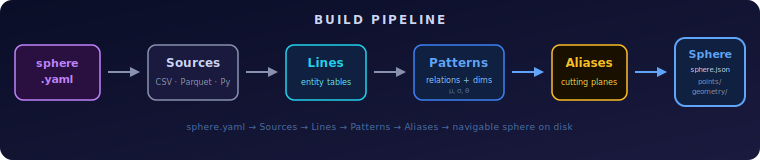
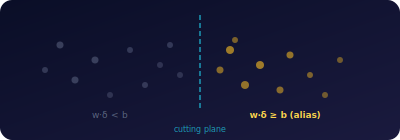

# Configuration — Sphere Builder

> Full YAML reference for building geometric data spheres with the hypertopos CLI.



Build a navigable GDS sphere from your data using a declarative YAML configuration file.

```bash
pip install hypertopos
hypertopos build --config sphere.yaml --output my_sphere/
```

---

## CLI Commands

### `hypertopos build`

Build a sphere from a YAML config file.

```bash
hypertopos build --config sphere.yaml [--output DIR] [--force] [--verbose]
```

| Flag | Description |
|------|-------------|
| `--config` | Path to `sphere.yaml` (required) |
| `--output` | Output directory. Default: `gds_{sphere_id}/` next to the YAML file |
| `--force` | Overwrite output directory if it exists |
| `--verbose` | Print progress with per-phase timing (sources, chains, geometry, temporal) |
| `--no-chains` | Skip chain extraction |
| `--no-temporal` | Skip temporal snapshot generation |
| `--no-edges` | Skip edge table emission |

### `hypertopos validate`

Dry-run: parse and validate YAML without building.

```bash
hypertopos validate --config sphere.yaml
```

Checks:
- Required fields and valid enum values
- Source file/script existence, join file existence
- Line→source, pattern→entity_line, relation→line, composite/chain→event_line cross-references
- graph_features.event_line exists in lines
- Feature metric syntax (`count`, `sum:col`, `count:window=1d:agg=max`)
- event_dimensions only on event-type patterns
- temporal.pattern must be anchor type
- Duplicate dimension names within a pattern
- Cycle detection in from_pattern references

### `hypertopos info`

Print summary of a built sphere.

```bash
hypertopos info my_sphere/
```

---

## YAML Reference — `sphere.yaml`

### Top-level fields

```yaml
version: "0.1.0"              # Required. YAML schema version.

sphere_id: my_sphere          # Required. Unique identifier.
name: "My Sphere"             # Optional. Human-readable name.
description: "What this sphere represents."  # Optional. Stored in sphere.json.

sources: { ... }              # Required. Data source definitions.
lines: { ... }                # Required. Entity line definitions.
patterns: { ... }             # Required. Pattern (anomaly model) definitions.
composite_lines: { ... }      # Optional. Composite anchor lines from event co-occurrence.
temporal: [ ... ]              # Optional. Temporal snapshot configurations.
```

---

## Sources

Sources define where your data comes from. Each source produces a single Arrow table.

### Tier 1: Single file (zero Python)

```yaml
sources:
  customers:
    path: data/customers.parquet       # .parquet, .csv, or .arrow
```

Supported formats (auto-detected from extension):
- `.parquet` — Apache Parquet
- `.csv` — CSV (comma-delimited by default)
- `.arrow` — Arrow IPC

### Tier 1b: CSV with options

```yaml
sources:
  transactions:
    path: data/transactions.csv
    format: csv                        # explicit format override
    delimiter: ";"                     # default: ","
    encoding: utf-8                    # default: utf-8
```

### Tier 1c: Column transforms

Apply type casting and null filling without writing Python.

```yaml
sources:
  transactions:
    path: data/transactions.csv
    delimiter: ";"
    transform:
      amount:
        type: float64                  # cast to type
      balance:
        type: float64
        fill_null: 0.0                 # replace nulls
      bank:
        fill_null: ""                  # empty string for missing
      account_id:
        type: string                   # force string even if inferred as int
```

**Supported cast types:** `string`, `int32`, `int64`, `float32`, `float64`, `bool`

Transforms apply **after** joins (if both `join` and `transform` are present).

### Tier 2: Multi-file join

Join multiple files into a single table. No Python required.

```yaml
sources:
  accounts:
    path: data/account.parquet         # base table
    join:
      - file: data/loan.parquet        # join target
        on: account_id                 # join key (same column name on both sides)
        type: left                     # left (default) or inner
        columns: [loan_amount, status] # optional: only pull these columns
      - file: data/card.parquet
        on: account_id
        type: left
        columns: [card_type]
    transform:                         # transforms apply AFTER joins
      loan_amount:
        type: float64
        fill_null: 0.0
```

**Join types:**
- `left` — keep all rows from base table, null for unmatched
- `inner` — keep only matched rows

**`on` field:** Column name used as join key. Must exist on both the base table and the join
file. For joins where the column names differ, rename in a Tier 3 script.

**YAML gotcha:** The `on:` key in YAML 1.1 can be parsed as boolean `True` instead of string
`"on"`. The parser handles both cases — no action needed from the user.

### Tier 3: Python script

For complex transformations (date parsing, computed columns, multi-table assembly).

```yaml
sources:
  accounts:
    script: prepare_accounts.py        # relative to sphere.yaml location
```

**Contract:** The script must define a `prepare()` function that returns a `pyarrow.Table`:

```python
import pyarrow as pa

def prepare() -> pa.Table:
    # Load, join, transform — full Python control
    ...
    return pa.table({
        "primary_key": pa.array([...], type=pa.string()),
        "name": pa.array([...], type=pa.string()),
        "amount": pa.array([...], type=pa.float64()),
    })
```

The `primary_key` column (string) is required on the returned table, or specify a different
key column in the `lines` section.

**When to use Tier 3:**
- Date parsing from non-standard formats (e.g. `YYMMDD` integers)
- Computed columns (e.g. `late_days = max(0, (receipt_date - commit_date).days)`)
- Complex multi-table joins with aggregations
- NaN/sentinel value coercion
- Anomaly injection for benchmarks

---

## Lines

Lines define entity tables in the sphere. Each line maps to one source.

```yaml
lines:
  transactions:
    source: transactions               # Required. References a source name.
    key: trans_id                       # Required. Primary key column.
    role: event                         # Required. "anchor", "event", or "context".

  customers:
    source: customers
    key: customer_id
    role: anchor
    fts: true                          # Enable full-text search index.
    partition_col: region              # Optional. Hive partitioning column.
```

### Field reference

| Field | Type | Default | Description |
|-------|------|---------|-------------|
| `source` | string | — | **Required.** Name of a source defined in `sources:`. |
| `key` | string | — | **Required.** Column to use as `primary_key`. Renamed automatically. |
| `role` | string | `"anchor"` | `"anchor"` (entity), `"event"` (transaction/fact), or `"context"` *(concept — accepted by parser but no special behavior yet)*. |
| `fts` | bool or list | `null` | Full-text search index. `true` = all string columns. `["name", "desc"]` = specific columns. `false`/`null` = none. Default: all for anchor, none for event. |
| `partition_col` | string | `null` | Column for Hive-style partitioning on large lines. |
| `description` | string | `null` | Human-readable description. Stored in sphere.json — visible to agents via `get_sphere_info`. |
| `columns` | dict | `null` | Column rename map: `{new_name: source_col_name}`. Only listed columns are kept. |

### Column selection and rename

```yaml
lines:
  transactions:
    source: raw_transactions
    key: id
    role: event
    columns:
      account_id: acct_num             # rename acct_num → account_id
      amount: tx_amount                # rename tx_amount → amount
      date: transaction_date
```

When `columns` is set, only the listed columns (plus `key`) are included. Unlisted columns
are dropped.

### NB-Split (Narrow-Budget Split)

Multiple lines can reference the same source with different line IDs to isolate
dimensions per concern — preventing dimensional dilution when patterns share an
entity line. This technique is called **NB-Split**. See the `gds-sphere-designer`
skill for design guidelines, benchmark results, and worked examples.

**Cross-line bridging:** Lines sharing the same `source` (same source name in YAML)
are automatically recognized as **sibling lines** at runtime. `composite_risk` and
`passive_scan` bridge across sibling lines — combining p-values via Fisher's method
even though each pattern operates on its own entity line. This preserves dimensional
isolation while enabling multi-pattern composite scoring.

```yaml
lines:
  accounts:
    source: accounts              # ← same source
    key: primary_key
    role: anchor
  accounts_stress:
    source: accounts              # ← same source = sibling of accounts
    key: primary_key
    role: anchor
```

The `source` field is persisted as `source_id` in sphere.json. It is used solely for
sibling line discovery — no other runtime behavior depends on it.

---

## Patterns

Patterns define anomaly detection models. Each pattern operates on one entity line.

### Event pattern

Detects anomalies in individual events (transactions, line items).

```yaml
patterns:
  tx_pattern:
    type: event
    entity_line: transactions          # Must reference a line with role: event.
    relations:
      - line: customers                # FK target line.
        direction: in                  # "in" = FK points from event to anchor.
        key_on_entity: customer_id     # FK column on the event entity line.
        required: true                 # true = every event must have this edge.
      - line: categories
        direction: in
        key_on_entity: category
        required: false                # false = edge is optional (missing = structural signal).
        display_name: category         # Human-readable dimension label.
    event_dimensions:
      - column: amount                 # Numeric column → continuous geometry dimension.
        display_name: amount
      - column: balance
    anomaly_percentile: 95             # Theta threshold percentile (default: 95).
    dimension_weights: kurtosis        # "kurtosis" (recommended), "auto", or [0.5, 0.3, ...].
```

### Anchor pattern

Detects anomalies in entity populations (customers, accounts, suppliers).

```yaml
patterns:
  customer_pattern:
    type: anchor
    entity_line: customers             # Must reference a line with role: anchor.
    derived_dimensions:
      - from_pattern: tx_pattern       # Derive features from this event pattern (or line).
        features:
          - tx_count: count
          - total_spend: sum:amount
          - avg_amount: avg:amount
          - amount_std: std:amount
          - max_amount: max:amount
          - n_categories: count_distinct:category
          - burst_daily: "count:window=1d:agg=max"
          - burst_monthly: "count:window=30d:agg=max"
    relations: auto                    # Auto-generate _d_* lines from derived dims.
    anomaly_percentile: 95
    dimension_weights: kurtosis
    gmm_n_components: 3               # Gaussian mixture components for calibration.
    group_by_property: segment         # Per-group mu/sigma/theta calibration.
    tracked_properties: [segment, region]  # Property completeness dimensions.
```

### Pattern field reference

| Field | Type | Default | Description |
|-------|------|---------|-------------|
| `type` | string | — | **Required.** `"event"` or `"anchor"`. |
| `entity_line` | string | — | **Required.** Line ID this pattern operates on. |
| `relations` | list or `"auto"` | `null` | Explicit relation list, or `"auto"` for derived-dim patterns. |
| `event_dimensions` | list | `null` | Numeric columns for continuous event geometry (event patterns only). |
| `derived_dimensions` | list | `null` | Aggregated features from event data (anchor patterns only). |
| `anomaly_percentile` | float | `95.0` | Theta threshold: entities above this percentile are anomalous. |
| `dimension_weights` | string or list | `null` | `"kurtosis"` (recommended), `"auto"`, or explicit weight list. |
| `gmm_n_components` | int | `null` | Gaussian mixture components for multi-modal calibration. |
| `group_by_property` | string | `null` | Column for per-group calibration (e.g. per-country theta). |
| `tracked_properties` | list | `null` | Entity properties tracked as fill/no-fill dimensions. |
| `use_mahalanobis` | bool | `false` | Use Mahalanobis distance for anomaly detection (accounts for correlations). |
| `precomputed_dimensions` | list | `null` | Columns already on entity table to use as geometry dimensions. |
| `graph_features` | dict | `null` | Auto-compute graph structural features from event from/to columns. |
| `description` | string | `null` | Human-readable description. Stored in sphere.json — visible to agents via `get_sphere_info`. |
| `edge_table` | dict | `null` | Explicit edge table config (see below). Auto-emitted for event patterns with 2+ FK relations to same anchor line. |

### Edge Table

An edge table is a flat Lance dataset linking anchor entities through an event pattern. It enables runtime graph traversal (`find_geometric_path`, `discover_chains`) without pre-computed chain extraction.

**Auto-detection:** When an event pattern has 2+ relations pointing to the same anchor line (e.g. `from_entity` and `to_entity` both referencing the same anchor line), the builder emits an edge table automatically. No YAML config needed.

When auto-detecting, the builder also scans the event line schema for a timestamp column (first match of `timestamp`, `ts`, `event_time`, `created_at`, `tx_date`, `date`) and an amount column (first match of `amount_received`, `amount`, `amount_paid`, `value`, `total`, `amt`). If your columns use different names, declare them explicitly via `edge_table` config below.

**Explicit config:** Use `edge_table` when column names need to be specified manually or when auto-detection does not apply.

```yaml
patterns:
  tx_pattern:
    type: event
    entity_line: transactions
    edge_table:
      from_col: from_account       # Required. Source anchor FK column.
      to_col: to_account           # Required. Target anchor FK column.
      timestamp_col: date          # Optional. Epoch seconds for temporal BFS.
      amount_col: amount           # Optional. Numeric value carried on edges.
    # ... relations, event_dimensions, etc.
```

| Field | Type | Default | Description |
|-------|------|---------|-------------|
| `from_col` | string | — | **Required.** FK column for source anchor entity. |
| `to_col` | string | — | **Required.** FK column for target anchor entity. |
| `timestamp_col` | string | `null` | Timestamp column (epoch seconds). Enables temporal BFS in `discover_chains`. |
| `amount_col` | string | `null` | Numeric column carried on edges. Enables amount-weighted scoring in `find_geometric_path`. |

To skip edge table emission entirely (e.g. for faster iterative builds), use the `--no-edges` CLI flag.

### Multiple patterns on the same entity line

You can define multiple patterns for the same anchor line with different calibration:

```yaml
patterns:
  customer_pattern:
    type: anchor
    entity_line: customers
    group_by_property: segment
    gmm_n_components: 3
    tracked_properties: [segment, region]
    # ... same derived_dimensions ...

  customer_risk_pattern:
    type: anchor
    entity_line: customers
    group_by_property: region
    gmm_n_components: 2
    tracked_properties: [region, segment]
    # ... same derived_dimensions ...
```

Both patterns share the same derived dimensions (registered once, deduplicated automatically).
Different `group_by_property` and `tracked_properties` produce independent calibrations.
Use `composite_risk` in the MCP layer to combine signals via Fisher's method.

### Relation fields

| Field | Type | Default | Description |
|-------|------|---------|-------------|
| `line` | string | — | **Required.** Target anchor line ID. |
| `direction` | string | `"in"` | `"in"` (FK points from event to anchor) or `"out"`. |
| `key_on_entity` | string | `null` | FK column name on the entity line. Auto-resolved if null. |
| `required` | bool | `true` | Whether every entity must have this edge. |
| `display_name` | string | `null` | Human-readable dimension label. Defaults to line ID. |
| `edge_max` | int | `null` | Continuous mode cap: `null` = binary (0/1), integer = count capped at this value. |

### Event dimension fields

| Field | Type | Default | Description |
|-------|------|---------|-------------|
| `column` | string | — | **Required.** Numeric column on the event entity line. |
| `display_name` | string | `null` | Human-readable label. Defaults to column name. |

### Derived dimension feature syntax

Features are specified as `dimension_name: metric_spec`:

| Syntax | Metric | Example |
|--------|--------|---------|
| `name: count` | Row count per anchor entity | `tx_count: count` |
| `name: sum:col` | Sum of column | `total_spend: sum:amount` |
| `name: avg:col` | Mean of column | `avg_amount: avg:amount` |
| `name: std:col` | Standard deviation | `amount_std: std:amount` |
| `name: max:col` | Maximum value | `max_amount: max:amount` |
| `name: count_distinct:col` | Distinct value count | `n_cats: count_distinct:category` |
| `name: "count:window=Xd:agg=Y"` | Windowed count (burst) | `burst_daily: "count:window=1d:agg=max"` |
| `name: "sum:col:window=Xd:agg=Y"` | Windowed sum | `spend_monthly: "sum:amount:window=30d:agg=max"` |

**Window parameters:**
- `window=Xd` — rolling window size (`1d`, `7d`, `30d`, `90d`, etc.)
- `agg=Y` — aggregation over windows: `max` (peak), `mean`, `min`

**Temporal windowing requires:** a `temporal` config for the pattern (provides `timestamp_col`).

**`from_pattern` resolution:** Can reference a pattern ID (resolves to its entity_line) or
a line ID directly. When referencing a pattern, the FK column is auto-resolved from the
pattern's relations. When referencing a line, the FK is inferred from naming convention
(`{anchor_line}_id` → strips trailing 's').

**`anchor_fk` override:** When an event pattern has multiple relations to the same anchor line
(e.g. two FK columns both pointing to the same anchor line), the auto-resolve picks
the first match. Use `anchor_fk` to disambiguate:

```yaml
derived_dimensions:
  # Outgoing: auto-resolves to first FK (from_account)
  - from_pattern: tx_pattern
    features:
      - tx_out_count: count
  # Incoming: explicit FK override
  - from_pattern: transactions
    anchor_fk: to_account
    features:
      - tx_in_count: count
```

**IET (inter-event-time) metrics:**

```yaml
- from_pattern: tx_pattern
  features:
    - avg_gap_between_tx: iet_mean    # mean gap (seconds) between events per entity
    - tx_regularity: iet_std          # std of gaps — low = regular, high = bursty
    - fastest_gap: iet_min            # minimum gap — shortest interval between consecutive events
```

IET requires a `temporal` config for the pattern (provides `timestamp_col`).
Temporal column is auto-resolved from the temporal config — no explicit time_col needed.

---

## Composite Lines

Composite lines create implicit anchor entities from event data co-occurrence (e.g.
customer×merchant pairs, supplier×part pairs).

```yaml
composite_lines:
  customer_merchant_pairs:
    event_line: transactions           # Source event line.
    key_cols: [customer_id, merchant_id]  # Columns forming the composite key.
    separator: "|"                     # Key separator (default: "|").
    derived_dimensions:
      - features:
          - pair_tx_count: count
          - pair_total: sum:amount
          - pair_std: std:amount
          - pair_diversity: count_distinct:category
    anomaly_percentile: 95
    dimension_weights: kurtosis
```

A composite line automatically:
1. Creates an anchor line with composite primary keys (e.g. `"CUST-001|MERCH-042"`)
2. Registers an anchor pattern (`{line_id}_pattern`)
3. Computes derived dimensions from the event data

### Composite line field reference

| Field | Type | Default | Description |
|-------|------|---------|-------------|
| `event_line` | string | — | **Required.** Event line to extract pairs from. |
| `key_cols` | list | — | **Required.** Column names forming the composite key. |
| `separator` | string | `"\|"` | Separator for composite primary key string. |
| `derived_dimensions` | list | `null` | Feature aggregations (same syntax as pattern features). |
| `anomaly_percentile` | float | `95.0` | Theta threshold for the auto-created pattern. |
| `dimension_weights` | string or list | `null` | Weight strategy for the auto-created pattern. |
| `description` | string | `null` | Human-readable description for the composite line and its auto-created pattern. |

---

## Precomputed Dimensions

Use when entity properties are already computed (ratios, scores, flags) and just need
normalization as geometry dimensions.

```yaml
patterns:
  account_pattern:
    precomputed_dimensions:
      - column: intermediary_score       # Column already on entity table.
        edge_max: 1                      # Fixed max (0-1 ratio). Or "auto".
      - column: fan_asymmetry
        edge_max: 1
      - column: structuring_pct
        edge_max: 1
        display_name: structuring        # Optional label.
```

| Field | Type | Default | Description |
|-------|------|---------|-------------|
| `column` | string | — | **Required.** Column name on the entity table. Must already exist. |
| `edge_max` | int or `"auto"` | `"auto"` | Fixed normalization cap, or auto-compute from percentile. |
| `percentile` | float | `99.0` | Percentile for auto edge_max computation. |
| `display_name` | string | `null` | Human-readable dimension label. |

---

## Graph Features

Auto-compute graph structural features from event data with from/to columns.

```yaml
patterns:
  account_pattern:
    graph_features:
      event_line: transactions
      from_col: from_account
      to_col: to_account
      features: [in_degree, out_degree, reciprocity, counterpart_overlap]
```

**Supported features:**
- `in_degree` — number of unique incoming edges
- `out_degree` — number of unique outgoing edges
- `reciprocity` — fraction of counterparties with bidirectional flow
- `counterpart_overlap` — Jaccard similarity of in/out counterparty sets

| Field | Type | Default | Description |
|-------|------|---------|-------------|
| `event_line` | string | — | **Required.** Event line with from/to columns. |
| `from_col` | string | — | **Required.** Source entity FK column. |
| `to_col` | string | — | **Required.** Destination entity FK column. |
| `features` | list | all four | Which features to compute. |

---

## Chain Lines

Extract multi-hop entity chains via seeded BFS and register as an anchor line.

```yaml
chain_lines:
  tx_chains:
    event_line: transactions
    from_col: from_account
    to_col: to_account
    features:
      - hop_count
      - is_cyclic
      - time_span_hours
      - n_distinct_categories
      - amount_decay
    seed_percentile_fan_out: 95          # Seed entities with fan-out above p95.
    seed_multi_currency: 2               # Seed entities with 2+ categories.
    seed_pass_through: true              # Seed pass-through entities (in>=2, out>=2).
    time_window_hours: 168               # 7-day chain window.
    max_hops: 15
    min_hops: 2
    max_chains: 300000
    bidirectional: true
    anomaly_percentile: 95
    description: "Entity chains — multi-hop paths through the event graph."
```

Automatically creates an anchor line + pattern (`{line_id}_pattern`).

| Field | Type | Default | Description |
|-------|------|---------|-------------|
| `event_line` | string | — | **Required.** Event line with from/to columns. |
| `from_col` | string | — | **Required.** Source entity FK column. |
| `to_col` | string | — | **Required.** Destination entity FK column. |
| `features` | list | 4 default | Chain features to use as geometry dimensions. |
| `seed_percentile_fan_out` | float | `95.0` | Fan-out percentile for seed selection. |
| `seed_percentile_cross_bank` | float | `90.0` | Cross-category activity percentile for seed selection. |
| `seed_multi_currency` | int | `2` | Min distinct categories for seed selection. |
| `seed_pass_through` | bool | `true` | Include pass-through entities as seeds. |
| `time_window_hours` | int | `168` | Max time span for a chain (hours). |
| `max_hops` | int | `15` | Max chain length. |
| `min_hops` | int | `2` | Min chain length. |
| `max_chains` | int | `300000` | Max chains to extract. |
| `bidirectional` | bool | `true` | Follow edges in both directions. |
| `anomaly_percentile` | float | `95.0` | Theta for the auto-created chain pattern. |
| `description` | string | `null` | Description for chain line + pattern. |

---

## Aliases

An alias defines a named sub-population of a pattern using a cutting plane in delta-space.



```yaml
aliases:
  high_value:
    base_pattern: customer_pattern
    cutting_plane:
      dimension: 0          # which delta dimension
      threshold: 2.0        # the bias value (b)
```

### Alias field reference

| Field | Type | Default | Description |
|-------|------|---------|-------------|
| `base_pattern` | string | — | **Required.** Pattern this alias filters. |
| `cutting_plane.dimension` | int | — | **Required.** Delta dimension index for the hyperplane. |
| `cutting_plane.threshold` | float | — | **Required.** Bias value (b) for the cutting plane. |
| `cutting_plane.normal` | list[float] | `null` | Explicit cutting plane normal vector (advanced — overrides dimension/threshold). |
| `cutting_plane.bias` | float | `null` | Explicit bias for custom normal (advanced). |
| `description` | string | `null` | Human-readable description. |

Navigation primitives (π5, π6, etc.) accept an `alias_id` parameter to restrict operations to the alias sub-population.

---

## Temporal

Temporal snapshots track how anchor entity geometry changes over time.

```yaml
temporal:
  - pattern: customer_pattern          # Anchor pattern to snapshot.
    event_line: transactions           # Event line providing timestamps.
    timestamp_col: date                # Date/timestamp column on the event line.
    window: 90d                        # Snapshot window size.

  - pattern: supplier_pattern
    event_line: lineitems
    timestamp_col: orderdate
    window: 90d
```

Each entry generates rolling temporal snapshots and builds a trajectory index for the
anchor pattern. Multiple entries are supported (one per anchor pattern).

After temporal build, the following MCP tools become available:
- `dive_solid` / `get_solid` — entity temporal history
- `find_drifting_entities` — population drift ranking
- `find_drifting_similar` — trajectory ANN search
- `compare_time_windows` — population centroid shift
- `find_regime_changes` — changepoint detection

### Temporal field reference

| Field | Type | Default | Description |
|-------|------|---------|-------------|
| `pattern` | string | — | **Required.** Anchor pattern ID. |
| `event_line` | string | — | **Required.** Event line providing timestamps. |
| `timestamp_col` | string | — | **Required.** Date/timestamp column on the event line. |
| `window` | string | — | **Required.** Rolling window size (e.g. `"90d"`, `"30d"`). |

---

## Complete Examples

### Minimal sphere (2 files, no transforms)

```yaml
sphere_id: simple_sales
name: "Sales Analysis"

sources:
  orders:
    path: data/orders.parquet
  customers:
    path: data/customers.parquet

lines:
  orders:
    source: orders
    key: order_id
    role: event
  customers:
    source: customers
    key: customer_id
    role: anchor
    fts: true

patterns:
  order_pattern:
    type: event
    entity_line: orders
    relations:
      - line: customers
        direction: in
        key_on_entity: customer_id
        required: true
    event_dimensions:
      - column: amount
    anomaly_percentile: 95

  customer_pattern:
    type: anchor
    entity_line: customers
    derived_dimensions:
      - from_pattern: order_pattern
        features:
          - order_count: count
          - total_spend: sum:amount
          - avg_order: avg:amount
    relations: auto
    anomaly_percentile: 95
    dimension_weights: kurtosis
```

```bash
hypertopos build --config sphere.yaml --output gds_sales/
```

### Full sphere (joins, temporal, alias)

```yaml
sphere_id: banking_demo
name: "Banking Analysis"

sources:
  accounts:
    path: data/accounts.parquet
  transactions:
    path: data/transactions.csv
    delimiter: ";"
    transform:
      amount: { type: float64 }
      balance: { type: float64, fill_null: 0.0 }

lines:
  transactions:
    source: transactions
    key: trans_id
    role: event
  accounts:
    source: accounts
    key: account_id
    role: anchor
    fts: true
  districts:
    source: accounts
    key: account_id
    role: anchor
    columns: { district_id: district_id }

patterns:
  tx_pattern:
    type: event
    entity_line: transactions
    relations:
      - line: accounts
        direction: in
        key_on_entity: account_id
    event_dimensions:
      - column: amount
      - column: balance
    anomaly_percentile: 95
    dimension_weights: kurtosis

  account_pattern:
    type: anchor
    entity_line: accounts
    derived_dimensions:
      - from_pattern: tx_pattern
        features:
          - tx_count: count
          - total_amount: sum:amount
          - avg_amount: avg:amount
          - amount_std: std:amount
          - burst_daily: "count:window=1d:agg=max"
    relations: auto
    anomaly_percentile: 95
    dimension_weights: kurtosis

aliases:
  high_value_accounts:
    base_pattern: account_pattern
    cutting_plane:
      dimension: 1
      threshold: 2.5
    description: "Accounts with unusually high total_amount"

temporal:
  - pattern: account_pattern
    event_line: transactions
    timestamp_col: date
    window: 90d
```

---

## Performance

### Caching

The build CLI caches expensive operations automatically. Caches are stored in a `.cache/`
directory next to the `sphere.yaml` file.

| Cache | What | Invalidation |
|-------|------|-------------|
| **Tier 3 script results** | `prepare()` output saved as `.cache/{script}.parquet` | Script file modification time (mtime) changes |
| **Chain extraction** | Extracted chains saved as `.cache/chains_{id}_{hash}.pkl` | YAML chain parameters change (hash of all config fields + event count) |

**First build** runs everything from scratch. **Subsequent builds** (with `--force`) skip
Tier 3 scripts and chain extraction if inputs haven't changed.

To force a full rebuild without cache, delete the `.cache/` directory:
```bash
rm -rf .cache/
hypertopos build --config sphere.yaml --force --verbose
```

### Parallelism

The builder parallelizes where possible:
- **Points write** — parallel across lines (ThreadPoolExecutor, up to 4 workers)
- **Geometry build** — parallel across patterns (one thread per pattern)

### Build timing

Use `--verbose` to see per-phase timing:
```
Source 'transactions': 5,078,345 rows, 18 cols
Source 'accounts': 515,080 rows, 11 cols
Sources total: 0.6s
Extracting chains for 'tx_chains'...
  Seeds: 109,718
  Chains cached to chains_tx_chains_ed008d26354b42ee.pkl
  Chains extracted: 300,000
Chains total: 336s
Building geometry...
Geometry total: 263s
Building temporal for 'account_pattern' (2d windows)...
Temporal total: 305s
Build total: 527s
```

### Skip flags (iterative build)

```bash
# Step 1: Geometry only — fast iteration on dimensions + calibration
hypertopos build --config sphere.yaml --force --verbose --no-chains --no-temporal --no-edges

# Step 2: Add edges + temporal
hypertopos build --config sphere.yaml --force --verbose --no-chains

# Step 3: Full build with chains
hypertopos build --config sphere.yaml --force --verbose
```

**Security note:** chain pickle files (`.cache/chains_*.pkl`) should not be shared across trust boundaries — pickle deserialization can execute arbitrary code.

### Reference benchmarks

| Sphere | First run | Cached run |
|--------|-----------|-----------|
| Berka (4.5K accounts, 1M tx) | 24s | 24s |
| TPCH SF1 (150K cust, 6M tx) | 2.9 min | 2.9 min |
| AML HI-Small (515K accts, 5M tx, 300K chains) | ~22 min | ~9.5 min |
| AML LI-Small (712K accts, 7M tx, 300K chains) | ~13.4 min | ~9.4 min |

### Parallel chain extraction

Chain BFS runs on 4 parallel workers via `ProcessPoolExecutor`. The adjacency graph is serialized to a temp file once; workers load from disk independently. Post-merge dedup via frozenset ensures no duplicate chains across workers.

---

## Troubleshooting

### "Column validation failed"

The build performs early column validation before heavy work. If a referenced column
doesn't exist in the source data, you'll see a clear error listing all problems:

```
error: build failed: Column validation failed:
  Line 'orders': key column 'order_id' not in source 'raw_orders'
  Pattern 'tx_pattern': event_dimension column 'balance' not in source
  Pattern 'tx_pattern': relation key_on_entity 'cust_id' not in source
```

Check:
- Column name spelling (case-sensitive)
- If using `columns:` rename map, use the NEW name (after rename)
- If source is a Tier 3 script, verify the returned table has the expected columns

### "Source 'X' not found"

A line references a source name not defined in `sources:`. Check spelling.

### CSV type inference issues

PyArrow's CSV reader infers column types, which can fail:
- Integer column with one null → inferred as `double` (not `int64`)
- Date column `20240101` → inferred as `int64` (not date)

Fix: add `transform:` with explicit `type:` casts, or use a Tier 3 script.

### "duplicate vectors" warnings during build

Lance KMeans index warnings are normal for small datasets (<10K entities). The sphere
is fully functional — ANN search falls back to brute-force scan which is fast at this scale.

### Multiple patterns share derived dimensions

When two patterns have the same `entity_line` and the same derived dimensions, the builder
deduplicates automatically. Register derived dims on ONE pattern or BOTH — the result is
identical. Both patterns will share the same `_d_*` dimension lines.

### Output directory already exists

Use `--force` to overwrite, or delete manually before building.
```bash
hypertopos build --config sphere.yaml --force
```

---

## See also

- [Quickstart](quickstart.md) — build your first sphere in 5 minutes
- [Concepts](concepts.md) — Points, Edges, Polygons, Solids, Patterns, Aliases
- [API Reference](api-reference.md) — Python API for HyperSphere, HyperSession, GDSNavigator
- [Data Format](data-format.md) — physical Arrow IPC layout, sphere.json schema
