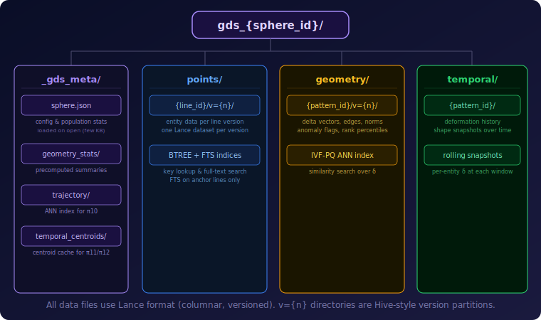
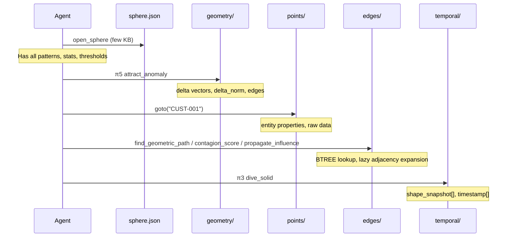
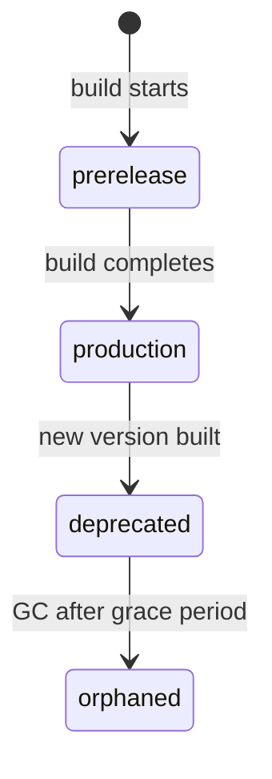

# Physical Data Format

> How hypertopos stores geometric data on disk: directory layout, sphere.json config, Arrow schemas, and what gets read when.

---

## Directory Layout



Each sphere is a self-contained directory:

```
gds_{sphere_id}/
├── _gds_meta/
│   ├── sphere.json              # central config (lines, patterns, aliases, storage)
│   ├── geometry_stats/          # precomputed population summaries
│   ├── trajectory/              # ANN index for trajectory similarity search
│   ├── temporal_centroids/      # cached population centroids per time window
│   └── edge_stats/              # per-event-pattern edge table summary cache (row count, unique from/to, ts/amount range)
├── points/
│   ├── {line_id}/v={n}/
│   │   └── data.lance           # entity records for this line version
│   └── ...
├── geometry/
│   ├── {pattern_id}/v={n}/
│   │   └── data.lance           # delta vectors and edges for this pattern version
│   └── ...
├── edges/
│   ├── {pattern_id}/
│   │   └── data.lance           # anchor-to-anchor edge table (Lance, BTREE indexed)
│   └── ...
└── temporal/
    ├── {pattern_id}/
    │   └── data.lance           # shape/delta snapshots over time
    └── ...
```

All data files use [Lance](https://github.com/lancedb/lance) format (columnar, versioned, with native ANN index support). The `v={n}` directories are Hive-style version partitions.

---

## sphere.json

The central config file. Loaded once on `open_sphere` (typically a few KB). Contains everything the agent needs to understand the sphere without touching any data files.

| Field | Type | Description |
|-------|------|-------------|
| `sphere_id` | string | Unique sphere identifier |
| `lines` | dict | Line definitions: versions, columns, partition config, descriptions |
| `patterns` | dict | Pattern stats: `mu`, `sigma_diag`, `theta`, `edge_max`, `dimension_weights`, `group_stats` |
| `aliases` | dict | Alias definitions: `base_pattern`, cutting plane (`normal` vector, `bias`) |
| `storage` | dict | Storage config per layer (format, partition mode) |

Example (abridged pattern entry):

```json
{
  "patterns": {
    "tx_pattern": {
      "pattern_id": "tx_pattern",
      "entity_line": "transactions",
      "pattern_type": "event",
      "version": 1,
      "status": "production",
      "relations": [
        {"line_id": "accounts", "direction": "in", "required": true},
        {"line_id": "tx_types", "direction": "in", "required": true}
      ],
      "mu": [1.0, 1.0, 0.827, 0.259, 0.130, 0.356],
      "sigma_diag": [0.01, 0.01, 0.379, 0.437, 0.209, 0.204],
      "theta": [1.284, 1.284, 1.284, 1.284, 1.284, 1.284],
      "population_size": 1056320,
      "has_edge_table": true,
      "edge_table": {
        "from_col": "from_account",
        "to_col": "to_account",
        "timestamp_col": "timestamp",
        "amount_col": "amount_received"
      }
    }
  }
}
```

Event patterns with adjacency structure (`has_edge_table: true`) carry an `edge_table` block describing the source columns used to materialize `edges/{pattern_id}/data.lance`. `timestamp_col` and `amount_col` are present whenever they were resolved from explicit YAML config or auto-detected from the event line schema.

`mu` is the population mean per dimension, `sigma_diag` is the standard deviation used for z-scoring, and `theta` is the per-dimension anomaly threshold vector (entities whose z-scored delta exceeds theta on any dimension are flagged).

---

## Arrow Schemas

### Points (`points/{line_id}/v={n}/data.lance`)

| Column | Type | Description |
|--------|------|-------------|
| `primary_key` | string | Unique entity identifier |
| *(domain columns)* | various | Business data (name, amount, date, etc.) |

Domain columns vary per line. The `primary_key` column is always present and always string-typed.

### Geometry (`geometry/{pattern_id}/v={n}/data.lance`)

| Column | Type | Description |
|--------|------|-------------|
| `primary_key` | string | Entity identifier |
| `delta` | fixed_size_list\<float32\> | Z-scored delta vector (deviation from mu) |
| `delta_norm` | float32 | L2 norm of delta (distance from population center -- used for scoring, clustering, and similarity) |
| `delta_rank_pct` | float32 | Percentile rank of delta_norm (0--100) |
| `edges` | list\<struct\> | Edge list: line_id, point_key, direction, status |

The `delta` vector length equals the number of dimensions in the pattern. Geometry datasets carry an IVF-PQ ANN index on the `delta` column for trajectory similarity search.

### Edges (`edges/{pattern_id}/data.lance`)

| Column | Type | Description |
|--------|------|-------------|
| `from_key` | string | Source anchor entity |
| `to_key` | string | Target anchor entity |
| `event_key` | string | Event primary key (traceability back to the event polygon) |
| `timestamp` | float64 | Epoch seconds |
| `amount` | float64 | Numeric value (nullable) |

Emitted automatically for event patterns with 2+ FK relations to the same anchor line, or explicitly via YAML `edge_table` config. Skipped with `--no-edges` CLI flag. The dataset carries BTREE indexes on `from_key` and `to_key` for O(log n) lookups at any scale.

### Temporal (`temporal/{pattern_id}/data.lance`)

| Column | Type | Description |
|--------|------|-------------|
| `primary_key` | string | Entity identifier |
| `shape_snapshot` | fixed_size_list\<float32\> | Shape vector at this point in time |
| `delta_snapshot` | fixed_size_list\<float32\> | Delta vector at this point in time |
| `timestamp` | timestamp | When this snapshot was taken |
| `deformation_type` | string | How the shape changed (`internal` / `edge` / `structural`) |

Each row is one entity at one point in time. Multiple rows per entity form the temporal solid.

---

## Data Flow

What gets read at each stage of navigation:



The key principle: the agent reads only `sphere.json` on startup. Everything else loads on-demand during navigation. A session that never inspects temporal data never touches `temporal/`.

---

## Version Lifecycle *(concept — not yet finalized)*



- **prerelease** -- data is being written; not yet available for navigation.
- **production** -- active version; all navigation reads from this version.
- **deprecated** -- superseded by a newer version; kept for grace period.
- **orphaned** -- no longer referenced; eligible for garbage collection after the grace period.

Only one version per line or pattern is in `production` at any time.

---

## See Also

- [concepts.md](concepts.md) -- core objects, geometry vocabulary, population statistics
- [configuration.md](configuration.md) -- YAML builder reference for defining spheres
- [api-reference.md](api-reference.md) -- Python API and navigation primitives
