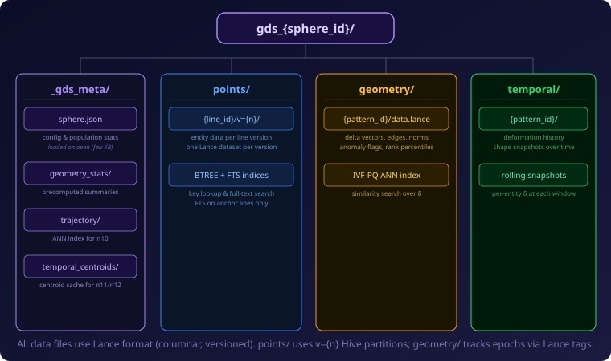
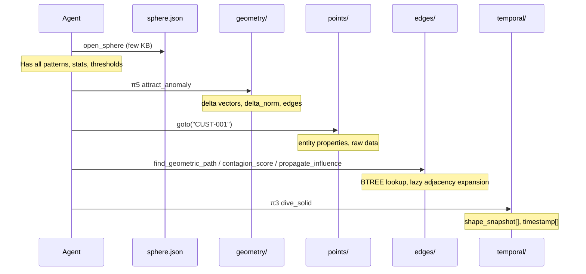
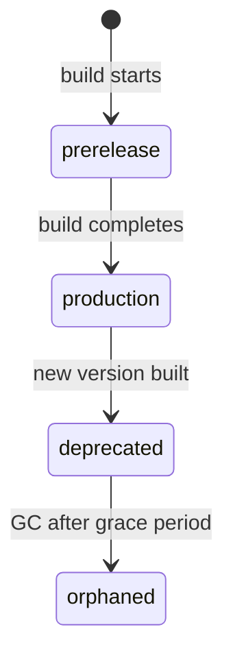

# Physical Data Format

> How hypertopos stores geometric data on disk: directory layout, sphere.json config, Arrow schemas, and what gets read when.

---

## Directory Layout



Each sphere is a self-contained directory:

```
gds_{sphere_id}/
├── _gds_meta/
│   ├── sphere.json              # central config (lines, patterns, aliases, storage)
│   ├── geometry_stats/          # precomputed population summaries
│   ├── trajectory/              # per-entity trajectory summary vectors (optional IVF_FLAT ANN index — skipped for too-few-entity patterns, which then use a brute-force scan)
│   ├── temporal_centroids/      # cached population centroids per time window
│   ├── edge_stats/              # per-event-pattern edge table summary cache (row count, unique from/to, ts/amount range)
│   ├── edge_features/           # per-edge derived dim sidecar (event patterns with edge_dimensions: in YAML)
│   │   └── {pattern_id}/
│   │       └── data.lance       # event_key + 5 dim columns; same values baked into polygon shape
│   └── contagion_stats/         # per-pattern (primary_key, neighbor_count, anomalous_neighbor_count, contagion_ratio) — feeds the graph contagion scanner directly, BTREE-indexed on primary_key
├── points/
│   ├── {line_id}/v={n}/
│   │   └── data.lance           # entity records for this line version
│   └── ...
├── geometry/
│   ├── {pattern_id}/
│   │   └── data.lance           # delta vectors and edges; calibration epochs tracked internally as Lance versions tagged `epoch_<N>`
│   └── ...
├── edges/
│   ├── {pattern_id}/
│   │   └── data.lance           # anchor-to-anchor edge table (Lance, BTREE indexed)
│   └── ...
└── temporal/
    ├── {pattern_id}/
    │   └── data.lance           # shape/delta snapshots over time
    └── ...
```

All data files use [Lance](https://github.com/lancedb/lance) format (columnar, versioned, with native ANN index support). The `v={n}` directories on `points/` are Hive-style version partitions; `geometry/` is a single flat Lance dataset per pattern with calibration epochs tracked via native Lance version tags (`epoch_<N>`).

---

## sphere.json

The central config file. Loaded once on `open_sphere` (typically a few KB). Contains everything the agent needs to understand the sphere without touching any data files.

| Field | Type | Description |
|-------|------|-------------|
| `sphere_id` | string | Unique sphere identifier |
| `format_version` | string | On-disk layout version, written as `"<major>.<minor>"`. Major `3` is required; minor bumps (e.g. `"3.1"`) ride a backward-compatible field addition and load on any major-3 reader. Pre-3.x and malformed values are rejected with a rebuild hint. |
| `lines` | dict | Line definitions: versions, columns, partition config, descriptions |
| `patterns` | dict | Pattern stats: `mu`, `sigma_diag`, `theta`, `edge_max`, `dimension_weights`, `group_stats` |
| `aliases` | dict | Alias definitions: `base_pattern`, cutting plane (`normal` vector, `bias`) |
| `storage` | dict | Storage config per layer (format, partition mode) |
| `label_audit` | dict, optional | Top-level label-aware calibration metadata — `{label_column, label_positive_value, patterns: [...]}`. Present only when the build registered a YAML `label_audit:` block; absent on spheres built without one. When present, `format_version` is stamped `"3.1"`. |

Example (abridged pattern entry):

```json
{
  "patterns": {
    "tx_pattern": {
      "pattern_id": "tx_pattern",
      "entity_line": "transactions",
      "pattern_type": "event",
      "version": 1,
      "status": "production",
      "relations": [
        {"line_id": "accounts", "direction": "in", "required": true},
        {"line_id": "tx_types", "direction": "in", "required": true}
      ],
      "mu": [1.0, 1.0, 0.827, 0.259, 0.130, 0.356],
      "sigma_diag": [0.01, 0.01, 0.379, 0.437, 0.209, 0.204],
      "theta": [1.284, 1.284, 1.284, 1.284, 1.284, 1.284],
      "population_size": 1056320,
      "has_edge_table": true,
      "edge_table": {
        "from_col": "from_account",
        "to_col": "to_account",
        "timestamp_col": "timestamp",
        "amount_col": "amount_received"
      }
    }
  }
}
```

Event patterns with adjacency structure (`has_edge_table: true`) carry an `edge_table` block describing the source columns used to materialize `edges/{pattern_id}/data.lance`. `timestamp_col` and `amount_col` are present whenever they were resolved from explicit YAML config or auto-detected from the event line schema.

`mu` is the population mean per dimension, `sigma_diag` is the standard deviation used for z-scoring, and `theta` is the per-dimension anomaly threshold vector (entities whose z-scored delta exceeds theta on any dimension are flagged).

---

## Arrow Schemas

### Points (`points/{line_id}/v={n}/data.lance`)

| Column | Type | Description |
|--------|------|-------------|
| `primary_key` | string | Unique entity identifier |
| *(domain columns)* | various | Business data (name, amount, date, etc.) |

Domain columns vary per line. The `primary_key` column is always present and always string-typed.

### Geometry (`geometry/{pattern_id}/data.lance`)

Single Lance dataset per pattern. Calibration epochs are not separate directories — each rebuild creates a new internal Lance dataset version, which is tagged `epoch_<N>` so historical epochs remain readable via `LanceDataset.checkout_version(<tag>)`. The current epoch counter is `Sphere.patterns[pid].version`; the on-disk Lance version is resolved via the tag.

| Column | Type | Description |
|--------|------|-------------|
| `primary_key` | string | Entity identifier |
| `delta` | fixed_size_list\<float32\> | Z-scored delta vector (deviation from mu) |
| `delta_norm` | float32 | L2 norm of delta (distance from population center -- used for scoring, clustering, and similarity) |
| `delta_rank_pct` | float32 | Percentile rank of delta_norm (0--100) |
| `conformal_p` | float32 | Conformal p-value (null when not computed) |
| `bregman_divergence` | float32 | Sum of per-dimension Bregman terms (distribution-aware anomaly distance). Null on pre-2.3 spheres. |
| `anomaly_confidence` | float32 | Bootstrap stability score: fraction of bootstrap resamples in which entity is anomalous. Null when bootstrap was skipped. |
| `edges` | list\<struct\> | Edge list: line_id, point_key, direction, status |

The `delta` vector length equals the number of dimensions in the pattern. Geometry datasets carry an IVF-PQ ANN index on the `delta` column for trajectory similarity search.

### Edges (`edges/{pattern_id}/data.lance`)

| Column | Type | Description |
|--------|------|-------------|
| `from_key` | string | Source anchor entity |
| `to_key` | string | Target anchor entity |
| `event_key` | string | Event primary key (traceability back to the event polygon) |
| `timestamp` | float64 | Epoch seconds |
| `amount` | float64 | Numeric value (nullable) |

Emitted automatically for event patterns with 2+ FK relations to the same anchor line, or explicitly via YAML `edge_table` config. Skipped with `--no-edges` CLI flag. The dataset carries BTREE indexes on `from_key` and `to_key` for O(log n) lookups at any scale.

### Edge features (`_gds_meta/edge_features/{pattern_id}/data.lance`)

| Column | Type | Description |
|--------|------|-------------|
| `event_key` | string | Event primary key (joins to the polygon table and the edge table) |
| `pair_edge_count` | float32 | Edges per `(from_key, to_key)` directed pair, broadcast to every edge in the pair |
| `position_in_chain` | float32 | Depth in the longest reverse-temporal chain ending at this edge; values below `min_position` set to 0.0 |
| `time_since_pair_last_edge` | float32 | Seconds since the previous edge in the same pair; first edge in a pair gets a sentinel = `dormant_seconds` (auto-resolved to sphere span) |
| `pair_amount_zscore` | float32 | Signed z-score of amount within `(from_key, to_key)` pairs whose CV < `cv_threshold`; HIGH_VAR pairs and pairs below `min_count` write 0.0 |
| `find_motif_structuring` | float32 | 1.0 if the edge participates in any A→B→C→D structuring motif within `time_window_hours`; else 0.0 |

Written when an event pattern declares an `edge_dimensions:` block. The same per-event values are also baked into the polygon `shape_snapshot` (event polygons grow by the declared dim count) so `find_anomalies` and other navigator primitives transparently include them in `delta` / `delta_norm` / classification. The sidecar persists separately for forward-compatibility with a future HopPredicate query API that will reference per-edge dim values directly. Patterns without the YAML block emit no sidecar.

### Temporal (`temporal/{pattern_id}/data.lance`)

| Column | Type | Description |
|--------|------|-------------|
| `primary_key` | string | Entity identifier |
| `shape_snapshot` | fixed_size_list\<float32\> | Shape vector at this point in time |
| `delta_snapshot` | fixed_size_list\<float32\> | Delta vector at this point in time |
| `timestamp` | timestamp | When this snapshot was taken |
| `deformation_type` | string | How the shape changed (`internal` / `edge` / `structural`) |

Each row is one entity at one point in time. Multiple rows per entity form the temporal solid.

---

## Data Flow

What gets read at each stage of navigation:


```mermaid
sequenceDiagram
    participant Agent
    participant sphere.json
    participant geometry/
    participant points/
    participant edges/
    participant temporal/

    Agent->>sphere.json: open_sphere (few KB)
    Note over Agent: Has all patterns, stats, thresholds

    Agent->>geometry/: π5 attract_anomaly
    Note over geometry/: delta vectors, delta_norm, edges

    Agent->>points/: goto("CUST-001")
    Note over points/: entity properties, raw data

    Agent->>edges/: find_geometric_path / contagion_score / propagate_influence
    Note over edges/: BTREE lookup, lazy adjacency expansion

    Agent->>temporal/: π3 dive_solid
    Note over temporal/: shape_snapshot[], timestamp[]
```

The key principle: the agent reads only `sphere.json` on startup. Everything else loads on-demand during navigation. A session that never inspects temporal data never touches `temporal/`.

---

## Version Lifecycle *(concept — not yet finalized)*


```mermaid
stateDiagram-v2
    [*] --> prerelease: build starts
    prerelease --> production: build completes
    production --> deprecated: new version built
    deprecated --> orphaned: GC after grace period
```

- **prerelease** -- data is being written; not yet available for navigation.
- **production** -- active version; all navigation reads from this version.
- **deprecated** -- superseded by a newer version; kept for grace period.
- **orphaned** -- no longer referenced; eligible for garbage collection after the grace period.

Only one version per line or pattern is in `production` at any time.

---

## Multi-epoch calibration

`_gds_meta/calibration_history/{pattern_id}/v={N}.json` — each full builder run
that re-fits a pattern writes one such file containing a frozen
`CalibrationFit` (population statistics `mu/sigma_diag/theta`, plus
ancillary fit-time fields like `dimension_weights`, `dim_percentiles`,
`group_stats`, `gmm_components`, `edge_max`, and `edge_dim_thresholds` —
per-source-dim `_count_above_threshold` cutoffs persisted only when the
anchor pattern declares `edge_dim_aggregations:`, otherwise omitted). The
file is immutable for the lifetime of the epoch.

`sphere.json` carries three calibration-history fields (introduced in the prior format and retained under `3.0`):

- root: `calibration_history_policy: {"last_k": 5}` — number of most-recent
  epochs to keep on disk. `last_k < 1` is rejected with `ValueError` at load
  time. Default 5.
- per-pattern: `calibration_epoch: int` — N of the latest epoch on disk.
- per-pattern: `schema_hash: str` — sha256 hex digest of the schema-relevant
  fields (`relations`, `event_dimensions`, `prop_columns`, `dimension_kinds`).
  Used by the next builder run to detect schema drift.

**Schema change**: when `schema_hash` differs across builder runs (or a new
pattern is added), the prior `_gds_meta/calibration_history/{pid}/` is wiped
and the next epoch becomes `v=1`. mu/sigma vectors from a previous schema
have different dimensionality and would be unreadable, so retention serves
no purpose.

**Pattern removed**: when a pattern is dropped from the builder definition,
its `_gds_meta/calibration_history/{pid}/` is left on disk untouched.
Cosmetic cleanup is a future "sphere janitor" feature concern.

**GC**: at the end of every full builder run, each pattern's history dir is
trimmed to the most-recent `last_k` epochs by deleting oldest by N.

**Inline cache**: `sphere.json` continues to carry the latest `mu/sigma/theta/...`
inline at the pattern node — this is a cached snapshot of the latest epoch
that existing readers continue to use unchanged. The history dir is purely
additive.

---

## Row IDs

The reader uses `with_row_id=True` on Lance scanner calls (`storage/reader.py` point-lookup + filter-cache paths) to populate two LRU caches keyed by `(pattern_id, version, primary_key)`. The cached `_rowid` is consumed within the same `GDSReader` instance only — it is never persisted to disk, never carried in any `Manifest`, and never returned to MCP callers. The contract is **within-session use only**.

Cross-session row-ID stability (Lance's "Stable Row IDs through updates" surface, exposed as `LanceDataset.has_stable_row_ids` from Lance 6.0.0) is not yet consumed. Persisting row IDs across sessions would require gating on `has_stable_row_ids` per dataset and is paired with the future native-MVCC migration.

## See Also

- [concepts.md](concepts.md) -- core objects, geometry vocabulary, population statistics
- [configuration.md](configuration.md) -- YAML builder reference for defining spheres
- [api-reference.md](api-reference.md) -- Python API and navigation primitives
